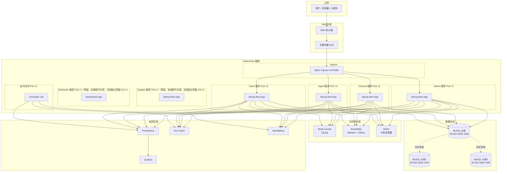
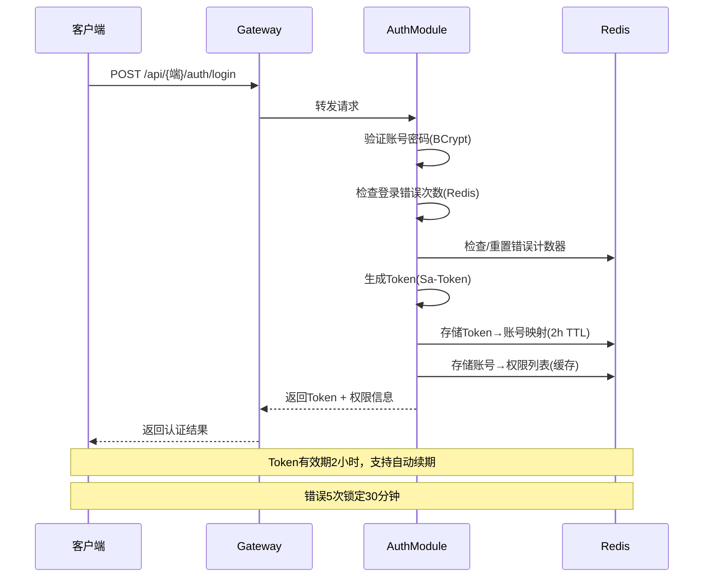
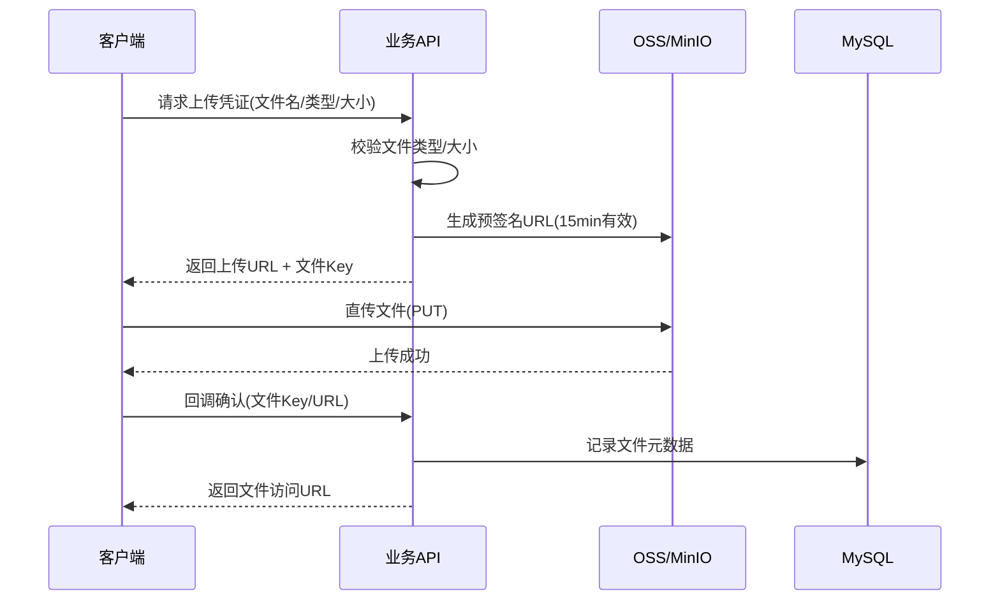
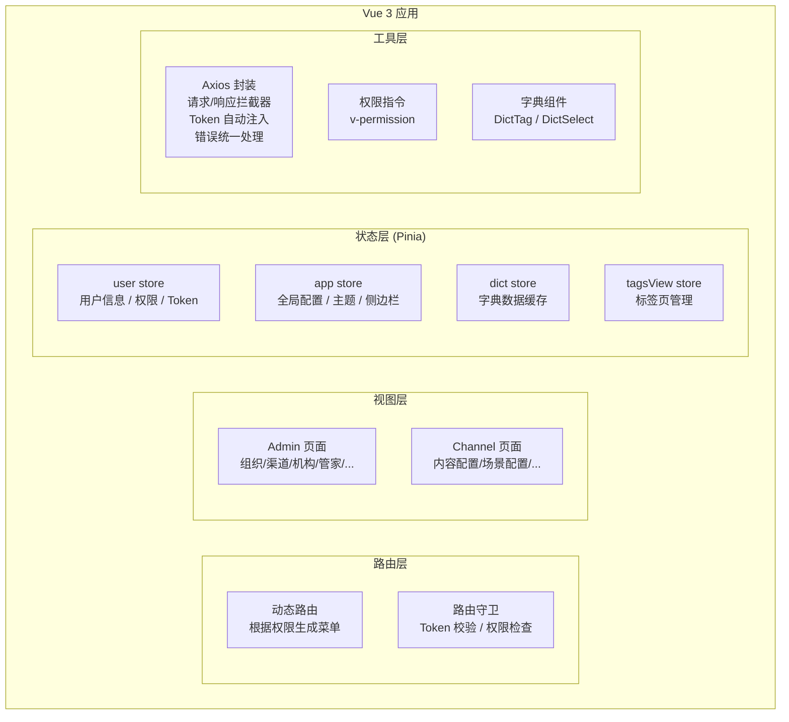
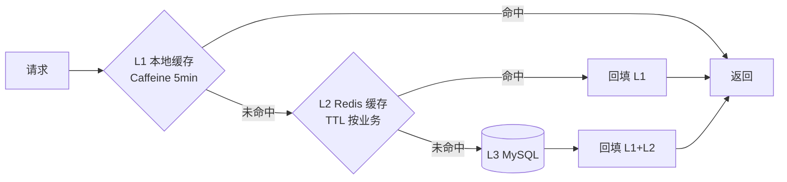
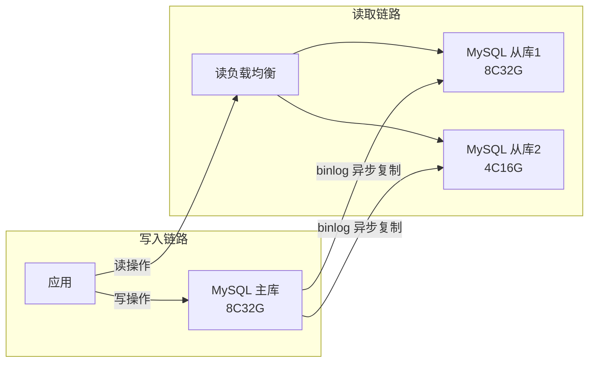
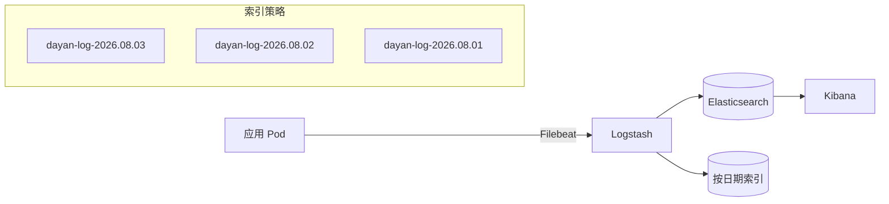

---
AIGC:
    Label: "1"
    ContentProducer: 001191110102MACQD9K64018705
    ProduceID: 59831912238739_0/project_7654537080038572324-files/大雁养老_系统架构设计文档.md
    ReservedCode1: ""
    ContentPropagator: 001191110102MACQD9K64028705
    PropagateID: 59831912238739#1785762003196
    ReservedCode2: ""
---
# 大雁养老 - 系统架构设计文档

## 一、文档信息

| 项目 | 内容 |
|------|------|
| 文档版本 | v1.1 |
| 编制日期 | 2026-08-03 |
| 文档状态 | 修订版 |
| 编制依据 | 《大雁养老 - 产品需求设计文档 v4.0》、《大雁养老 - 数据库设计文档 v4.2》 |
| 适用范围 | 大雁养老服务权益平台全业务域架构设计 |

---

## 二、架构概述

### 2.1 设计目标与约束

#### 设计目标

| 维度 | 目标 | 量化指标 |
|------|------|---------|
| 性能 | 高响应速度 | 列表查询 P99 < 500ms，权益激活 P99 < 200ms，登录认证 P99 < 300ms，字典查询 P99 < 50ms |
| 并发 | 支撑峰值业务 | 峰值 200 QPS |
| 可用性 | 服务持续可用 | SLA ≥ 99.9%，关键链路（权益激活/活动报名/定时任务）故障自动恢复 < 30s |
| 安全性 | 数据与接口安全 | 渠道数据逻辑隔离、敏感数据 AES 加密、全量审计日志 |
| 可扩展 | 业务持续增长 | 支持水平扩展，10万客户/30万权益卡/100万服务记录无压力 |
| 可维护 | 降低运维成本 | 模块化设计、统一监控告警、自动化部署 |

#### 设计约束

1. **业务约束**：平台核心商品为养老权益（非保险），代理人不进行产品分销，不涉及佣金逻辑
2. **技术约束**：Java Spring Boot 技术栈，MySQL 关系型数据库，Redis 缓存
3. **安全约束**：渠道间数据逻辑隔离（channel_code 字段级过滤），敏感数据加密存储
4. **性能约束**：单库支撑 127 张表，2654 个字段，需在索引和查询层面做深度优化
5. **部署约束**：支持容器化部署，CI/CD 自动化流水线

### 2.2 架构原则

| 原则 | 说明 | 落地措施 |
|------|------|---------|
| **高可用** | 核心服务无单点故障 | Redis Cluster、MySQL 主从、应用多实例 + 负载均衡 |
| **可扩展** | 支持业务增长和功能迭代 | Maven 多模块、领域驱动分层、水平扩容能力 |
| **安全隔离** | 渠道数据严格隔离 | MyBatis-Plus TenantLineHandler、channel_code 自动过滤 |
| **性能优先** | 关键链路极致优化 | 多级缓存、索引优化、异步处理、连接池调优 |
| **领域清晰** | 17 个业务域边界分明 | 按业务域拆分 Maven 模块，模块间通过接口通信 |
| **可观测** | 全链路可追踪 | trace_id 贯穿、全量操作审计、Prometheus 监控 |
| **防御性设计** | 防止非法操作和异常传播 | 状态机驱动状态流转、统一异常处理、接口限流 |

---

## 三、技术选型

### 3.1 后端技术栈

| 层次 | 技术 | 版本 | 用途 | 选型理由 |
|------|------|------|------|---------|
| 后端框架 | Spring Boot | 3.2.x | 应用主框架 | 生态成熟、自动配置、快速开发 |
| 微服务框架 | Spring Cloud | 2023.x | 微服务体系（对应 Spring Boot 3.2） | 网关/服务治理标准化、版本配套 |
| 微服务组件 | Spring Cloud Alibaba | 2023.x | 阿里系中间件整合（Nacos/Sentinel） | 与 Spring Boot 3.2 配套、国产组件开箱即用 |
| 配置中心 | Nacos | 2.3.x | 配置中心 + 服务发现 + Sentinel 规则中心 | 动态配置、多环境隔离、Sentinel 规则持久化 |
| ORM 框架 | MyBatis-Plus | 3.5.x | 数据持久化 | 多租户插件支持、代码生成、分页插件、Lambda 查询 |
| 认证框架 | Sa-Token | 1.37.x | 多端认证授权 | 多端 Token 隔离、权限认证、SSO 能力、轻量级 |
| 缓存 | Redis (Cluster) | 7.2.x | 数据缓存/会话/分布式锁 | 高性能、Cluster 高可用、数据结构丰富 |
| 数据库 | MySQL | 8.0.x | 主数据库 | InnoDB 引擎、JSON 支持、窗口函数、成熟稳定 |
| 限流熔断 | Sentinel | 1.8.x | 接口限流/熔断降级 | 阿里开源、与 Spring Boot 集成好、规则经 Nacos 动态持久化 |
| 消息队列 | RocketMQ | 5.1.x | 异步消息/延迟消息 | 事务消息、延迟消息、高可靠、金融级 |
| 文件存储 | MinIO / 阿里 OSS | 最新版 | 图片/视频/文件存储 | S3 兼容、CDN 加速、成本低 |
| 日志框架 | SLF4J + Logback | 内置 | 应用日志 | Spring Boot 内置、配置灵活 |
| 链路追踪 | SkyWalking | 9.x | 分布式追踪 | 无侵入、Java Agent 接入、全链路可视化 |
| API 文档 | Knife4j (Swagger) | 4.x | 接口文档 | 在线调试、分组管理、多端文档隔离 |
| 工具库 | Hutool | 5.8.x | 通用工具集 | 加密/编码/日期/文件等工具全覆盖 |
| 加密 | BouncyCastle | 1.77 | AES 加密 | AES 敏感字段加解密 |
| 密码哈希 | Spring Security Crypto | 内置 | BCrypt | 不可逆密码哈希 |
| ID 生成 | 雪花算法 (SnowflakeId) + AUTO_INCREMENT | 自研 + MySQL | 混用：分片候选表（44表，含 channel_code 按渠道分片）用雪花ID，平台共享表（83表）用自增。详见数据库 §2.0.1 |

### 3.2 前端技术栈

| 层次 | 技术 | 版本 | 用途 | 选型理由 |
|------|------|------|------|---------|
| Admin 端 | Vue 3 + TypeScript | 3.4.x | 平台管理后台 | 组合式 API、类型安全、生态丰富 |
| Channel 端 | Vue 3 + TypeScript | 3.4.x | 渠道管理后台 | 与 Admin 端技术栈统一，降低维护成本 |
| UI 框架 | Element Plus | 2.7.x | PC 端 UI 组件库 | 企业级组件、中文文档完善 |
| 状态管理 | Pinia | 2.x | 全局状态管理 | Vue 3 官方推荐、TypeScript 友好 |
| 路由 | Vue Router | 4.x | 前端路由 | Vue 3 标配 |
| HTTP 客户端 | Axios | 1.7.x | 接口请求 | 拦截器、请求取消、并发控制 |
| 图表 | ECharts | 5.x | 数据可视化 | 功能强大、支持大数据量渲染 |

### 3.3 移动端技术栈

| 层次 | 技术 | 版本 | 用途 | 选型理由 |
|------|------|------|------|---------|
| 移动端框架 | uni-app | 最新版 | Agent 端 + Client 端 | 一套代码多端运行（微信小程序/H5/App） |
| UI 框架 | uView UI | 2.x | 移动端 UI 组件 | uni-app 生态最完善组件库 |
| 状态管理 | Pinia (uni版) | 最新版 | 全局状态 | 与 PC 端统一技术认知 |
| 微信 SDK | 微信小程序 SDK | 最新基础库 | 微信登录/支付/分享 | 原生能力调用 |

### 3.4 基础设施

| 层次 | 技术 | 版本 | 用途 | 选型理由 |
|------|------|------|------|---------|
| 容器化 | Docker | 24.x | 应用打包 | 标准化部署、环境一致性 |
| 编排 | Kubernetes | 1.28.x | 生产环境编排 | 自动扩缩容、滚动更新、自愈 |
| CI/CD | GitLab CI | 最新 | 自动化构建部署 | 流水线可视化、多环境管理（DEV/SIT/UAT/PROD 四环境） |
| 配置中心 | Nacos | 2.3.x | 配置中心 + 服务发现 + Sentinel 规则中心 | 动态配置、多环境 Profile、规则持久化 |
| 监控 | Prometheus + Grafana | 最新 | 指标监控 | 生态成熟、告警灵活 |
| 日志收集 | ELK (Elasticsearch + Logstash + Kibana) | 8.x | 日志收集查询 | 全文检索、可视化分析 |
| 反向代理 | Nginx | 1.25.x | 负载均衡/静态资源 | 高性能、配置灵活 |

---

## 四、系统架构图

### 4.1 整体架构图

```mermaid
graph TB
    subgraph 用户端
        A1[Admin 管理后台<br/>Vue3 + Element Plus]
        A2[Channel 渠道后台<br/>Vue3 + Element Plus]
        A3[Agent 代理人端<br/>uni-app 小程序/H5]
        A4[Client 客户端<br/>uni-app 小程序/H5]
    end

    subgraph 接入层
        B1[Nginx 反向代理<br/>SSL终止 / 静态资源 / 负载均衡]
        B2[CDN 加速<br/>图片/视频/静态文件]
    end

    subgraph 网关层
        C1[Spring Cloud Gateway<br/>路由 / 限流 / 鉴权 / 日志]
    end

    subgraph 应用层
        D1[系统模块<br/>system]
        D2[核心模块<br/>organ]
        D3[渠道模块<br/>channel]
        D4[代理人模块<br/>agent]
        D5[客户模块<br/>client]
        D6[权益模块<br/>equity]
        D7[服务模块<br/>service]
        D8[商品模块<br/>goods]
        D9[订单模块<br/>order]
        D10[结算模块<br/>finance]
        D11[养老机构模块<br/>park]
        D12[场景模块<br/>scene]
        D13[管家模块<br/>butler]
        D14[供应商模块<br/>supplier]
        D15[内容模块<br/>content]
        D16[课程模块<br/>course]
        D17[分销商模块<br/>distributor]
    end

    subgraph 中间件层
        E1[Redis Cluster<br/>缓存 / 会话 / 分布式锁]
        E2[RocketMQ<br/>异步消息 / 延迟任务]
        E3[MinIO / OSS<br/>文件存储]
        E4[SkyWalking<br/>链路追踪]
        E5[Sentinel<br/>限流熔断]
    end

    subgraph 数据层
        F1[(MySQL 主库<br/>写操作)]
        F2[(MySQL 从库<br/>读操作)]
    end

    subgraph 监控运维
        G1[Prometheus + Grafana<br/>指标监控]
        G2[ELK Stack<br/>日志收集]
        G3[告警中心<br/>钉钉/企微/短信]
    end

    A1 & A2 --> B1
    A3 & A4 --> B1
    B1 --> C1
    B1 --> B2
    C1 --> D1 & D2 & D3 & D4 & D5 & D6 & D7 & D8 & D9 & D10 & D11 & D12 & D13 & D14 & D15 & D16 & D17
    D1 & D2 & D3 & D4 & D5 & D6 & D7 & D8 & D9 & D10 & D11 & D12 & D13 & D14 & D15 & D16 & D17 --> E1
    D6 & D7 & D9 & D10 --> E2
    D11 & D15 --> E3
    D1 & D2 & D3 & D4 & D5 & D6 & D7 & D8 & D9 & D10 & D11 & D12 & D13 & D14 & D15 & D16 & D17 --> F1
    D1 & D2 & D3 & D4 & D5 & D6 & D7 & D8 & D9 & D10 & D11 & D12 & D13 & D14 & D15 & D16 & D17 --> F2
    F1 -.->|主从复制| F2
    D1 & D2 & D3 & D4 & D5 & D6 & D7 & D8 & D9 & D10 & D11 & D12 & D13 & D14 & D15 & D16 & D17 --> E4
    C1 --> E5
    D1 & D2 & D3 & D4 & D5 & D6 & D7 & D8 & D9 & D10 & D11 & D12 & D13 & D14 & D15 & D16 & D17 --> G1
    D1 & D2 & D3 & D4 & D5 & D6 & D7 & D8 & D9 & D10 & D11 & D12 & D13 & D14 & D15 & D16 & D17 --> G2
    G1 --> G3
    G2 --> G3
```



### 4.2 逻辑分层架构

```mermaid
graph LR
    subgraph 接入层["接入层 (Access Layer)"]
        direction TB
        Nginx[Nginx<br/>SSL / 反向代理 / 静态资源]
        CDN[CDN<br/>静态资源加速]
    end

    subgraph 网关层["网关层 (Gateway Layer)"]
        direction TB
        GW[API Gateway<br/>路由转发 / Token校验 / 限流<br/>请求日志 / 跨域处理 / 灰度发布]
    end

    subgraph 业务层["业务层 (Business Layer)"]
        direction TB
        subgraph Controller["Controller 接口层"]
            C1[RESTful API<br/>参数校验 / 响应封装]
        end
        subgraph Service["Service 业务层"]
            S1[业务逻辑<br/>状态机驱动 / 事务管理]
            S2[渠道隔离<br/>TenantLineHandler]
            S3[权限控制<br/>Sa-Token 注解]
        end
        subgraph Domain["Domain 领域层"]
            DM1[领域模型<br/>实体 / 值对象]
            DM2[领域服务<br/>业务规则封装]
        end
        subgraph Infrastructure["基础设施层"]
            I1[MyBatis-Plus Mapper]
            I2[Redis 缓存]
            I3[MQ 消息]
            I4[文件存储]
        end
    end

    subgraph 数据层["数据层 (Data Layer)"]
        direction TB
        DB1[(MySQL 主库)]
        DB2[(MySQL 从库)]
        RD[(Redis Cluster)]
    end

    接入层 --> 网关层
    网关层 --> Controller
    Controller --> Service
    Service --> Domain
    Domain --> Infrastructure
    Infrastructure --> 数据层
```



### 4.3 部署架构图



---

## 五、后端架构设计

### 5.1 工程模块划分

采用 Maven 多模块结构，按业务域划分，统一父工程管理依赖版本：

```
dayan-platform (父工程)
├── dayan-common                          # 公共模块
│   ├── dayan-common-core                 # 核心工具（响应封装、异常定义、常量）
│   ├── dayan-common-redis                # Redis 封装（缓存操作、分布式锁）
│   ├── dayan-common-mybatis              # MyBatis-Plus 配置（租户隔离、分页、审计填充）
│   ├── dayan-common-security             # Sa-Token 封装（多端认证、权限注解）
│   ├── dayan-common-log                  # 日志封装（操作审计AOP、trace_id）
│   ├── dayan-common-mq                   # MQ 封装（消息发送、消费幂等模板）
│   ├── dayan-common-oss                  # 文件存储封装（OSS/MinIO 适配）
│   └── dayan-common-swagger              # API 文档封装
│
├── dayan-gateway                         # API 网关模块
│
├── dayan-modules                         # 业务模块集合
│   ├── dayan-module-system               # 系统域（字典、状态机、配置、菜单、日志）
│   ├── dayan-module-organ                # 核心域（组织、账号、RBAC）
│   ├── dayan-module-channel              # 渠道域（渠道管理、内容配置、场景配置）
│   ├── dayan-module-agent                # 代理人域（代理人、客户绑定、业绩、分享）
│   ├── dayan-module-client               # 客户域（客户、健康档案、家庭成员）
│   ├── dayan-module-equity               # 权益域（模板、批次、卡/函库、激活）
│   ├── dayan-module-service              # 服务域（会话、需求、方案、安排、回访）
│   ├── dayan-module-goods                # 商品域（商品、SKU 管理）
│   ├── dayan-module-order                # 订单域（权益订单、场景订单、课程订单、旅居订单）
│   ├── dayan-module-finance              # 结算域（流水、账单、发票、对账）
│   ├── dayan-module-park                 # 养老机构域（机构、房间、照护、餐饮）
│   ├── dayan-module-scene                # 场景域（场景、项目、排期）
│   ├── dayan-module-butler               # 管家域（管家、排班、评价、技能）
│   ├── dayan-module-supplier             # 供应商域（供应商、合同、评价）
│   ├── dayan-module-content              # 内容域（内容、分类、媒体、阅读记录）
│   ├── dayan-module-course               # 课程域（课程、讲师、学习记录）
│   └── dayan-module-distributor          # 分销商域（分销商信息）
│
├── dayan-admin                           # Admin 端启动器（聚合 organ/system/butler 等）
├── dayan-channel                         # Channel 端启动器（聚合 channel/content 等，仅渠道）
├── dayan-supplier                        # Supplier 端启动器（聚合 supplier 等，独立系统；前端暂不实现，API 预留）
├── dayan-distributor                     # Distributor 端启动器（聚合 distributor 等，独立系统；前端暂不实现，API 预留）
├── dayan-agent                           # Agent 端启动器（聚合 agent/equity/goods/order 等）
├── dayan-client                          # Client 端启动器（聚合 client/equity/service 等）
│
└── dayan-job                             # 定时任务模块（SLA升级、权益过期、对账）
```

**各模块职责说明**：

| 模块 | 职责 | 依赖的核心表 |
|------|------|-------------|
| dayan-common-core | 统一响应 R<T>、业务异常 BusinessException、常量定义、SnowflakeId | 无 |
| dayan-common-mybatis | TenantLineHandler 租户隔离、MetaObjectHandler 审计字段自动填充、分页插件 | 全表 |
| dayan-common-security | Sa-Token 多端配置、@SaCheckPermission 注解封装、多端 Token 命名空间 | organ_account 等 |
| dayan-common-redis | RedisTemplate 封装、CacheKey 枚举、分布式锁工具 | 无 |
| dayan-common-log | @OperLog AOP 注解、trace_id MDC 注入、system_operation_log 写入 | system_operation_log |
| dayan-module-system | 字典 CRUD、状态机引擎、系统配置、菜单管理、消息中心 | system_* 共 18 张表 |
| dayan-module-organ | 组织管理、账号管理、RBAC 权限、部门管理 | organ_* 共 9 张表 |
| dayan-module-equity | 权益模板、批次管理、卡/函库 CRUD、激活流程、使用人管理 | equity_* 共 6 张表 |
| dayan-module-service | 服务会话管理、四环节（需求/方案/安排/回访）、状态机驱动 | service_* 共 7 张表 |
| dayan-module-order | 订单创建/状态机驱动、批量入库 | order_* 共 4 张表（equity/scene/course/sojourn） |
| dayan-module-finance | 流水/支付/退款/结算单/对账/发票/应收 | finance_* 共 7 张表 |

### 5.2 核心框架集成

#### 5.2.1 Sa-Token 多端认证设计

六端使用独立的 Token 命名空间（admin/channel/supplier/distributor/agent/client），互不干扰；开放平台 open-api 作为第七端采用签名认证（X-App-Key/X-Sign），不使用 Token：

```java
// Sa-Token 多端配置
@Configuration
public class SaTokenConfig {
    
    // 六端 Token 前缀 + 一端签名认证（open-api 使用 X-App-Key/X-Sign，无 Token）
    public static final String TOKEN_PREFIX_ADMIN = "admin:";
    public static final String TOKEN_PREFIX_CHANNEL = "channel:";
    public static final String TOKEN_PREFIX_SUPPLIER = "supplier:";       // 供应商独立端
    public static final String TOKEN_PREFIX_DISTRIBUTOR = "distributor:"; // 分销商独立端（预留：当前 distributor_info 无 account 表，将来补建）
    public static final String TOKEN_PREFIX_AGENT = "agent:";
    public static final String TOKEN_PREFIX_CLIENT = "client:";
    
    /**
     * 多端登录隔离：同一账号可在不同端同时登录（Token 命名空间独立）。
     * 同一端配置为 is-concurrent=false + is-share=true，语义为：
     *   "同一账号多次登录复用同一 Token，不并发签发新 Token；
     *    后登录的会话共享先登录的 Token（共享 Session）"。
     * 注意：此组合不是"踢人重发新 Token"，而是"Token 复用共享"——
     *   先登录的会话不会被踢下线，新旧会话使用同一 Token，无需重新登录。
     * 供应商/分销商端：前端暂不实现，但后端 Token 命名空间与路由已预留。
     */
    @Bean
    public SaTokenListener saTokenListener() {
        return new SaTokenListener() {
            @Override
            public void doLogin(String type, Object loginId, String token, SaLoginModel loginModel) {
                // 记录登录日志
                // type = "admin" / "channel" / "supplier" / "distributor" / "agent" / "client"
            }
            
            @Override
            public void doKickout(String type, Object loginId, String token) {
                // 踢人下线记录
            }
        };
    }
}
```

**多端认证流程**：



##### 多渠道身份与登录选渠道（Agent / Client 端）

> 代理人与客户的信息和账号**均按渠道隔离**：每个渠道的代理人/客户都是独立个体（独立的 info + account 行，信息可重复存在），同一真实人员/老人在不同渠道可各有一条记录（agent_code / client_code 渠道内唯一，非全局唯一）。手机号/open_id/union_id **不要求全局唯一**——同一手机号或微信可关联多个渠道的账号。登录与数据可见性由「账号 + 渠道」共同决定。

**身份模型（自然键关联，不建独立身份表）**：
- 同一手机号（account.phone）或 open_id / union_id 在不同渠道的账号即视为同一自然人的不同账号。
- 鉴权层对"身份查找"**豁免租户隔离**（跨渠道按手机号/open_id 检索账号），列出该身份关联的所有渠道。

**登录时选渠道**（无需登录后切换）：
1. 用户提交手机号/微信凭证 → 后端按手机号/open_id 跨渠道检索（豁免租户隔离）该身份关联的所有渠道账号。
2. 若仅一个渠道 → 直接校验并签发该渠道 Token。
3. 若多个渠道 → 返回渠道列表，前端展示供用户选择；用户选定渠道后，按该渠道账号校验并签发 Token。
4. 选定后 Token 内含 `channelCode`（= 该账号 channel_code），数据视图即锁定为该渠道。需换渠道时重新登录选另一渠道即可（不提供登录后切换接口）。

**账号来源**：代理人/客户可能完全依赖大雁自建账号（username/password + 手机号/微信），也可能复用渠道本身的账号体系（通过 `ext_account_no` 关联渠道侧唯一编码/公号登录）。

**Token 携带的渠道上下文**（SaToken `loginExtra`）：
- `channelCode`：登录选定的渠道（agent_account.channel_code / client_account.channel_code）。租户拦截器读取此值进行数据过滤（见 §5.2.2）。

> **说明**：Channel / Supplier / Butler / Organ 端账号不跨渠道（主体本身就是渠道/供应商/组织），登录无需选渠道，仅 Agent / Client 端适用本节。

#### 5.2.2 MyBatis-Plus 租户隔离设计

```java
/**
 * 渠道数据隔离处理器
 * 自动在所有包含 channel_code 字段的 SQL 中追加 WHERE channel_code = ?
 * 注：客户域全部表（client_info / client_account / client_favorite / client_health_profile /
 *     client_care_need / client_family_member / client_address）含 channel_code，按渠道隔离。
 *     鉴权层的"跨渠道身份查找"（按 phone/open_id 定位账号）通过 ThreadLocal 临时关闭租户过滤实现。
 */
@Component
public class ChannelTenantHandler implements TenantLineHandler {
    
    // 忽略租户过滤的表清单（平台共享表，不含 channel_code）
    private static final Set<String> IGNORE_TABLES = Set.of(
        "system_dict_common",
        "system_dict_region",
        "system_dict_iplocation",
        "system_state_machine",
        "system_config",
        "system_config_log",
        "system_menu",
        "system_message_template",
        "system_dict_business",
        "organ_info",
        "organ_account",
        "organ_role",
        "organ_permission",
        "organ_role_permission_ship",
        "organ_department",
        "organ_employee",
        "organ_account_role_rel",
        "organ_role_menu_rel",
        "distributor_info"
    );
    
    @Override
    public Expression getTenantId() {
        // 从 Sa-Token 上下文获取当前渠道编码 channelCode
        // Admin/Channel/Supplier/Butler 端：登录即其主体渠道；Agent/Client 端：登录时选定的渠道
        String channelCode = StpUtil.getExtra("channelCode");
        return new StringValue(channelCode);
    }
    
    @Override
    public String getTenantIdColumn() {
        return "channel_code";
    }
    
    @Override
    public boolean ignoreTable(String tableName) {
        // 平台共享表不走租户隔离
        return IGNORE_TABLES.contains(tableName);
    }
}
```

#### 5.2.3 状态机引擎设计

基于 `system_state_machine` 表驱动的通用状态机引擎：

```java
/**
 * 通用状态机引擎
 * 所有状态流转必须通过此引擎，禁止应用层直接 UPDATE 状态字段
 */
@Component
public class StateMachineEngine {
    
    @Autowired
    private StateMachineMapper stateMachineMapper;
    
    /**
     * 触发一维状态流转
     * <p>适用于权益（EQUITY_SM）、订单（ORDER_SM）等单维状态机。
     * 服务会话（SERVICE_SESSION_SM）为二维状态机，请使用重载方法
     * fireEvent(machineCode, currentState, subStatus, event)。
     * @param machineCode 状态机编码（ORDER_SM / EQUITY_SM）
     * @param currentState 当前状态
     * @param event 触发事件
     * @return 目标状态
     * @throws BusinessException 非法状态流转时抛出
     */
    public Integer fireEvent(String machineCode, Integer currentState, String event) {
        // 1. 查询合法的状态转换规则
        StateMachine rule = stateMachineMapper.selectOne(
            new LambdaQueryWrapper<StateMachine>()
                .eq(StateMachine::getMachineCode, machineCode)
                .eq(StateMachine::getFromState, currentState)
                .eq(StateMachine::getEventCode, event)
                .eq(StateMachine::getStatus, 1)
        );
        
        // 2. 无匹配规则 = 非法流转
        if (rule == null) {
            throw new BusinessException(
                String.format("非法状态流转: machine=%s, from=%d, event=%s", 
                    machineCode, currentState, event)
            );
        }
        
        // 3. 检查条件表达式（如有）
        if (StringUtils.isNotBlank(rule.getConditionExpr())) {
            evaluateCondition(rule.getConditionExpr());
        }
        
        return rule.getToState();
    }

    /**
     * 触发二维状态流转（重载，用于服务会话等二维状态机）
     * <p>服务会话采用 (session_status, sub_status) 二维状态机：主状态流转的同时
     * 可能联动变更子状态（如主状态进入"服务中"时，子状态置为"normal"）。
     * 一维 fireEvent(...) 用于权益/订单等单维状态机；本重载用于服务会话。
     * @param machineCode  状态机编码（SERVICE_SESSION_SM）
     * @param currentState 当前主状态 (session_status)
     * @param subStatus    当前子状态 (sub_status, varchar(20) 字符串枚举)
     * @param event        触发事件
     * @return 目标主状态 + 目标子状态（to_state / to_sub_state 由规则表配置）
     * @throws BusinessException 非法状态流转时抛出
     */
    public StatePair fireEvent(String machineCode, Integer currentState,
                               String subStatus, String event) {
        StateMachine rule = stateMachineMapper.selectOne(
            new LambdaQueryWrapper<StateMachine>()
                .eq(StateMachine::getMachineCode, machineCode)
                .eq(StateMachine::getFromState, currentState)
                .eq(StateMachine::getFromSubState, subStatus)
                .eq(StateMachine::getEventCode, event)
                .eq(StateMachine::getStatus, 1)
        );
        if (rule == null) {
            throw new BusinessException(
                String.format("非法状态流转: machine=%s, from=%d/%s, event=%s",
                    machineCode, currentState, subStatus, event)
            );
        }
        if (StringUtils.isNotBlank(rule.getConditionExpr())) {
            evaluateCondition(rule.getConditionExpr());
        }
        // toSubState 为空表示本次事件不变更子状态，沿用原值
        String nextSubStatus = rule.getToSubState() != null
                ? rule.getToSubState() : subStatus;
        return new StatePair(rule.getToState(), nextSubStatus);
    }

    /** 二维状态机返回值：下一主状态 + 下一子状态 */
    @Data
    @AllArgsConstructor
    public static class StatePair {
        private Integer nextState;
        private String nextSubStatus;
    }
}
```

**状态机清单**：

| 状态机编码 | 业务实体 | 状态数 | 说明 |
|-----------|---------|--------|------|
| ORDER_SM | order_equity / order_scene / order_course / order_sojourn | 8 态 | 订单生命周期 |
| EQUITY_SM | equity_depot | 8 态 | 权益卡/函生命周期 |
| SERVICE_SESSION_SM | service_session | 7 态 + sub_status | 服务会话生命周期 |

#### 5.2.4 统一异常处理

```java
@RestControllerAdvice
public class GlobalExceptionHandler {
    
    // 业务异常 → 200 + 错误码
    @ExceptionHandler(BusinessException.class)
    public R<?> handleBusinessException(BusinessException e) {
        log.warn("业务异常: code={}, msg={}", e.getCode(), e.getMessage());
        return R.fail(e.getCode(), e.getMessage());
    }
    
    // 权限异常 → 403
    @ExceptionHandler(NotPermissionException.class)
    public R<?> handlePermissionException(NotPermissionException e) {
        return R.fail(403, "无权限访问");
    }
    
    // 未登录 → 401
    @ExceptionHandler(NotLoginException.class)
    public R<?> handleNotLoginException(NotLoginException e) {
        return R.fail(401, "未登录或登录已过期");
    }
    
    // 参数校验 → 400
    @ExceptionHandler(MethodArgumentNotValidException.class)
    public R<?> handleValidationException(MethodArgumentNotValidException e) {
        String msg = e.getBindingResult().getFieldErrors().stream()
            .map(f -> f.getField() + ": " + f.getDefaultMessage())
            .collect(Collectors.joining("; "));
        return R.fail(400, msg);
    }
    
    // Sentinel 限流 → 429
    @ExceptionHandler(FlowException.class)
    public R<?> handleFlowException(FlowException e) {
        return R.fail(429, "请求过于频繁，请稍后重试");
    }
    
    // 兜底异常 → 500
    @ExceptionHandler(Exception.class)
    public R<?> handleException(Exception e) {
        log.error("系统异常", e);
        return R.fail(500, "系统内部错误");
    }
}
```

#### 5.2.5 统一响应封装

```java
@Data
public class R<T> implements Serializable {
    private int code;       // 状态码：0=成功，非0=失败
    private String msg;     // 提示信息
    private T data;         // 响应数据
    private String traceId; // 链路追踪ID
    
    public static <T> R<T> ok() { return ok(null); }
    public static <T> R<T> ok(T data) {
        R<T> r = new R<>();
        r.setCode(0);
        r.setMsg("success");
        r.setData(data);
        r.setTraceId(MDC.get("traceId"));
        return r;
    }
    
    public static <T> R<T> fail(int code, String msg) {
        R<T> r = new R<>();
        r.setCode(code);
        r.setMsg(msg);
        r.setTraceId(MDC.get("traceId"));
        return r;
    }
}
```

### 5.3 渠道数据隔离方案

#### 5.3.1 隔离策略

平台采用 **共享数据库 + 逻辑隔离** 模式，通过 `channel_code` 字段实现渠道间数据隔离。

**隔离层级**：

| 层级 | 实现方式 | 说明 |
|------|---------|------|
| SQL 层 | MyBatis-Plus TenantLineHandler | 自动追加 `WHERE channel_code = ?` |
| 应用层 | ThreadLocal 传递 channel_code | Sa-Token 登录后写入上下文 |
| 缓存层 | Redis Key 包含 channel_code | `dayan:{module}:{channelCode}:{bizKey}` |
| 接口层 | Gateway 统一解析渠道标识 | Token 中提取 channel_code 注入请求头 |

#### 5.3.2 需要隔离的表（含 channel_code 字段）

| 业务域 | 需隔离的表 |
|--------|-----------|
| 渠道域 | channel_info, channel_config_content, channel_config_scene, channel_config_goods |
| 代理人域 | agent_info, agent_account, agent_favorite, agent_client_rel, agent_performance, agent_share_record |
| 客户域 | client_info, client_account, client_favorite, client_health_profile, client_care_need, client_family_member, client_address |
| 权益域 | equity_depot, equity_activate, equity_use_person, equity_batch |
| 订单域 | order_equity, order_scene, order_course, order_sojourn |
| 服务域 | service_session, service_equity_demand, service_equity_solution, service_equity_arrange, service_equity_followup |
| 结算域 | finance_flow, finance_bill |

> **关联隔离表说明**：以下表本身不含 `channel_code` 字段，但通过父表外键（order_code / session_code / equity_code）天然属于某渠道，查询时必须先过滤父表渠道，避免跨渠道泄露：
> - 结算域支付退款表：finance_payment（支付记录）、finance_refund（退款记录）—— v4.2 从订单域迁入结算域，经 order_code 关联订单，按订单所属渠道隔离。
> - 服务子表：service_evaluation（服务评价）、service_visit_record（探访记录）—— 经 session_code / butler_code 关联服务会话或管家，按会话所属渠道隔离。（注：service_change_log 已迁入 system 域为 system_service_change_log）
> - 权益模板与换人记录：equity_template（平台级模板，无 channel_code，平台共享）；equity_change_holder（更换权益人记录，经 equity_code 关联权益卡，按权益所属渠道隔离）。
>
> 注：equity_batch 含 channel_code（分配渠道，NULL=未分配），已列入上表隔离清单。

#### 5.3.3 忽略清单（平台共享表）

系统域字典/配置/状态机、核心域组织/账号/权限/部门、分销商域等不含 `channel_code` 字段的表，不执行租户过滤。

> **客户域说明**：客户信息（client_info）按渠道隔离（含 channel_code）——每个渠道的客户都是独立个体，同一真实老人在不同渠道可各有一条记录。故客户域全部表参与租户过滤。

### 5.4 缓存设计

#### 5.4.1 Redis Key 规范

```
格式: dayan:{模块}:{业务}:{渠道编码}:{业务键}
TTL: 根据业务特性设置

示例:
dayan:system:dict:{dictType}                    # 字典缓存 TTL=24h
dayan:system:config:{env}:{scope}:{configKey}   # 系统配置（system_config，按 env+scope 多级 Key）TTL=24h
                                                #   scope=global/organ/user，scope 为 global 时占位 "global"
                                                #   例：dayan:system:config:prod:global:site_title
                                                #       dayan:system:config:prod:organ:ORG00001:site_title
dayan:auth:token:{loginType}:{loginId}          # Token 会话 TTL=2h
dayan:auth:login_err:{loginType}:{username}     # 登录错误计数 TTL=30min
dayan:equity:detail:{channelCode}:{equityCode}  # 权益详情 TTL=30min
dayan:park:list:{channelCode}:{cityCode}        # 机构列表 TTL=1h
dayan:scene:schedule:{channelCode}:{sceneCode}  # 场景排期 TTL=10min
dayan:content:list:{channelCode}:{appType}      # 内容列表 TTL=1h
dayan:order:lock:{orderNo}                      # 订单分布式锁 TTL=30s
dayan:rate_limit:{loginType}:{api}              # 接口限流计数 TTL=1s
```

#### 5.4.2 缓存分层

| 层级 | 存储位置 | 命中场景 | TTL | 说明 |
|------|---------|---------|-----|------|
| L1 | 本地缓存 (Caffeine) | 字典、系统配置 | 5min | 极热点数据，避免网络开销 |
| L2 | Redis Cluster | 业务数据、会话 | 按业务设定 | 核心缓存层 |
| L3 | MySQL | 缓存未命中 | - | 数据源 |

#### 5.4.3 热点数据策略

| 数据 | 缓存策略 | 更新策略 |
|------|---------|---------|
| 系统字典 | L1(5min) + L2(24h) | 字典变更时主动失效 |
| 机构列表 | L2(1h) + 按城市分 Key | 机构信息变更时失效 |
| 权益详情 | L2(30min) | 状态变更时主动失效 |
| 场景排期 | L2(10min) | 排期变更时主动失效 |
| 用户权限 | L2(2h 跟随 Token) | 角色/权限变更时主动失效 |
| 数据字典 (key-level) | 按 dict_type 分区存储 | 单条变更只失效对应 type |
| 系统配置 (system_config) | L1(5min) + L2(24h)，按 env+scope+organCode/userCode 维度设计 Key | 写操作（含 system_config_log 审计）后主动失效对应 env+scope 维度 |

#### 5.4.4 缓存失效策略

1. **主动失效**：写操作完成后，删除相关缓存 key（Cache-Aside 模式）
2. **延迟双删**：先删缓存 → 更新数据库 → 延迟 500ms 再删缓存（防并发脏数据）
3. **兜底过期**：所有缓存必须设置 TTL，防止永久脏数据
4. **缓存穿透防护**：空值缓存 TTL=5min + 布隆过滤器（权益码/激活码）

### 5.5 消息队列设计

#### 5.5.1 异步场景

| 场景 | Topic | Tag | 消息类型 | 说明 |
|------|-------|-----|---------|------|
| 权益激活通知 | EQUITY_EVENT | ACTIVATE | 普通消息 | 激活后通知管家创建服务会话，同时触发多渠道消息发送（站内信+APP推送通知管家） |
| 订单支付回调 | ORDER_EVENT | PAYMENT | 事务消息 | 支付成功后更新订单状态 |
| 订单超时取消 | ORDER_DELAY | TIMEOUT_CANCEL | 延迟消息(30min) | 未支付订单自动取消 |
| SLA 超时升级 | SERVICE_SLA | TIMEOUT | 延迟消息(2h) | 管家未受理自动升级 |
| 权益过期扫描 | EQUITY_DELAY | EXPIRE | 延迟消息 | 定时扫描过期权益 |
| 对账任务触发 | FINANCE_EVENT | RECONCILE | 延迟消息(每日03:00) | 触发日终对账 |
| 消息发送任务 | MESSAGE_SEND | SEND | 普通消息 | 按 biz_type 匹配模板组合、渲染变量后异步投递各渠道（短信/站内信/推送/企微/微信模板/邮件） |
| 消息状态回执 | MESSAGE_EVENT | CALLBACK | 普通消息 | 第三方服务商送达/失败回执回调，更新 system_message.send_status（2成功/3失败/4已送达） |
| 消息降级重试 | MESSAGE_SEND | FALLBACK | 延迟消息(30s) | 主渠道失败后按 fallback_channel_type 降级重试（延迟30秒） |
| 消息推送重试 | NOTIFY_RETRY | SMS/PUSH | 普通消息(重试3次) | 推送失败重试 |

#### 5.5.2 消息可靠性保障

```yaml
# RocketMQ 可靠性配置
rocketmq:
  producer:
    send-message-timeout: 3000      # 发送超时
    retry-times-when-send-failed: 3  # 发送失败重试
    retry-times-when-send-async: 3   # 异步发送重试
  consumer:
    max-reconsume-times: 5           # 最大消费重试次数
    consume-timeout: 15              # 消费超时(分钟)
```

**可靠性措施**：

1. **发送端**：事务消息（订单支付等关键场景）保证本地事务与消息一致
2. **消费端**：消费幂等表（message_id + biz_type 唯一索引）防止重复消费
3. **消息体**：包含 trace_id，便于全链路追踪
4. **死信队列**：消费失败 5 次后进入死信队列，人工介入处理

#### 5.5.3 消费幂等性设计

```java
/**
 * 消息消费幂等模板
 * 基于 message_id + biz_type 去重
 */
@Component
public class MessageIdempotentService {
    
    @Autowired
    private StringRedisTemplate redisTemplate;
    
    public boolean tryAcquire(String messageId, String bizType, long ttlSeconds) {
        String key = "mq:idempotent:" + bizType + ":" + messageId;
        Boolean result = redisTemplate.opsForValue()
            .setIfAbsent(key, "1", ttlSeconds, TimeUnit.SECONDS);
        return Boolean.TRUE.equals(result);
    }
}
```

#### 5.5.4 消息发送流程（v4.2 多渠道触达）

> 基于 system_message_template（全渠道模板）与 system_message（发送记录）两表，配合 RocketMQ 实现多渠道消息触达、状态回执与降级重试。

```
业务事件触发
   │  (携带 biz_type + 接收人 target_type/target_code + 变量参数)
   ▼
按 biz_type 查询模板组合 (system_message_template，多渠道)
   │
   ▼
填充 variables 渲染 title + content（${var} 占位符替换）
   │
   ▼
写 system_message 发送记录（send_status=0 待发送，生成 message_code + batch_code）
   │
   ▼
投递 RocketMQ（Topic=MESSAGE_SEND, Tag=SEND）
   │
   ▼
消费者按 channel_type 调用对应渠道 SDK（短信/站内信/推送/企微/微信模板/邮件）
   │           │
   │           ├── 成功 → 更新 send_status=2 成功，记录 provider_msg_id
   │           │
   │           └── 失败 → 更新 send_status=3 失败，记录 error_msg
   │                      │
   │                      ▼
   │              按 fallback_channel_type 降级：投递 MESSAGE_SEND/FALLBACK（延迟30s）重试
   │
   ▼
第三方服务商异步回执 → 投递 RocketMQ（Topic=MESSAGE_EVENT, Tag=CALLBACK）
   │
   ▼
更新 system_message.send_status=4 已送达（站内信可进一步置 5 已读 / 6 已撤回）
```

**关键设计点**：

1. **模板匹配**：同一 biz_type 下可配置多渠道模板，发送时按渠道组合并发投递
2. **状态机**：send_status 全状态追踪（0待发送/1发送中/2成功/3失败/4已送达/5已读/6已撤回）
3. **降级策略**：主渠道失败后读取 template 的 fallback_channel_type，延迟 30 秒投递降级渠道
4. **回执驱动**：第三方送达/失败回执通过 MESSAGE_EVENT/CALLBACK 异步更新最终状态
5. **幂等保障**：基于 message_code + provider_msg_id 去重，防止回执重复消费

### 5.6 文件存储方案

#### 5.6.1 存储选型

| 场景 | 存储方案 | 说明 |
|------|---------|------|
| 机构图片 (park_media_image) | OSS + CDN | 高频访问，CDN 加速 |
| 机构视频 (park_media_video) | OSS + CDN | 大文件，流式播放 |
| 内容媒体 (content_media) | OSS + CDN | 图文素材 |
| 机构 VR (park_media_vr) | OSS | 低频大文件 |
| 运营附件 | MinIO | 内部文件，无需 CDN |

#### 5.6.2 文件命名规范

```
格式: {bucket}/{模块}/{渠道编码}/{日期}/{UUID}.{ext}

示例:
dayan-park/PK00001/20260803/a1b2c3d4-e5f6.jpg      # 机构图片
dayan-content/20260803/f7g8h9i0-j1k2.png            # 内容图片
dayan-order/CH00001/20260803/m3n4o5p6-q7r8.pdf      # 订单附件
```

#### 5.6.3 上传流程



---

## 六、前端架构设计

### 6.1 Admin/Channel 端架构

**技术栈**：Vue 3 + TypeScript + Element Plus + Pinia + Vue Router + Axios + ECharts

**架构模式**：基于角色的权限控制 + 动态路由 + 模块化 store



**Admin 端核心页面**：

| 模块 | 页面 | 说明 |
|------|------|------|
| 系统管理 | 字典管理、菜单管理、配置管理、操作日志 | 平台基础配置 |
| 组织管理 | 组织架构、账号管理、角色权限、部门管理 | 核心域 RBAC |
| 渠道管理 | 渠道列表、渠道配置、功能开关、数据同步 | 渠道域 |
| 管家管理 | 管家列表、排班管理、评价管理、技能标签 | 管家域 |
| 机构管理 | 机构列表、房间管理、照护设置、餐饮设置 | 养老机构域 |
| 场景管理 | 场景列表、项目管理、排期管理 | 场景域 |
| 商品管理 | 商品列表、SKU 管理 | 商品域 |
| 权益管理 | 模板管理、批次管理、卡/函库、激活记录 | 权益域 |
| 服务管理 | 服务会话列表、需求/方案/安排/回访 | 服务域 |
| 订单管理 | 权益订单、场景订单、课程订单、旅居订单 | 订单域 |
| 结算管理 | 流水查询、结算单、对账记录、发票 | 结算域 |
| 内容管理 | 内容素材、分类管理、多媒体 | 内容域 |
| 供应商管理 | 供应商列表、合同管理、评价 | 供应商域 |

### 6.2 Agent/Client 端架构

**技术栈**：uni-app + Vue 3 + uView UI + Pinia

**架构特点**：

| 特性 | 说明 |
|------|------|
| 多端适配 | 一套代码编译微信小程序 + H5 |
| 渠道定制 | 根据 channel_code 动态切换主题色/Logo/功能模块 |
| 微信生态 | 微信登录、微信支付、分享海报 |
| 离线缓存 | 关键数据本地缓存，减少接口调用 |

**Agent 端（养老保典）核心页面**：

| 页面 | 功能 | 说明 |
|------|------|------|
| 首页 | 工作台、快捷入口、待办提醒 | 代理人主要工作入口 |
| 权益商城 | 权益商品列表、采购下单 | 代理人个人采购 |
| 我的客户 | 客户列表、客户详情、绑定记录 | 客户管理 |
| 场景活动 | 活动列表、报名管理、活动详情 | 场景活动组织 |
| 内容中心 | 大雁生产的内容浏览与分享 | 营销素材使用 |
| 个人中心 | 个人信息、业绩统计、收藏 | 个人管理 |

**Client 端（雁颐汇）核心页面**：

| 页面 | 功能 | 说明 |
|------|------|------|
| 首页 | 权益展示、服务入口、推荐内容 | 客户端主要入口 |
| 权益激活 | 激活码/绑定码输入、激活流程 | 核心链路 |
| 我的权益 | 权益列表、权益详情、使用记录 | 权益管理 |
| 服务中心 | 服务进度、管家信息、评价 | 服务查看 |
| 机构浏览 | 机构列表、详情、VR 看房 | 养老机构了解 |
| 个人中心 | 个人信息、健康档案、家庭成员 | 个人管理 |

### 6.3 前端工程结构

#### Admin/Channel 端目录规范

```
dayan-admin-web/
├── public/                      # 静态资源
│   └── favicon.ico
├── src/
│   ├── api/                     # 接口定义（按业务域分文件）
│   │   ├── system.ts           # 系统域接口
│   │   ├── organ.ts            # 核心域接口
│   │   ├── channel.ts          # 渠道域接口
│   │   ├── equity.ts           # 权益域接口
│   │   └── ...
│   ├── assets/                  # 静态资源（图片/图标/样式）
│   ├── components/              # 公共组件
│   │   ├── DictTag.vue         # 字典标签组件
│   │   ├── DictSelect.vue      # 字典下拉组件
│   │   ├── Pagination.vue      # 分页组件
│   │   └── ImageUpload.vue     # 图片上传组件
│   ├── directive/               # 自定义指令
│   │   └── permission.ts       # v-permission 权限指令
│   ├── hooks/                   # 组合式函数
│   │   ├── useDict.ts          # 字典数据 Hook
│   │   ├── usePermission.ts    # 权限判断 Hook
│   │   └── useTable.ts         # 表格通用 Hook
│   ├── layout/                  # 布局组件
│   │   ├── Sidebar.vue
│   │   ├── Navbar.vue
│   │   └── TagsView.vue
│   ├── router/                  # 路由配置
│   │   ├── index.ts
│   │   └── modules/            # 按业务域拆分路由
│   ├── store/                   # Pinia 状态管理
│   │   ├── modules/
│   │   │   ├── user.ts
│   │   │   ├── app.ts
│   │   │   ├── dict.ts
│   │   │   └── tagsView.ts
│   │   └── index.ts
│   ├── utils/                   # 工具函数
│   │   ├── request.ts          # Axios 封装
│   │   ├── auth.ts             # Token 管理
│   │   └── validate.ts         # 校验规则
│   ├── views/                   # 页面（按业务域组织）
│   │   ├── system/             # 系统管理
│   │   ├── organ/              # 组织管理
│   │   ├── channel/            # 渠道管理
│   │   ├── butler/             # 管家管理
│   │   ├── park/               # 机构管理
│   │   ├── equity/             # 权益管理
│   │   ├── service/            # 服务管理
│   │   ├── order/              # 订单管理
│   │   └── ...
│   ├── App.vue
│   └── main.ts
├── .env.development             # 开发环境变量
├── .env.production              # 生产环境变量
├── vite.config.ts               # Vite 配置
├── tsconfig.json
└── package.json
```

> **Supplier / Distributor 端前端（暂不实现）**：供应商（dayan-supplier-web）和分销商（dayan-distributor-web）作为独立系统，前端管理界面当前不实现，相关管理操作暂由 Admin 后台代管（通过 admin-api）。后端已预留独立的 dayan-supplier / dayan-distributor 启动模块、/supplier-api/ 与 /distributor-api/ 路径前缀、独立 Token 命名空间，将来独立前端时直接对接，无需重构后端。

#### Agent/Client 端目录规范

```
dayan-agent-app/   (dayan-client-app/ 结构相同)
├── src/
│   ├── api/                      # 接口定义
│   ├── components/               # 公共组件
│   ├── pages/                    # 页面
│   │   ├── index/               # 首页
│   │   ├── equity/              # 权益相关
│   │   ├── service/             # 服务相关
│   │   ├── scene/               # 场景活动
│   │   └── mine/                # 个人中心
│   ├── store/                    # Pinia 状态
│   ├── static/                   # 静态资源
│   ├── styles/                   # 全局样式
│   ├── utils/                    # 工具函数
│   ├── uni_modules/              # uni-app 插件
│   ├── pages.json                # 页面配置
│   ├── manifest.json             # 应用配置
│   └── App.vue
├── unpackage/                    # 编译输出
└── package.json
```

---

## 七、安全架构设计

### 7.1 认证与授权

#### 7.1.1 Sa-Token 多端 Token 隔离

```yaml
# Sa-Token 配置
sa-token:
  token-name: dayan-token
  timeout: 7200          # Token 有效期 2 小时
  activity-timeout: -1   # 临时有效期（-1 表示不限制）
  is-concurrent: false   # 同一端不并发签发新 Token
  is-share: true         # 同一端多次登录复用同一 Token（共享 Session）
  # 说明：is-concurrent=false + is-share=true 的实际语义为
  #   "同一账号多次登录复用同一 Token，不签发新 Token，后登录会话共享先登录的 Token"，
  #   而非"踢人重发新 Token"。先登录的会话不会被踢下线。
  token-style: uuid      # Token 风格
  is-log: true           # 开启日志
  is-print: false        # 不打印 banner
  
  # 多端隔离：通过不同的 token-prefix 实现（六端 Token + 一端签名认证）
  # Admin:       Authorization: admin {token}
  # Channel:     Authorization: channel {token}
  # Supplier:    Authorization: supplier {token}       ← 供应商独立端
  # Distributor: Authorization: distributor {token}    ← 分销商独立端
  # Agent:       Authorization: agent {token}
  # Client:      Authorization: client {token}
```

#### 7.1.2 登录安全策略

| 策略 | 实现 | 说明 |
|------|------|------|
| 密码加密 | BCrypt（不可逆） | 所有账号体系密码存储 |
| 错误锁定 | Redis 计数器（5次/30min） | key: `auth:login_err:{type}:{username}` |
| Token 续期 | 活动窗口内自动续期 | 减少重复登录 |
| 强制下线 | 管理员可踢人 | 记录踢人日志 |
| 密码强度 | 最少8位，含大小写+数字 | 注册/修改密码时校验 |

### 7.2 数据安全

#### 7.2.1 AES 加密字段清单

| 业务域 | 表名 | 加密字段 | 说明 |
|--------|------|---------|------|
| 代理人域 | agent_info | id_card | 身份证号 |
| 代理人域 | agent_info | phone | 手机号 |
| 客户域 | client_info | id_card | 身份证号 |
| 客户域 | client_info | phone | 手机号 |
| 客户域 | client_family_member | id_card | 家庭成员身份证 |
| 管家域 | butler_info | phone | 管家手机号 |
| 供应商域 | supplier_contact | phone | 联系人手机 |
| 渠道域 | channel_info | contact_phone | 渠道联系手机 |
| 订单域 | order_equity | payer_phone | 支付人手机 |
| 结算域 | finance_account | bank_account | 银行账号 |

**加密方案**：

```java
/**
 * AES 加解密工具
 * 使用 AES-256-GCM 模式（认证加密，防篡改；每次加密生成随机 nonce，禁止使用固定 IV）
 */
@Component
public class AesEncryptor {

    @Value("${security.aes-key}")
    private String aesKey;  // 32字节密钥（256-bit），配置中心管理；不再使用固定 IV

    private static final int GCM_NONCE_LENGTH = 12;   // 96-bit nonce（GCM 推荐 12 字节）
    private static final int GCM_TAG_LENGTH = 128;     // 128-bit 认证 Tag

    public String encrypt(String plainText) {
        // 1. 每次加密生成随机 12 字节 nonce（SecureRandom）
        // 2. Cipher AES/GCM/NoPadding 初始化（SecretKey + GCMParameterSpec(tagBits=128, nonce)）
        // 3. 加密输出 = 密文 + 认证 Tag（GCM 末尾自带 16 字节 Tag）
        // 4. 密文结构：Base64( nonce(12B) || ciphertext || tag(16B) )，nonce 随密文一同存储
    }

    public String decrypt(String cipherText) {
        // 1. Base64 解码后拆分：前 12 字节为 nonce，尾部 16 字节为 Tag，中间为密文
        // 2. 用同一 nonce + Tag 长度重新构造 GCMParameterSpec 初始化 Cipher
        // 3. doFinal 时校验 Tag，校验失败抛 AEADBadTagException → 视为密文被篡改，拒绝解密
    }
}
```

#### 7.2.2 脱敏规则

| 数据类型 | 脱敏规则 | 示例 |
|---------|---------|------|
| 手机号 | 保留前3后4 | `138****5678` |
| 身份证号 | 保留前6后4 | `110101****1234` |
| 银行账号 | 保留后4位 | `****5678` |
| 姓名 | 保留姓 | `张**` |
| 地址 | 保留省市 | `北京市朝阳区***` |

**脱敏实现**：MyBatis-Plus 类型处理器 + `@SensitiveField` 注解，序列化时自动脱敏。

### 7.3 接口安全

#### 7.3.1 签名验证

```
签名算法: HMAC-SHA256
签名要素: appKey + timestamp + nonce + body_md5
有效期: 5 分钟
防重放: nonce 5分钟内不可重复（Redis 存储）
```

**签名流程**：

```
1. 客户端生成 timestamp(毫秒) + nonce(随机字符串)
2. 计算 bodyMd5 = MD5(requestBody)
3. 计算 sign = HMAC-SHA256(appKey + timestamp + nonce + bodyMd5, appSecret)
4. 请求头携带: X-Timestamp, X-Nonce, X-Sign
5. 服务端校验: 时间差 < 5min + nonce 未使用 + 签名一致
```

#### 7.3.2 限流策略（Sentinel）

| 接口类型 | 限流规则 | 阈值 |
|---------|---------|------|
| 登录接口 | QPS 限流 | 10 QPS/IP |
| 权益激活 | QPS 限流 | 50 QPS/全局 |
| 活动报名 | QPS 限流 | 100 QPS/全局 |
| 列表查询 | QPS 限流 | 20 QPS/用户 |
| 文件上传 | QPS 限流 | 5 QPS/用户 |
| 短信发送 | QPS 限流 | 1 QPS/手机号 |

```yaml
# Sentinel 规则配置
spring:
  cloud:
    sentinel:
      transport:
        dashboard: sentinel-dashboard:8080
      eager: true
      # 规则持久化到 Nacos
      datasource:
        flow:
          nacos:
            server-addr: nacos:8848
            data-id: dayan-sentinel-flow
            rule-type: flow
```

### 7.4 审计日志

#### 7.4.0 两套操作日志体系的边界

平台同时存在两套日志表，职责边界如下，**禁止混用**：

| 维度 | system_operation_log（统一操作日志） | system_log_organ / system_log_channel / system_log_agent / system_log_client（分域业务日志） |
|------|--------------------------------------|----------------------------------------------------------------------------------------------|
| 定位 | 安全审计 / 合规追溯 | 按账号类型分域的业务行为日志 |
| 记录内容 | 所有账号的关键写操作（POST/PUT/DELETE） | 登录日志、业务流水、端内关键行为轨迹 |
| 关注点 | "谁在什么时间对什么对象做了什么"（操作人 / 时间 / 目标对象 / 动作） | "某端某账号发生了什么业务行为"（登录、激活、下单等） |
| 数据来源 | `@OperLog` AOP 自动织入写操作 | 各业务域主动写入对应端日志表 |
| 查询场景 | 安全审计、合规取证、问题根因追溯 | 按端统计业务行为、用户行为画像、端内流水查询 |

**查询指南**：安全审计 / 合规取证查 `system_operation_log`；按端统计业务行为、查登录流水查 `system_log_*`。两者通过 `trace_id` 可串联同一请求链。

#### 7.4.1 全量写操作记录

所有写操作（POST/PUT/DELETE）自动记录到 `system_operation_log`：

| 记录字段 | 说明 |
|---------|------|
| trace_id | 链路追踪 ID（贯穿整个请求链） |
| operator | 操作人（login_id + 角色类型） |
| module | 操作模块 |
| action | 操作类型（CREATE/UPDATE/DELETE） |
| target_table | 目标表 |
| target_id | 目标记录 ID |
| request_ip | 请求 IP |
| user_agent | 客户端 UA |
| request_params | 请求参数（脱敏后） |
| response_code | 响应状态码 |
| cost_time | 耗时(ms) |
| created_at | 操作时间 |

**AOP 实现**：

```java
@Target(ElementType.METHOD)
@Retention(RetentionPolicy.RUNTIME)
public @interface OperLog {
    String module() default "";
    String action() default "";
    boolean saveParams() default true;    // 是否记录参数
    boolean saveResult() default false;   // 是否记录结果
}

@Aspect
@Component
public class OperLogAspect {
    
    @Around("@annotation(operLog)")
    public Object around(ProceedingJoinPoint point, OperLog operLog) throws Throwable {
        long start = System.currentTimeMillis();
        String traceId = MDC.get("traceId");
        
        try {
            Object result = point.proceed();
            // 记录成功日志
            saveLog(operLog, point, result, traceId, 
                    System.currentTimeMillis() - start, true);
            return result;
        } catch (Throwable e) {
            // 记录失败日志
            saveLog(operLog, point, null, traceId, 
                    System.currentTimeMillis() - start, false);
            throw e;
        }
    }
}
```

#### 7.4.2 trace_id 贯穿

```yaml
# MDC trace_id 注入（Filter 层）
# 请求进入时:
# 1. 从请求头获取 X-Trace-Id，无则生成
# 2. 注入 MDC: MDC.put("traceId", traceId)
# 3. 传递给下游服务（请求头携带）
# 4. 响应头返回 X-Trace-Id
# 5. 请求结束时 MDC.clear()
```

---

## 八、性能设计

### 8.1 数据库优化

#### 8.1.1 索引策略

**联合索引设计**（基于业务查询热点）：

| 表 | 联合索引 | 覆盖场景 |
|----|---------|---------|
| equity_depot | (equity_status, expire_time) | 过期权益批量处理 |
| equity_depot | (channel_code, equity_status) | 渠道权益库存查询 |
| equity_depot | (client_code, equity_status) | 客户权益列表查询 |
| service_session | (session_status, created_at) | 待处理服务列表 |
| service_session | (butler_code, session_status) | 管家工作台 |
| order_equity | (order_status, created_at) | 订单管理列表 |
| finance_flow | (account_type, account_code, flow_time) | 账户流水查询 |
| park_info | (city_code, operate_status, sort_order) | 城市机构列表 |
| park_info | (ability_type, operate_status, min_price_display) | 机构筛选搜索 |

**索引规范**：

1. 单表索引数量 ≤ 6 个（含主键）
2. 联合索引遵循最左前缀原则
3. 区分度高的字段放在联合索引前面
4. 避免索引列使用函数或类型转换

#### 8.1.2 读写分离

```yaml
# MyBatis-Plus 动态数据源配置
spring:
  datasource:
    dynamic:
      primary: master          # 主库（写）
      strict: false
      datasource:
        master:
          url: jdbc:mysql://master:3306/dayan_platform
        slave1:
          url: jdbc:mysql://slave1:3306/dayan_platform
        slave2:
          url: jdbc:mysql://slave2:3306/dayan_platform
      # 路由策略：@DS 注解指定，默认走主库
```

| 操作 | 数据源 | 说明 |
|------|--------|------|
| 写操作 | master | INSERT/UPDATE/DELETE |
| 列表查询 | slave1/slave2 | 轮询负载均衡 |
| 权益激活 | master | 强一致性要求 |
| 字典查询 | 缓存优先 | 不直接查库 |

#### 8.1.3 分库分表策略（未来扩展）

> 本平台为商业项目，前瞻性设计了分库分表方案。当前单库运行，主键已就位（分片表用雪花ID），分片规则配置化（ShardingSphere-JDBC），无需改表结构即可激活。详见数据库设计文档 §2.0.1。

**两套策略并存**：业务交易表按渠道分片，审计日志表按时间分区——二者不混用。

##### 策略一：按 channel_code 分库分表（业务交易表，44表）

| 分片组 | 表 | 触发条件 | 分片键 | 分片算法 |
|--------|-----|---------|--------|---------|
| 客户族 | client_info / client_account / client_* (7表，含 channel_code) | 单表 > 500万行 | channel_code | ShardingSphere 行表达式，哈希取模 |
| 代理人族 | agent_info / agent_account / agent_* (6表) | 单表 > 200万行 | channel_code | 同上 |
| 权益族 | equity_depot / equity_batch / equity_* (5表) | equity_depot > 1000万行 | channel_code | 同上 |
| 服务族 | service_session / service_equity_* (7表) | 单表 > 300万行 | channel_code | 同上 |
| 订单族 | order_equity / scene / course / sojourn (4表) | 单表 > 500万行 | channel_code | 同上 |
| 结算族 | finance_payment / refund / flow / * (7表) | 单表 > 300万行 | channel_code | 同上 |
| 管家业务 | butler_client_rel / service_record / * (4表) | 跟随客户族 | channel_code | 同上 |
| C端行为 | content_record_share / read / course_record_learn / message_read (4表) | 单表 > 1000万行 | channel_code | 同上 |

> **客户信息按渠道隔离**：client_info 含 channel_code——每个渠道的客户都是独立个体，同一真实老人在不同渠道可各有一条记录（信息可重复存在）。故客户域 7 表均按渠道分片。

**绑定表规则**：客户族↔代理人族↔权益族↔服务族↔订单族↔结算族互为绑定表（同 channel_code 路由到同库同表，避免跨库 JOIN）。

**广播表**：系统元数据/平台资源表（83表，organ/park/scene/goods/content主体/course主体/supplier/channel/distributor 等）作为广播表，每个库节点存全量。

**推荐分片规模**：起步 2 库 × 4 表 = 8 个分片，按需扩到 4 库 × 8 表。

##### 策略二：按时间分区（审计日志表，单库内 PARTITION BY）

| 表 | 分区策略 | 触发条件 | 分区键 |
|----|---------|---------|--------|
| system_operation_log | 按月 RANGE 分区 | 日增 > 10,000 | created_at |
| system_login_log | 按月 RANGE 分区 | 日增 > 5,000 | created_at |
| system_service_change_log | 按月 RANGE 分区 | 日增 > 2,000 | created_at |
| system_order_status_log | 按月 RANGE 分区 | 日增 > 3,000 | created_at |
| system_config_log | 按月 RANGE 分区 | 配置变更审计 | created_at |

> 日志表不按渠道分片的原因：安全审计需跨渠道查询（"查所有渠道谁操作了某功能"），分片后跨片查询成本极高。按时间分区 + 定期归档（保留12个月热数据）更合适。

### 8.2 缓存优化

#### 8.2.1 多级缓存架构



#### 8.2.2 缓存预热

系统启动时预加载以下数据到缓存：

| 数据 | 加载时机 | 加载方式 |
|------|---------|---------|
| 系统字典 | 应用启动 + 字典变更 | 全量加载到 L1+L2 |
| 系统配置 (system_config) | 应用启动 + 配置变更 | global/organ 级配置全量加载到 L1+L2；user 级按需懒加载（避免预加载海量用户配置） |
| 状态机规则 | 应用启动 | 全量加载到 L1 |
| 热门机构列表 | 应用启动 | Top10 城市预加载到 L2 |
| 数据字典(Biz) | 应用启动 | 全量加载到 L2 |

### 8.3 接口优化

#### 8.3.1 批量查询

```java
// 批量查询模式：避免循环单条查询
// Bad: for(id : ids) { mapper.selectById(id); }
// Good: mapper.selectBatchIds(ids);

// 批量插入使用 MyBatis-Plus 的 saveBatch
// 每批 500 条，避免单次 SQL 过大
service.saveBatch(entityList, 500);
```

#### 8.3.2 异步处理

| 场景 | 同步/异步 | 说明 |
|------|---------|------|
| 权益激活 → 创建服务会话 | 异步(MQ) | 激活接口快速返回，MQ 异步创建 |
| 订单支付 → 权益出库 | 异步(MQ) | 事务消息保证最终一致性 |
| 操作日志写入 | 异步(MQ) | 不阻塞业务接口 |
| 推送通知 | 异步(MQ) | 不阻塞业务接口 |
| 数据导出 | 异步(线程池) | 后台生成 → 下载中心 |

#### 8.3.3 连接池配置

```yaml
# HikariCP 连接池（推荐配置）
spring:
  datasource:
    hikari:
      minimum-idle: 10          # 最小空闲连接
      maximum-pool-size: 50     # 最大连接数
      idle-timeout: 300000      # 空闲超时 5min
      max-lifetime: 1800000     # 连接最大生命周期 30min
      connection-timeout: 5000  # 连接超时 5s
      pool-name: DayanHikariPool
```

### 8.4 前端优化

| 优化项 | 实现方式 | 效果 |
|--------|---------|------|
| 路由懒加载 | `() => import('@/views/xxx.vue')` | 首屏加载 < 2s |
| 组件按需引入 | Element Plus 按需引入 | 减小打包体积 60% |
| CDN 加速 | 静态资源 CDN 分发 | 全国访问延迟 < 50ms |
| Gzip 压缩 | Nginx 开启 gzip | 传输体积减少 70% |
| 图片优化 | WebP 格式 + 懒加载 | 图片加载提速 |
| 接口缓存 | Axios 请求去重 + 接口缓存 | 减少重复请求 |
| 虚拟滚动 | 大列表 virtual-scroll | 1000+ 列表流畅 |
| 代码分割 | Vite 自动代码分割 | 按需加载 |

---

## 九、高可用设计

### 9.1 数据库高可用

#### 9.1.1 主从复制架构



#### 9.1.2 故障切换流程

```
1. 主库心跳检测失败（连续 3 次，间隔 5s）
2. 从库触发选举（基于 MHA 或 Orchestrator）
3. 延迟最低的从库晋升为主库
4. VIP 漂移到新主库
5. 应用自动重连（HikariCP 连接池重建）
6. 原主库恢复后自动降为从库
7. 发送告警通知运维团队
```

**RTO**：< 30 秒（自动切换）  
**RPO**：< 1 秒（异步复制延迟）

### 9.2 应用高可用

#### 9.2.1 多实例部署

| 服务 | 实例数 | 健康检查 | 说明 |
|------|--------|---------|------|
| Admin 服务 | 2 | /actuator/health | K8s liveness + readiness |
| Channel 服务 | 2 | /actuator/health | K8s liveness + readiness |
| Agent 服务 | 3 | /actuator/health | 高并发端多实例 |
| Client 服务 | 3 | /actuator/health | 高并发端多实例 |
| 定时任务 | 1 | - | 分布式锁防重复执行 |

#### 9.2.2 负载均衡

```yaml
# Nginx 负载均衡配置
upstream dayan-agent {
    least_conn;  # 最少连接数
    server agent-pod-1:8080 weight=1 max_fails=3 fail_timeout=30s;
    server agent-pod-2:8080 weight=1 max_fails=3 fail_timeout=30s;
    server agent-pod-3:8080 weight=1 max_fails=3 fail_timeout=30s;
}
```

#### 9.2.3 熔断降级（Sentinel）

| 降级策略 | 触发条件 | 降级行为 |
|---------|---------|---------|
| 慢调用比例 | RT > 1s 比例 > 50% | 熔断 10s，返回默认值 |
| 异常比例 | 异常比例 > 60% | 熔断 10s，返回默认值 |
| 异常数 | 异常数 > 10/min | 熔断 10s，返回默认值 |
| 系统保护 | Load > 阈值 | 拒绝新请求 |

### 9.3 缓存高可用

#### 9.3.1 Redis Cluster 部署

```
部署模式: 3 主 3 从
数据分片: 16384 个 slot 均匀分配
持久化: RDB(每5min) + AOF(每秒)
内存策略: allkeys-lru
最大内存: 每节点 4GB
```

#### 9.3.2 持久化策略

| 策略 | 配置 | 说明 |
|------|------|------|
| RDB | save 300 1 / save 60 10000 | 每 5 分钟或有 1 万变更时快照 |
| AOF | appendfsync everysec | 每秒刷盘，最多丢 1 秒数据 |
| 混合持久化 | aof-use-rdb-preamble yes | 兼顾恢复速度和数据安全 |

#### 9.3.3 故障切换

```
1. 主节点心跳丢失（cluster-node-timeout 15s）
2. 从节点发起选举（故障转移）
3. 从节点晋升为主节点
4. 应用自动重连（Jedis Cluster 自动刷新 slot 映射）
5. 原主节点恢复后自动成为从节点
```

---

## 十、监控与运维

### 10.1 应用监控

#### 10.1.1 Spring Boot Actuator

```yaml
# Actuator 端点暴露
management:
  endpoints:
    web:
      exposure:
        include: health,info,metrics,prometheus
  metrics:
    tags:
      application: dayan-platform
      env: ${spring.profiles.active}
    export:
      prometheus:
        enabled: true
        step: 15s  # 每 15s 采集一次
```

#### 10.1.2 Prometheus 采集指标

| 指标类别 | 关键指标 | 告警阈值 |
|---------|---------|---------|
| JVM | heap_used_percent | > 80% |
| JVM | gc_pause_seconds | > 500ms |
| HTTP | http_server_requests_seconds (P99) | > 500ms |
| HTTP | http_server_requests_seconds (QPS) | > 180（接近峰值200） |
| 数据库 | hikari_connections_active | > 40（最大50） |
| 数据库 | hikari_connections_pending | > 5 |
| Redis | lettuce_command_seconds (P99) | > 50ms |
| 系统 | system_cpu_usage | > 80% |
| 线程 | thread_pool_active | > 80% max |

#### 10.1.3 Grafana 仪表盘

| 仪表盘 | 内容 |
|--------|------|
| 系统总览 | QPS、RT、错误率、实例数 |
| JVM 监控 | 堆内存、GC、线程数 |
| 接口详情 | 各接口 P99/P95/AVG RT、QPS、错误率 |
| 数据库 | 连接池、慢查询、主从延迟 |
| Redis | 命中率、内存使用、连接数 |
| 业务指标 | 权益激活量、订单量、服务会话量 |

### 10.2 日志收集

#### 10.2.1 日志规范

```
日志级别使用规范:
- ERROR: 系统异常、需要人工介入的错误
- WARN:  业务异常、可恢复的异常、安全告警
- INFO:  关键业务节点（登录、支付、激活、状态变更）
- DEBUG: 开发调试信息（生产环境关闭）

日志格式（JSON）:
{
  "timestamp": "2026-08-03T10:00:00.000+08:00",
  "level": "INFO",
  "traceId": "abc123def456",
  "service": "dayan-module-equity",
  "thread": "http-nio-8080-exec-1",
  "class": "EquityServiceImpl",
  "message": "权益激活成功",
  "bizData": {
    "equityCode": "EQ000000000001",
    "clientCode": "CL00001",
    "channelCode": "CH00001"
  }
}
```

#### 10.2.2 ELK 架构



### 10.3 告警规则

| 告警名称 | 条件 | 级别 | 通知渠道 | 说明 |
|---------|------|------|---------|------|
| 服务宕机 | instance down > 30s | P0 | 电话+短信+钉钉 | 服务不可用 |
| 接口超时 | P99 > 1s 持续 3min | P1 | 短信+钉钉 | 性能劣化 |
| 错误率飙升 | 5xx 错误率 > 5% 持续 2min | P1 | 短信+钉钉 | 系统异常 |
| 数据库连接池耗尽 | pending > 5 持续 1min | P0 | 电话+短信 | 连接不足 |
| Redis 内存告警 | 内存使用 > 85% | P2 | 钉钉 | 需要扩容 |
| 磁盘空间不足 | 使用率 > 85% | P2 | 钉钉 | 需要清理 |
| 对账不一致 | 对账差异 > 0 | P1 | 短信+钉钉 | 每日03:00检测 |
| MQ 消息堆积 | 堆积 > 10000 | P2 | 钉钉 | 消费能力不足 |
| 主从延迟 | 延迟 > 5s | P1 | 短信+钉钉 | 数据同步异常 |
| SSL 证书即将过期 | 剩余 < 15天 | P2 | 钉钉 | 提前续期 |
| 登录暴力破解 | 同IP错误 > 20次/5min | P1 | 钉钉 | 安全告警 |

---

> **文档版本**: v1.1  
> **编制日期**: 2026-08-03  
> **编制依据**: 《大雁养老 - 产品需求设计文档 v4.0》、《大雁养老 - 数据库设计文档 v4.2》  
> **适用范围**: 大雁养老服务权益平台全业务域架构设计，覆盖 17 个业务域、127 张数据表、七端应用

---

### 修订记录

#### v1.1 修订说明（2026-08-03，对齐数据库文档 v4.2）

1. **模块结构对齐七端架构**（§5.1）：确认启动模块为 dayan-admin / dayan-channel / dayan-supplier / dayan-distributor / dayan-agent / dayan-client 六个独立启动器，保留 dayan-job 定时任务模块、dayan-gateway 网关；业务模块统一置于 dayan-modules/ 下，命名 dayan-module-xxx。
2. **settings/config 合并**（§5.2.2 / §5.4.1 / §5.4.3 / §8.2.2）：全文档 system_settings 引用替换为合并后的 system_config（含 scope/env/organ_code/user_code/value_type/is_secret/is_runtime 字段）；IGNORE_TABLES 补充 system_config_log；Redis Key 规范调整为 dayan:system:config:{env}:{scope}:{configKey} 多级维度；缓存预热区分 global/organ 全量与 user 按需懒加载。
3. **隔离表清单补全**（§5.3.2）：将含 channel_code 的 equity_batch 补入隔离清单；补充说明 finance_payment/finance_refund/service_evaluation/service_visit_record/service_change_log/equity_change_holder 等关联表通过父表外键（order_code/session_code/equity_code）实现渠道隔离，equity_template 为平台共享表。
4. **状态机引擎二维重载**（§5.2.3）：新增 fireEvent(machineCode, currentState, subStatus, event) → StatePair(nextState, nextSubStatus) 重载方法，用于服务会话 (session_status, sub_status) 二维状态机；一维方法保留用于权益/订单。
5. **Nacos 纳入技术栈**（§3.1 / §3.4）：后端技术栈补充 Spring Cloud 2023.x、Spring Cloud Alibaba 2023.x、Nacos 2.3.x（配置中心 + 服务发现 + Sentinel 规则中心）；CI/CD 明确为 GitLab CI，四环境（DEV/SIT/UAT/PROD）。
6. **操作日志两套体系边界**（§7.4.0）：新增 system_operation_log（统一操作日志，安全审计/合规）与 system_log_organ/channel/agent/client（分域业务日志，按端统计）的分工边界说明与查询指南。
7. **Sa-Token 登录策略澄清**（§5.2.1 / §7.1.1）：修正 is-concurrent=false + is-share=true 的语义说明，澄清为"同一账号多次登录复用同一 Token、共享 Session"，非"踢人重发"。
8. **文档依据与版本**：编制依据由数据库设计文档 v4.1 升级为 v4.2；文档版本由 v1.0 升级为 v1.1。

#### v1.1 跨文档一致性修订（2026-08-04）

| 日期 | 版本 | 修订内容 |
|------|------|---------|
| 2026-08-04 | v1.1 | 跨文档一致性修订：状态机二维列对齐(String sub_status)、模块表计数订正(system 18/service 7)、部署图补 supplier/distributor Pod |

---

> 本内容由 Coze AI 生成，请遵循相关法律法规及《人工智能生成合成内容标识办法》使用与传播。
