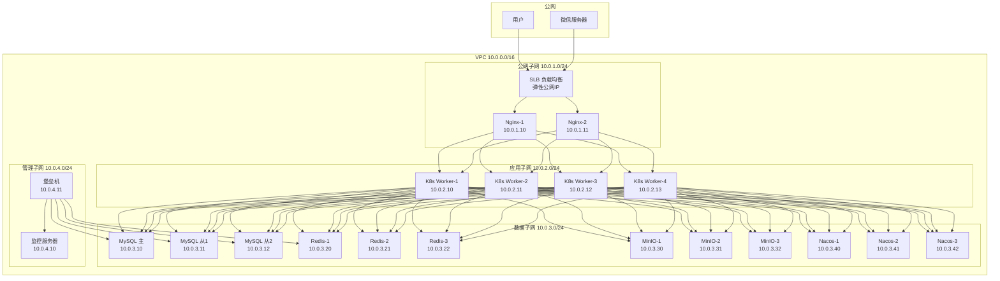
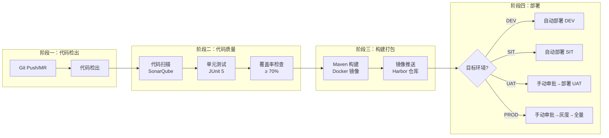
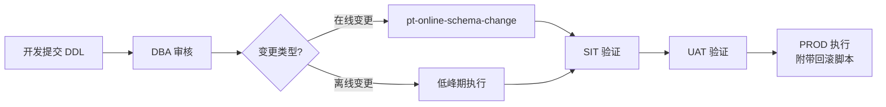
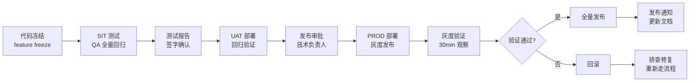

---
AIGC:
    Label: "1"
    ContentProducer: 001191110102MACQD9K64018705
    ProduceID: 59831912238739_0/project_7654537080038572324-files/大雁养老_部署与运维方案.md
    ReservedCode1: ""
    ContentPropagator: 001191110102MACQD9K64028705
    PropagateID: 59831912238739#1785762022091
    ReservedCode2: ""
---
# 大雁养老 - 部署与运维方案

## 一、环境规划

### 1.1 环境清单

| 环境 | 用途 | 域名 | 数据库 | 说明 |
|------|------|------|--------|------|
| DEV（开发环境） | 日常开发调试 | dev-api.dayanpeng.com | MySQL 单节点 | 开发人员自测，数据可随时重置 |
| SIT（系统集成测试环境） | 功能测试/集成测试 | sit-api.dayanpeng.com | MySQL 单节点 | QA 测试，数据定期从生产脱敏同步 |
| UAT（用户验收测试环境） | 上线前验证 | uat-api.dayanpeng.com | MySQL 主从（与生产同配置） | 与生产环境配置一致，连接生产从库读 |
| PROD（生产环境） | 正式对外服务 | api.dayanpeng.com | MySQL 主从 + Redis Cluster | 正式环境，严格变更管控 |

**环境访问地址**：

| 端 | DEV | SIT | UAT | PROD |
|----|-----|-----|-----|------|
| Admin | dev-admin.dayanpeng.com | sit-admin.dayanpeng.com | uat-admin.dayanpeng.com | admin.dayanpeng.com |
| Channel | dev-channel.dayanpeng.com | sit-channel.dayanpeng.com | uat-channel.dayanpeng.com | channel.dayanpeng.com |
| Supplier | dev-supplier.dayanpeng.com | sit-supplier.dayanpeng.com | uat-supplier.dayanpeng.com | supplier.dayanpeng.com |
| Distributor | dev-distributor.dayanpeng.com | sit-distributor.dayanpeng.com | uat-distributor.dayanpeng.com | distributor.dayanpeng.com |
| Agent（小程序） | 开发版小程序 | 体验版小程序 | 审核版小程序 | 正式版小程序 |
| Client（小程序） | 开发版小程序 | 体验版小程序 | 审核版小程序 | 正式版小程序 |

> **注**：Supplier（供应商端）/ Distributor（分销商端）前端暂不实现，后端启动模块已预留，最小部署 1 副本；此处域名在预留期内可暂不解析，待对应前端落地后启用。

### 1.2 服务器配置清单

#### 生产环境（PROD）

| 角色 | 规格 | 数量 | 用途 | 备注 |
|------|------|------|------|------|
| K8s Master | 4C8G 100G SSD | 3 | K8s 集群管理 | 高可用集群 |
| K8s Worker（应用） | 8C16G 200G SSD | 4 | 应用 Pod 运行 | Admin×2/Channel×2/Agent×3/Client×3/Supplier×1/Distributor×1 |
| K8s Worker（中间件） | 8C16G 200G SSD | 2 | 中间件 Pod | RocketMQ/SkyWalking/Nacos 集群 |
| MySQL 主库 | 8C32G 500G SSD | 1 | 主数据库 | 写操作 |
| MySQL 从库1 | 8C32G 500G SSD | 1 | 读数据库 | 读操作 + 备份 |
| MySQL 从库2 | 4C16G 500G SSD | 1 | 读数据库 | 读操作 + 报表 |
| Redis 主节点 | 4C8G 50G SSD | 3 | Redis Cluster | 数据分片 |
| Redis 从节点 | 4C8G 50G SSD | 3 | Redis Cluster | 主从复制 |
| MinIO | 4C8G 1T HDD | 3 | 文件存储 | 分布式部署 |
| 负载均衡 SLB | - | 1 | 流量分发 | HTTPS 终止 |
| 监控服务器 | 4C16G 500G SSD | 1 | Prometheus+Grafana+ELK | 监控+日志 |
| Nginx | 2C4G 50G SSD | 2 | 反向代理 | 高可用 keepalived |

#### 集成测试环境（SIT）

| 角色 | 规格 | 数量 | 用途 |
|------|------|------|------|
| 应用服务器 | 4C8G 200G SSD | 2 | 全部后端服务 |
| MySQL | 4C8G 200G SSD | 1 | 单节点数据库 |
| Redis | 2C4G 20G SSD | 1 | 单节点缓存 |
| Nginx | 2C4G 50G SSD | 1 | 反向代理 |

#### 开发环境（DEV）

| 角色 | 规格 | 数量 | 用途 |
|------|------|------|------|
| 应用服务器 | 4C8G 100G SSD | 1 | 全部后端服务 |
| MySQL | 2C4G 100G SSD | 1 | 单节点数据库 |
| Redis | 2C2G 10G SSD | 1 | 单节点缓存 |

### 1.3 网络架构



**安全组规则**：

| 规则 | 源 | 目标 | 端口 | 说明 |
|------|---|------|------|------|
| HTTPS 入站 | 0.0.0.0/0 | SLB | 443 | 公网 HTTPS |
| Nginx → K8s | Nginx 安全组 | 应用安全组 | 8080 | 应用转发 |
| 应用 → MySQL | 应用安全组 | 数据安全组 | 3306 | 数据库访问 |
| 应用 → Redis | 应用安全组 | 数据安全组 | 6379-6381 | Redis Cluster |
| MySQL 主从 | MySQL 主安全组 | MySQL 从安全组 | 3306 | 主从复制 |
| Redis Cluster | Redis 安全组内部 | Redis 安全组内部 | 16379 | 集群通信 |
| 应用 → Nacos | 应用安全组 | 数据安全组 | 8848/9848 | Nacos 配置/注册（8848 HTTP，9848 gRPC） |
| Nacos 集群内部 | Nacos 安全组内部 | Nacos 安全组内部 | 7848/8848 | Raft 选举 + 数据同步 |
| 堡垒机 → 全部 | 堡垒机安全组 | 所有安全组 | 22 | SSH 运维 |
| 监控采集 | 应用/数据安全组 | 监控安全组 | 9090/9100 | 指标采集 |

**SSL 证书**：

| 域名 | 证书类型 | 说明 |
|------|---------|------|
| *.dayanpeng.com | 通配符证书 | 覆盖所有子域名 |
| api.dayanpeng.com | 单域名证书 | API 接口专用 |
| 小程序域名 | 微信小程序证书 | 微信后台配置 |

---

## 二、容器化部署

### 2.1 Docker 镜像构建

#### 后端 Dockerfile

```dockerfile
# ========== 构建阶段 ==========
FROM maven:3.9-eclipse-temurin-17 AS builder

# 通过 --build-arg MODULE=<module> 指定构建模块，支持六端独立构建
# 默认 dayan-admin，CI 中传入 admin/channel/supplier/distributor/agent/client/dayan-job
ARG MODULE=dayan-admin

WORKDIR /build

# 先复制 pom 文件，利用 Docker 缓存加速依赖下载
COPY pom.xml .
COPY dayan-common/pom.xml dayan-common/
COPY dayan-modules/pom.xml dayan-modules/
COPY dayan-gateway/pom.xml dayan-gateway/
COPY dayan-admin/pom.xml dayan-admin/
COPY dayan-channel/pom.xml dayan-channel/
COPY dayan-supplier/pom.xml dayan-supplier/
COPY dayan-distributor/pom.xml dayan-distributor/
COPY dayan-agent/pom.xml dayan-agent/
COPY dayan-client/pom.xml dayan-client/
COPY dayan-job/pom.xml dayan-job/

RUN mvn dependency:go-offline -B

# 复制源码并构建（MODULE 由 --build-arg 注入，默认 dayan-admin）
COPY . .
RUN mvn clean package -DskipTests -pl ${MODULE} -am -Pprod

# ========== 运行阶段 ==========
FROM eclipse-temurin:17-jre-alpine

LABEL maintainer="dayan-dev@dayanpeng.com"
LABEL version="1.0.0"

# 时区设置
ENV TZ=Asia/Shanghai
RUN ln -snf /usr/share/zoneinfo/$TZ /etc/localtime && echo $TZ > /etc/timezone

# 创建应用用户
RUN addgroup -S dayan && adduser -S dayan -G dayan

WORKDIR /app

# 从构建阶段复制 jar（路径与 MODULE 对应）
COPY --from=builder /build/${MODULE}/target/${MODULE}.jar app.jar

# JVM 参数（可通过环境变量覆盖）
# SkyWalking agent（可选）：jar 由 K8s init-container 拉取并挂载至 /data/skywalking-agent.jar，
# 生产环境通过 JAVA_TOOL_OPTIONS 注入 -javaagent:/data/skywalking-agent.jar（详见 §2.3）；
# DEV/SIT 未挂载时不应设置该变量，避免 JVM 因找不到 agent 启动失败。
ENV JAVA_OPTS="-Xms512m -Xmx1024m \
  -XX:+UseG1GC \
  -XX:MaxGCPauseMillis=200 \
  -XX:+HeapDumpOnOutOfMemoryError \
  -XX:HeapDumpPath=/app/logs/heapdump.hprof \
  -Djava.security.egd=file:/dev/./urandom"
# -javaagent:/data/skywalking-agent.jar 不写入 JAVA_OPTS，改由运行时环境变量 JAVA_TOOL_OPTIONS 注入

EXPOSE 8080

USER dayan

# 健康检查
HEALTHCHECK --interval=30s --timeout=10s --retries=3 \
  CMD wget -qO- http://localhost:8080/actuator/health || exit 1

ENTRYPOINT ["sh", "-c", "java $JAVA_OPTS -Dspring.profiles.active=${SPRING_PROFILES_ACTIVE:-prod} -jar app.jar"]
```

#### 前端 Dockerfile（Admin/Channel）

```dockerfile
# ========== 构建阶段 ==========
FROM node:18-alpine AS builder

WORKDIR /build

COPY package.json pnpm-lock.yaml ./
RUN npm install -g pnpm && pnpm install --frozen-lockfile

COPY . .
RUN pnpm build

# ========== 运行阶段 ==========
FROM nginx:1.25-alpine

LABEL maintainer="dayan-dev@dayanpeng.com"

# 复制构建产物
COPY --from=builder /build/dist /usr/share/nginx/html

# Nginx 配置
COPY nginx.conf /etc/nginx/conf.d/default.conf

EXPOSE 80

HEALTHCHECK --interval=30s --timeout=5s --retries=3 \
  CMD wget -qO- http://localhost:80/ || exit 1

CMD ["nginx", "-g", "daemon off;"]
```

**前端 Nginx 配置**：

```nginx
server {
    listen 80;
    server_name _;
    root /usr/share/nginx/html;
    index index.html;

    # Gzip 压缩
    gzip on;
    gzip_types text/plain text/css application/json application/javascript;
    gzip_min_length 1024;

    # 静态资源缓存
    location /assets/ {
        expires 30d;
        add_header Cache-Control "public, immutable";
    }

    # API 代理
    location /api/ {
        proxy_pass http://dayan-backend:8080/api/;
        proxy_set_header Host $host;
        proxy_set_header X-Real-IP $remote_addr;
        proxy_set_header X-Forwarded-For $proxy_add_x_forwarded_for;
        proxy_set_header X-Trace-Id $request_id;
    }

    # SPA 路由兜底
    location / {
        try_files $uri $uri/ /index.html;
    }
}
```

### 2.2 docker-compose 编排（开发/集成测试环境）

```yaml
# docker-compose-sit.yml
# 注：本文件为简化示例，仅列出 dayan-admin + 中间件；channel/agent/client/gateway/supplier/distributor/job 服务的 compose 定义结构相同，按需追加（完整部署以 §2.3 K8s 为准）
version: '3.8'

services:
  # ========== 后端服务 ==========
  dayan-admin:
    build:
      context: .
      dockerfile: Dockerfile
      target: runtime
      args:
        MODULE: dayan-admin
    image: dayan-admin:latest
    container_name: dayan-admin
    ports:
      - "8080:8080"
    environment:
      - SPRING_PROFILES_ACTIVE=sit
      - MYSQL_HOST=mysql
      - REDIS_HOST=redis
      - JAVA_OPTS=-Xms256m -Xmx512m
    depends_on:
      mysql:
        condition: service_healthy
      redis:
        condition: service_healthy
    networks:
      - dayan-net
    volumes:
      - ./logs/admin:/app/logs

  # ========== MySQL ==========
  mysql:
    image: mysql:8.0
    container_name: dayan-mysql
    ports:
      - "3306:3306"
    environment:
      - MYSQL_ROOT_PASSWORD=${MYSQL_ROOT_PASSWORD}
      - MYSQL_DATABASE=dayan_platform
      - MYSQL_USER=dayan
      - MYSQL_PASSWORD=${MYSQL_PASSWORD}
    volumes:
      - mysql-data:/var/lib/mysql
      - ./sql/init.sql:/docker-entrypoint-initdb.d/init.sql
    command:
      - --character-set-server=utf8mb4
      - --collation-server=utf8mb4_unicode_ci
      - --innodb-buffer-pool-size=1G
      - --max-connections=200
      - --slow-query-log=1
      - --long-query-time=1
    healthcheck:
      test: ["CMD", "mysqladmin", "ping", "-h", "localhost"]
      interval: 10s
      timeout: 5s
      retries: 5
    networks:
      - dayan-net

  # ========== Redis ==========
  redis:
    image: redis:7.2-alpine
    container_name: dayan-redis
    ports:
      - "6379:6379"
    command: redis-server --requirepass ${REDIS_PASSWORD} --maxmemory 1gb --maxmemory-policy allkeys-lru
    volumes:
      - redis-data:/data
    healthcheck:
      test: ["CMD", "redis-cli", "-a", "${REDIS_PASSWORD}", "ping"]
      interval: 10s
      timeout: 5s
      retries: 5
    networks:
      - dayan-net

  # ========== RocketMQ ==========
  rocketmq-namesrv:
    image: apache/rocketmq:5.1.4
    container_name: dayan-rmq-namesrv
    ports:
      - "9876:9876"
    command: sh mqnamesrv
    environment:
      - JAVA_OPT_EXT=-Xms256m -Xmx256m
    networks:
      - dayan-net

  rocketmq-broker:
    image: apache/rocketmq:5.1.4
    container_name: dayan-rmq-broker
    ports:
      - "10911:10911"
    command: sh mqbroker -n rocketmq-namesrv:9876 --enable-proxy
    environment:
      - JAVA_OPT_EXT=-Xms256m -Xmx512m
    depends_on:
      - rocketmq-namesrv
    networks:
      - dayan-net

  # ========== MinIO ==========
  minio:
    image: minio/minio:latest
    container_name: dayan-minio
    ports:
      - "9000:9000"
      - "9001:9001"
    environment:
      - MINIO_ROOT_USER=${MINIO_USER}
      - MINIO_ROOT_PASSWORD=${MINIO_PASSWORD}
    command: server /data --console-address ":9001"
    volumes:
      - minio-data:/data
    networks:
      - dayan-net

  # ========== Nginx ==========
  nginx:
    image: nginx:1.25-alpine
    container_name: dayan-nginx
    ports:
      - "80:80"
      - "443:443"
    volumes:
      - ./nginx/nginx.conf:/etc/nginx/nginx.conf
      - ./nginx/conf.d:/etc/nginx/conf.d
      - ./nginx/ssl:/etc/nginx/ssl
    depends_on:
      - dayan-admin
    networks:
      - dayan-net

volumes:
  mysql-data:
  redis-data:
  minio-data:

networks:
  dayan-net:
    driver: bridge
```

### 2.3 Kubernetes 部署（生产环境）

#### Deployment 模板

```yaml
# k8s/dayan-admin-deployment.yaml
apiVersion: apps/v1
kind: Deployment
metadata:
  name: dayan-admin
  namespace: dayan-prod
  labels:
    app: dayan-admin
    version: v1.1.0   # 示例 tag，实际用 ${CI_COMMIT_SHORT_SHA}
spec:
  replicas: 2
  strategy:
    type: RollingUpdate
    rollingUpdate:
      maxSurge: 1
      maxUnavailable: 0
  selector:
    matchLabels:
      app: dayan-admin
  template:
    metadata:
      labels:
        app: dayan-admin
      annotations:
        prometheus.io/scrape: "true"
        prometheus.io/port: "8080"
        prometheus.io/path: "/actuator/prometheus"
    spec:
      containers:
        - name: dayan-admin
          image: registry.dayanpeng.com/dayan-admin:v1.1.0   # 示例 tag，实际用 ${CI_COMMIT_SHORT_SHA}
          ports:
            - containerPort: 8080
          env:
            - name: SPRING_PROFILES_ACTIVE
              value: "prod"
            - name: JAVA_OPTS
              value: "-Xms512m -Xmx1024m -XX:+UseG1GC"
            - name: MYSQL_HOST
              valueFrom:
                secretKeyRef:
                  name: dayan-db-secret
                  key: host
            - name: MYSQL_PASSWORD
              valueFrom:
                secretKeyRef:
                  name: dayan-db-secret
                  key: password
            - name: REDIS_HOST
              valueFrom:
                configMapKeyRef:
                  name: dayan-config
                  key: redis-host
          resources:
            requests:
              cpu: "500m"
              memory: "1Gi"
            limits:
              cpu: "2000m"
              memory: "2Gi"
          livenessProbe:
            httpGet:
              path: /actuator/health/liveness
              port: 8080
            initialDelaySeconds: 60
            periodSeconds: 30
            timeoutSeconds: 10
            failureThreshold: 3
          readinessProbe:
            httpGet:
              path: /actuator/health/readiness
              port: 8080
            initialDelaySeconds: 30
            periodSeconds: 10
            timeoutSeconds: 5
            failureThreshold: 3
          volumeMounts:
            - name: logs
              mountPath: /app/logs
      volumes:
        - name: logs
          emptyDir: {}
      imagePullSecrets:
        - name: registry-secret
```

#### Service 模板

```yaml
# k8s/dayan-admin-service.yaml
apiVersion: v1
kind: Service
metadata:
  name: dayan-admin
  namespace: dayan-prod
  labels:
    app: dayan-admin
spec:
  type: ClusterIP
  ports:
    - port: 8080
      targetPort: 8080
      protocol: TCP
  selector:
    app: dayan-admin
```

#### Ingress 模板

```yaml
# k8s/ingress.yaml
apiVersion: networking.k8s.io/v1
kind: Ingress
metadata:
  name: dayan-ingress
  namespace: dayan-prod
  annotations:
    nginx.ingress.kubernetes.io/ssl-redirect: "true"
    nginx.ingress.kubernetes.io/proxy-body-size: "50m"
    nginx.ingress.kubernetes.io/proxy-read-timeout: "60"
    nginx.ingress.kubernetes.io/proxy-send-timeout: "60"
    cert-manager.io/cluster-issuer: "letsencrypt-prod"
spec:
  ingressClassName: nginx
  tls:
    - hosts:
        - admin.dayanpeng.com
        - channel.dayanpeng.com
        - supplier.dayanpeng.com      # 预留域名，前端未实现前可暂不解析
        - distributor.dayanpeng.com   # 预留域名，前端未实现前可暂不解析
        - api.dayanpeng.com
      secretName: dayan-tls
  rules:
    - host: admin.dayanpeng.com
      http:
        paths:
          - path: /
            pathType: Prefix
            backend:
              service:
                name: dayan-admin-web
                port:
                  number: 80
    - host: channel.dayanpeng.com
      http:
        paths:
          - path: /
            pathType: Prefix
            backend:
              service:
                name: dayan-channel-web
                port:
                  number: 80
    - host: api.dayanpeng.com
      http:
        paths:
          - path: /admin
            pathType: Prefix
            backend:
              service:
                name: dayan-admin
                port:
                  number: 8080
          - path: /channel
            pathType: Prefix
            backend:
              service:
                name: dayan-channel
                port:
                  number: 8080
          - path: /supplier
            pathType: Prefix
            backend:
              service:
                name: dayan-supplier       # 前端暂不实现，后端预留，最小部署 1 副本
                port:
                  number: 8080
          - path: /distributor
            pathType: Prefix
            backend:
              service:
                name: dayan-distributor    # 前端暂不实现，后端预留，最小部署 1 副本
                port:
                  number: 8080
          - path: /agent
            pathType: Prefix
            backend:
              service:
                name: dayan-agent
                port:
                  number: 8080
          - path: /client
            pathType: Prefix
            backend:
              service:
                name: dayan-client
                port:
                  number: 8080
```

#### HPA 自动扩缩容

```yaml
# k8s/dayan-agent-hpa.yaml
apiVersion: autoscaling/v2
kind: HorizontalPodAutoscaler
metadata:
  name: dayan-agent-hpa
  namespace: dayan-prod
spec:
  scaleTargetRef:
    apiVersion: apps/v1
    kind: Deployment
    name: dayan-agent
  minReplicas: 3
  maxReplicas: 8
  metrics:
    - type: Resource
      resource:
        name: cpu
        target:
          type: Utilization
          averageUtilization: 70
    - type: Resource
      resource:
        name: memory
        target:
          type: Utilization
          averageUtilization: 80
```

#### CronJob 模板（dayan-job 定时任务）

> dayan-job 为独立启动模块（与六端并列），承载对账、权益过期、提醒推送等定时任务，使用 K8s CronJob 部署，**不常驻 Pod**，到点触发后起 Pod 执行完退出。生产环境发布时先 `suspend: true` 再更新镜像，避免发布窗口内误触发旧版本。

```yaml
# k8s/dayan-job-cronjob.yaml
apiVersion: batch/v1
kind: CronJob
metadata:
  name: dayan-job
  namespace: dayan-prod
spec:
  schedule: "0 3 * * *"           # 默认每天 03:00（具体由业务侧 @XxlScheduled 注解决定，此处仅兜底）
  concurrencyPolicy: Forbid        # 禁止并发，避免上次未跑完又起一次
  successfulJobsHistoryLimit: 3
  failedJobsHistoryLimit: 5
  jobTemplate:
    spec:
      backoffLimit: 2              # 失败重试 2 次
      template:
        spec:
          restartPolicy: Never
          containers:
            - name: job
              image: registry.dayanpeng.com/dayan-job:v1.1.0   # 示例 tag，实际用 ${CI_COMMIT_SHORT_SHA}
              args: ["--job.profile=prod"]   # 由启动参数选择执行的任务集
              env:
                - name: SPRING_PROFILES_ACTIVE
                  value: "prod"
                - name: NACOS_SERVER_ADDR
                  valueFrom:
                    configMapKeyRef:
                      name: dayan-config
                      key: nacos-server-addr
                - name: MYSQL_PASSWORD
                  valueFrom:
                    secretKeyRef:
                      name: dayan-db-secret
                      key: password
              resources:
                requests: { cpu: "500m", memory: "1Gi" }
                limits:   { cpu: "2000m", memory: "2Gi" }
          imagePullSecrets:
            - name: registry-secret
```

#### SkyWalking 部署说明（OAP Server + UI + Java Agent）

> SkyWalking 在 §1.2 中间件 Pod 容量清单中已预留，并在 doc03（系统架构设计）§3.1/§4.3 中声明为必选 APM 中间件，此处补充其部署与接入方式，避免容量已分配却无部署 manifests 的缺口。

- **OAP Server + UI**：部署为独立 StatefulSet（见 `skywalking-oap` Manifest，本节略，不展开 YAML），UI 经 Ingress 暴露 `skywalking.dayanpeng.com`（内网/运维侧访问）。OAP 使用 Elasticsearch 作为后端存储（可复用监控服务器或独立部署）。
- **Java Agent 注入**：agent jar **不打进镜像**，由各业务 Deployment 的 **init-container** 从 OAP 发行版或对象存储拉取 `skywalking-agent.jar`，挂载至 `/data/skywalking-agent.jar`；业务容器启动时通过环境变量 `JAVA_TOOL_OPTIONS="-javaagent:/data/skywalking-agent.jar -Dskywalking.agent.service_name=dayan-<module> -Dskywalking.collector.backend_service=skywalking-oap.dayan-prod:11800"` 注入（Dockerfile 中已预留说明，见 §2.1）。
- **后端服务名约定**：`dayan-admin` / `dayan-channel` / `dayan-supplier` / `dayan-distributor` / `dayan-agent` / `dayan-client` / `dayan-job`，与镜像/Deployment 命名一致，便于在 SkyWalking 拓扑图按服务聚合。
- **DEV/SIT**：可不部署独立 SkyWalking 集群，agent 指向 SIT 共享 OAP 或直接关闭（不注入 `JAVA_TOOL_OPTIONS`），避免本地缺 agent jar 导致启动失败。

### 2.4 配置分层约定

> 平台配置按"何时生效、如何变更"划分为三层，职责互不交叉，避免把所有配置塞进 ConfigMap 或全部塞进数据库的常见误区。

#### 三层配置职责对照

| 层级 | 存储载体 | 生效时机 | 变更方式 | 典型内容 |
|------|---------|---------|---------|---------|
| **① 基础设施配置层（部署期）** | K8s ConfigMap（非敏感）+ K8s Secret（敏感）+ 环境变量 | Pod 启动时注入 | 修改 ConfigMap/Secret 后**重启 Pod** | `REDIS_HOST`、`NACOS_SERVER_ADDR`、`MYSQL_PASSWORD`、`MINIO_ENDPOINT`、镜像 tag、JVM `JAVA_OPTS` |
| **② 框架/中间件配置层（启动期）** | Spring `application.yml` / `bootstrap.yml`（随镜像打包） | 应用启动加载 | 修改后**重新构建镜像** | MyBatis-Plus 逻辑删除字段、Jackson 序列化策略、HikariCP 池大小、Spring Profile 路由 |
| **③ 业务运行时配置层（运行期热更新）** | `system_config` 表（多级 global→organ→user）+ Nacos 配置中心 | 运行期**热更新，无需重启** | 后台改 `system_config` / 改 Nacos，经 Nacos/Redis pub-sub 推送 | 数据源切换、Sentinel 限流规则、订单自动取消时长、权益开关、短信模板开关 |

#### 各层变更与回滚路径

| 层级 | 变更流程 | 回滚路径 |
|------|---------|---------|
| 基础设施层 | 运维改 ConfigMap/Secret → `kubectl rollout restart` 触发滚动重启 → readiness 通过后切流 | ConfigMap/Secret 历史版本（或 GitOps 仓库回退）→ 再次重启 |
| 框架/中间件层 | 开发改 `application.yml` → 走 CI 重新构建镜像 → 灰度发布 | 回退到上一个稳定镜像 tag |
| 业务运行时层 | 后台/接口改 `system_config` → Nacos/Redis pub-sub 推送热更新 → 业务即时生效 | `system_config_log` 审计表回放旧值 + Nacos 历史版本回退 |

> **关键约定**：敏感凭证（`MYSQL_PASSWORD`、第三方密钥）一律进 K8s Secret + Nacos 加密配置，**禁止**写入 `system_config` 明文或 `application.yml`；业务可调参数（超时、开关、阈值）一律进 `system_config`，**禁止**为调一个业务参数而重启 Pod。

### 2.5 中间件部署：Nacos 配置中心 + Sentinel 规则中心

> Nacos 同时承担「配置中心」与「Sentinel 限流规则中心」两个角色，是业务运行时配置层（第③层）的承载组件，需作为核心中间件纳入部署。

#### Nacos 集群部署（生产环境）

| 项 | 规格 | 说明 |
|------|------|------|
| 版本 | Nacos 2.3.x | 与 Spring Cloud Alibaba 2023.x 对齐 |
| 节点数 | 3 节点集群 | 奇数节点，Raft 选举，容忍 1 节点宕机 |
| 部署形态 | K8s StatefulSet | 持久化卷挂载，稳定网络标识 |
| 规格 | 2C4G 50G SSD / 节点 | 配置量小，IO 要求低 |
| 元数据存储 | 外部 MySQL（复用平台从库2） | `nacos_config` schema，不与业务库混用 |
| 前置依赖 | MySQL、SLB（VIP `nacos.dayanpeng.com:8848`） | 客户端通过 VIP 连集群 |

**部署要点**：

```yaml
# 关键配置（nacos StatefulSet 片段，省略非关键字段）
spec:
  replicas: 3                      # 3 节点集群
  serviceName: nacos-headless
  template:
    spec:
      containers:
        - name: nacos
          image: nacos/nacos-server:v2.3.2
          env:
            - name: MODE
              value: "cluster"
            - name: NACOS_SERVERS
              value: "nacos-0.nacos-headless:8848 nacos-1.nacos-headless:8848 nacos-2.nacos-headless:8848"
            - name: SPRING_DATASOURCE_PLATFORM
              value: "mysql"
            - name: MYSQL_SERVICE_HOST        # 来自 Secret
              valueFrom: { secretKeyRef: { name: nacos-db-secret, key: host } }
            - name: MYSQL_SERVICE_PASSWORD    # 来自 Secret
              valueFrom: { secretKeyRef: { name: nacos-db-secret, key: password } }
          resources:
            requests: { cpu: "500m", memory: "1Gi" }
            limits:   { cpu: "2000m", memory: "4Gi" }
          livenessProbe:
            httpGet: { path: /nacos/v1/console/health/liveness, port: 8848 }
            initialDelaySeconds: 60
          readinessProbe:
            httpGet: { path: /nacos/v1/console/health/readiness, port: 8848 }
            initialDelaySeconds: 30
```

**Nacos 配置命名空间与 dataId 约定**：

| Namespace | 用途 | 示例 dataId |
|-----------|------|-------------|
| `dayan-dev` / `dayan-sit` / `dayan-uat` / `dayan-prod` | 四环境隔离 | - |
| 分组 `DATASOURCE` | 数据源切换（主从切换时下发新地址） | `dayan-datasource.yaml` |
| 分组 `SENTINEL` | Sentinel 限流/熔断规则（持久化） | `dayan-sentinel-flow.json`、`dayan-sentinel-degrade.json` |
| 分组 `COMMON` | 通用业务参数镜像（system_config 的兜底默认值） | `dayan-common.yaml` |

> SIT/UAT 环境可降级为 Nacos 单节点；DEV 环境可使用嵌入式 Nacos 或单节点。

#### 应用接入 Nacos

```yaml
# bootstrap.yml（随镜像打包，属框架/中间件配置层）
spring:
  application:
    name: dayan-admin
  profiles:
    active: ${SPRING_PROFILES_ACTIVE:prod}   # 由环境变量注入
  cloud:
    nacos:
      config:
        server-addr: ${NACOS_SERVER_ADDR}    # 由 ConfigMap 注入
        namespace: dayan-${spring.profiles.active}
        group: COMMON
        file-extension: yaml
        # 加密配置走 Nacos 加密插件，不落明文
      discovery:
        server-addr: ${NACOS_SERVER_ADDR}
    sentinel:
      transport:
        dashboard: ${SENTINEL_DASHBOARD}
      datasource:                            # Sentinel 规则持久化到 Nacos
        flow:
          nacos:
            server-addr: ${NACOS_SERVER_ADDR}
            dataId: dayan-sentinel-flow.json
            groupId: SENTINEL
            ruleType: flow
```

---

## 三、CI/CD 流水线

### 3.1 流水线设计



#### GitLab CI 配置

```yaml
# .gitlab-ci.yml
stages:
  - lint
  - test
  - build
  - deploy

variables:
  MAVEN_OPTS: "-Dmaven.repo.local=$CI_PROJECT_DIR/.m2/repository"
  DOCKER_REGISTRY: "registry.dayanpeng.com"

cache:
  key: "${CI_COMMIT_REF_SLUG}"
  paths:
    - .m2/repository

# 代码扫描
sonarqube-check:
  stage: lint
  image: maven:3.9-eclipse-temurin-17
  script:
    - mvn sonar:sonar -Dsonar.host.url=$SONAR_HOST -Dsonar.login=$SONAR_TOKEN
  only:
    - merge_requests
    - develop
    - release

# 单元测试
unit-test:
  stage: test
  image: maven:3.9-eclipse-temurin-17
  script:
    - mvn test -pl dayan-modules -am
    - mvn jacoco:report
  coverage: '/Total.*?([0-9]{1,3})%/'
  artifacts:
    reports:
      junit: "**/target/surefire-reports/TEST-*.xml"
      coverage_report:
        coverage_format: cobertura
        path: "**/target/site/jacoco/jacoco.xml"

# 构建 Docker 镜像（六端 + dayan-job 定时任务）
build-image:
  stage: build
  image: docker:24-dind
  services:
    - docker:24-dind
  script:
    - docker login -u $DOCKER_USER -p $DOCKER_PASS $DOCKER_REGISTRY
    # 六端独立镜像：admin/channel/supplier/distributor/agent/client（supplier/distributor 前端暂不实现，后端预留，最小部署 1 副本）
    - |
      for module in admin channel supplier distributor agent client; do
        docker build \
          --build-arg MODULE=dayan-$module \
          -t $DOCKER_REGISTRY/dayan-$module:${CI_COMMIT_SHORT_SHA} \
          -t $DOCKER_REGISTRY/dayan-$module:latest \
          .
        docker push $DOCKER_REGISTRY/dayan-$module:${CI_COMMIT_SHORT_SHA}
        docker push $DOCKER_REGISTRY/dayan-$module:latest
      done
    # dayan-job 独立镜像（定时任务，CronJob 部署）
    - docker build --build-arg MODULE=dayan-job \
        -t $DOCKER_REGISTRY/dayan-job:${CI_COMMIT_SHORT_SHA} \
        -t $DOCKER_REGISTRY/dayan-job:latest .
    - docker push $DOCKER_REGISTRY/dayan-job:${CI_COMMIT_SHORT_SHA}
    - docker push $DOCKER_REGISTRY/dayan-job:latest
  only:
    - develop
    - release
    - tags

# 部署到集成测试环境（SIT）
deploy-sit:
  stage: deploy
  image: bitnami/kubectl:latest
  script:
    - kubectl config use-context sit
    - |
      for module in admin channel supplier distributor agent client; do
        kubectl set image deployment/dayan-$module \
          dayan-$module=$DOCKER_REGISTRY/dayan-$module:${CI_COMMIT_SHORT_SHA} \
          -n dayan-sit
        kubectl rollout status deployment/dayan-$module -n dayan-sit --timeout=120s
      done
    # dayan-job 为 CronJob，更新 job-template 中的镜像
    - kubectl set image cronjob/dayan-job \
        job=$DOCKER_REGISTRY/dayan-job:${CI_COMMIT_SHORT_SHA} -n dayan-sit
  environment:
    name: sit
  only:
    - develop

# 部署到用户验收测试环境（UAT，需审批）
deploy-uat:
  stage: deploy
  image: bitnami/kubectl:latest
  script:
    - kubectl config use-context uat
    - |
      for module in admin channel supplier distributor agent client; do
        kubectl set image deployment/dayan-$module \
          dayan-$module=$DOCKER_REGISTRY/dayan-$module:${CI_COMMIT_SHORT_SHA} \
          -n dayan-uat
        kubectl rollout status deployment/dayan-$module -n dayan-uat --timeout=120s
      done
    - kubectl set image cronjob/dayan-job \
        job=$DOCKER_REGISTRY/dayan-job:${CI_COMMIT_SHORT_SHA} -n dayan-uat
  environment:
    name: uat
  when: manual
  only:
    - release

# 部署到生产环境（需审批 + 灰度）
deploy-prod:
  stage: deploy
  image: bitnami/kubectl:latest
  script:
    - kubectl config use-context prod
    # 灰度发布：先更新 1 个实例
    - |
      for module in admin channel supplier distributor agent client; do
        kubectl set image deployment/dayan-$module \
          dayan-$module=$DOCKER_REGISTRY/dayan-$module:${CI_COMMIT_SHORT_SHA} \
          -n dayan-prod
        kubectl rollout status deployment/dayan-$module -n dayan-prod --timeout=180s
      done
    # dayan-job：生产环境暂停 CronJob 再更新，避免发布过程中误触发旧版本任务
    - kubectl patch cronjob dayan-job -n dayan-prod -p '{"spec":{"suspend":true}}'
    - kubectl set image cronjob/dayan-job \
        job=$DOCKER_REGISTRY/dayan-job:${CI_COMMIT_SHORT_SHA} -n dayan-prod
    - kubectl patch cronjob dayan-job -n dayan-prod -p '{"spec":{"suspend":false}}'
    # 健康检查通过后确认
    - echo "生产部署完成，请验证业务功能"
  environment:
    name: prod
  when: manual
  only:
    - tags
```

### 3.2 分支与部署映射

| 分支 | 环境 | 触发方式 | 说明 |
|------|------|---------|------|
| `feature/*` | DEV | MR 合并自动触发 | 功能开发分支 |
| `develop` | SIT | MR 合并自动触发 | 系统集成测试验证 |
| `release/*` | UAT → PROD | 手动触发 + Tag | release 分支先验证 UAT，通过后打 Tag 发 PROD |
| `hotfix/*` | SIT → PROD | 手动触发 + Tag | 紧急修复 |

**分支命名规范**：

```
feature/DA-101-add-equity-activate    # 功能分支（DA = 项目代号）
hotfix/DA-201-fix-payment-callback     # 紧急修复
release/v1.1.0                         # 发布分支
```

### 3.3 回滚策略

#### 快速回滚（K8s 原生）

```bash
# 查看部署历史
kubectl rollout history deployment/dayan-admin -n dayan-prod

# 回滚到上一版本
kubectl rollout undo deployment/dayan-admin -n dayan-prod

# 回滚到指定版本
kubectl rollout undo deployment/dayan-admin -n dayan-prod --to-revision=3

# 查看回滚状态
kubectl rollout status deployment/dayan-admin -n dayan-prod
```

#### 镜像回滚

```bash
# 回滚到指定镜像版本
kubectl set image deployment/dayan-admin \
  dayan-admin=registry.dayanpeng.com/dayan-admin:上一个稳定版本SHA \
  -n dayan-prod
```

#### 数据库回滚

| 场景 | 策略 | 说明 |
|------|------|------|
| DDL 变更导致异常 | 执行反向 DDL | 每次 DDL 必须附带回滚脚本 |
| 数据异常 | 从备份恢复 | 使用最近的全量备份 + 增量 binlog |
| 配置错误 | 回滚配置 | 基础设施配置（连接信息/凭证）回滚走 ConfigMap/Secret 版本（变更后重启 Pod）；业务运行时配置回滚走 system_config_log 审计表 + Nacos 历史版本 |

---

## 四、数据库运维

### 4.1 备份策略

#### 备份方案

| 备份类型 | 工具 | 频率 | 保留周期 | 存储位置 |
|---------|------|------|---------|---------|
| 全量备份 | mysqldump / xtrabackup | 每日 02:00 | 30 天 | OSS 备份桶 |
| 增量备份（binlog） | mysqlbinlog | 实时 | 7 天 | OSS 备份桶 |
| 逻辑备份 | mysqldump 单表 | 每周日 03:00 | 90 天 | OSS 备份桶 |

#### 备份脚本

```bash
#!/bin/bash
# backup-daily.sh - 每日全量备份

BACKUP_DIR="/backup/mysql"
DATE=$(date +%Y%m%d_%H%M%S)
RETENTION_DAYS=30

# XtraBackup 全量备份
xtrabackup --backup \
  --host=${MYSQL_HOST} \
  --port=3306 \
  --user=${BACKUP_USER} \
  --password=${BACKUP_PASSWORD} \
  --target-dir=${BACKUP_DIR}/full_${DATE}

# 压缩
tar -czf ${BACKUP_DIR}/full_${DATE}.tar.gz ${BACKUP_DIR}/full_${DATE}

# 上传 OSS
ossutil cp ${BACKUP_DIR}/full_${DATE}.tar.gz oss://dayan-backup/mysql/full/

# 清理本地旧备份
find ${BACKUP_DIR} -name "full_*.tar.gz" -mtime +${RETENTION_DAYS} -delete

# 记录备份元数据
echo "{\"date\":\"${DATE}\",\"size\":\"$(du -sh ${BACKUP_DIR}/full_${DATE}.tar.gz | cut -f1)\",\"status\":\"success\"}" >> ${BACKUP_DIR}/backup.log
```

#### 备份验证

| 验证项 | 频率 | 方法 |
|--------|------|------|
| 备份完整性 | 每日 | 校验文件 MD5 |
| 备份可恢复性 | 每周 | 恢复到测试环境验证 |
| RPO 验证 | 每月 | 模拟故障场景，验证数据丢失量 |

### 4.2 数据迁移方案

#### Schema 变更流程



**DDL 变更规范**：

```sql
-- 每次 DDL 必须包含：
-- 1. 变更说明
-- 2. 影响范围评估
-- 3. 执行脚本
-- 4. 回滚脚本

-- ========== 变更说明 ==========
-- 需求: DA-101 权益域新增字段
-- 影响表: equity_depot
-- 预估耗时: < 10s（小表加字段）
-- 是否锁表: 否（MySQL 8.0 Instant DDL）

-- ========== 执行脚本 ==========
ALTER TABLE equity_depot 
ADD COLUMN outbound_time datetime DEFAULT NULL COMMENT '出库时间' AFTER logistics_no;

-- ========== 回滚脚本 ==========
ALTER TABLE equity_depot DROP COLUMN outbound_time;
```

#### 数据迁移工具

| 场景 | 工具 | 说明 |
|------|------|------|
| 结构迁移 | Flyway | 版本化 DDL 管理 |
| 数据同步 | DataX / Canal | 异构数据源同步 |
| 大表迁移 | pt-online-schema-change | 在线 DDL 不锁表 |
| 全量导入 | mysqldump + source | 小数据量场景 |

**Flyway 配置**：

```yaml
spring:
  flyway:
    enabled: true
    locations: classpath:db/migration
    baseline-on-migrate: true
    validate-on-migrate: true
    out-of-order: false
    table: flyway_schema_history
```

**迁移脚本命名规范**：

```
db/migration/
├── V1.0.0__init_schema.sql              # 初始化建表
├── V1.1.0__add_equity_outbound.sql      # 权益出库字段
├── V1.2.0__add_order_source.sql         # 订单来源字段
└── V1.3.0__add_butler_skill.sql         # 管家技能表
```

### 4.3 主从切换流程

#### 自动切换（MHA / Orchestrator）

```
故障检测 → 选举新主 → VIP漂移 → 应用重连 → 通知运维
   │              │            │           │           │
  3次心跳失败   延迟最低从库   < 5s       自动完成    钉钉+短信
```

#### 手动切换流程

```bash
# 1. 确认主从同步状态
mysql -h slave1 -e "SHOW SLAVE STATUS\G"
# 确认: Seconds_Behind_Master = 0

# 2. 停止应用写入（Sentinel 限流降级）
# 在 Sentinel Dashboard 设置全局降级规则

# 3. 等待从库追平
mysql -h slave1 -e "SELECT * FROM mysql.gtid_executed;"

# 4. 提升从库为主库
mysql -h slave1 -e "STOP SLAVE; RESET SLAVE ALL;"

# 5. VIP 漂移
/usr/sbin/arping -c 3 -A -I eth0 -s <new_master_vip> <gateway_ip>

# 6. 更新应用数据源配置
# 由 Nacos 配置中心主导：在 Nacos 修改 MySQL 连接地址（数据源切换属框架/中间件配置层，
# 通过 Nacos 下发后应用感知新地址；不通过 K8s ConfigMap，避免重启 Pod 扩大故障窗口）

# 7. 恢复应用流量
# Sentinel Dashboard 解除降级规则

# 8. 将原主库配置为新从库
mysql -h old_master -e "CHANGE MASTER TO MASTER_HOST='slave1'..."
```

---

## 五、监控告警

### 5.1 监控指标清单

#### 应用层指标

| 指标 | Prometheus 指标名 | 采集频率 | 说明 |
|------|-------------------|---------|------|
| 请求 QPS | `http_server_requests_seconds_count` | 15s | 按接口/方法统计 |
| 响应时间 P99 | `http_server_requests_seconds{quantile="0.99"}` | 15s | 关键链路监控 |
| 错误率 | `http_server_requests_seconds_count{status="5xx"}` | 15s | 5xx 错误占比 |
| 活跃线程数 | `tomcat_threads_current_threads` | 15s | 线程池健康 |
| JVM 堆内存 | `jvm_memory_used_bytes{area="heap"}` | 15s | 内存使用率 |
| GC 暂停时间 | `jvm_gc_pause_seconds` | 15s | GC 性能 |
| 数据库连接池 | `hikaricp_connections_active` | 15s | 连接池使用率 |

#### 中间件指标

| 指标 | 来源 | 告警阈值 |
|------|------|---------|
| Redis 内存使用 | `redis_memory_used_bytes` | > 85% maxmemory |
| Redis 命中率 | `redis_keyspace_hits_total / (hits + misses)` | < 90% |
| Redis 连接数 | `redis_connected_clients` | > 80% maxclients |
| MySQL 活跃连接 | `mysql_global_status_threads_connected` | > 80% max_connections |
| MySQL 慢查询 | `mysql_global_status_slow_queries` | 增长率 > 10/min |
| MySQL 主从延迟 | `mysql_slave_seconds_behind_master` | > 5s |
| RocketMQ 消费堆积 | `rocketmq_consumer_offset_diff` | > 10000 |
| MinIO 磁盘使用 | `minio_node_disk_used_bytes` | > 85% |
| Nacos 集群健康 | Nacos `/nacos/v1/console/health` + `nacos_monitor{...}` | 节点 down 或 leader 缺失 |
| Nacos 配置长轮询 | `nacos_config_long_polling_count` | > 阈值持续增长（疑似配置抖动） |
| Sentinel 限流触发 | `sentinel_block_exception_total` | 增长率突增（疑似限流规则误伤） |

#### 业务指标

| 指标 | 采集方式 | 说明 |
|------|---------|------|
| 权益激活量/分钟 | 自定义 Counter | 核心业务指标 |
| 订单创建量/分钟 | 自定义 Counter | 核心业务指标 |
| 服务会话创建量 | 自定义 Counter | 服务负载指标 |
| 短信发送量/成功率 | 自定义 Gauge | 通知渠道健康 |

### 5.2 告警规则与通知渠道

#### 告警分级

| 级别 | 定义 | 响应时间 | 通知方式 |
|------|------|---------|---------|
| P0 - 致命 | 核心服务不可用 | 5 分钟 | 电话 + 短信 + 钉钉 + 企微 |
| P1 - 严重 | 核心功能异常/性能严重劣化 | 15 分钟 | 短信 + 钉钉 + 企微 |
| P2 - 警告 | 非核心功能异常/资源预警 | 1 小时 | 钉钉 + 企微 |
| P3 - 提醒 | 需关注但不影响业务 | 下个工作日 | 钉钉 |

#### Prometheus 告警规则

```yaml
# alerting-rules.yml
groups:
  - name: dayan-platform-alerts
    rules:
      # P0: 服务宕机
      - alert: ServiceDown
        expr: up{job=~"dayan-.*"} == 0
        for: 30s
        labels:
          severity: P0
        annotations:
          summary: "{{ $labels.job }} 服务不可用"
          description: "实例 {{ $labels.instance }} 已宕机超过 30 秒"

      # P0: 数据库连接池耗尽
      - alert: DatabaseConnectionPoolExhausted
        expr: hikaricp_connections_pending{job=~"dayan-.*"} > 5
        for: 1m
        labels:
          severity: P0
        annotations:
          summary: "{{ $labels.job }} 数据库连接池即将耗尽"

      # P1: 接口超时
      - alert: HighLatency
        expr: histogram_quantile(0.99, rate(http_server_requests_seconds_bucket{job=~"dayan-.*"}[5m])) > 0.5
        for: 3m
        labels:
          severity: P1
        annotations:
          summary: "{{ $labels.uri }} P99 延迟超过 500ms"

      # P1: 错误率飙升
      - alert: HighErrorRate
        expr: |
          sum(rate(http_server_requests_seconds_count{status=~"5..",job=~"dayan-.*"}[5m]))
          /
          sum(rate(http_server_requests_seconds_count{job=~"dayan-.*"}[5m])) > 0.05
        for: 2m
        labels:
          severity: P1
        annotations:
          summary: "5xx 错误率超过 5%"

      # P1: 主从延迟
      - alert: MySQLReplicationLag
        expr: mysql_slave_seconds_behind_master > 5
        for: 1m
        labels:
          severity: P1
        annotations:
          summary: "MySQL 主从延迟超过 5 秒"

      # P2: Redis 内存告警
      - alert: RedisMemoryHigh
        expr: redis_memory_used_bytes / redis_memory_max_bytes > 0.85
        for: 5m
        labels:
          severity: P2
        annotations:
          summary: "Redis 内存使用超过 85%"

      # P2: 磁盘空间不足
      - alert: DiskSpaceLow
        expr: node_filesystem_avail_bytes / node_filesystem_size_bytes < 0.15
        for: 5m
        labels:
          severity: P2
        annotations:
          summary: "{{ $labels.mountpoint }} 磁盘剩余不足 15%"

      # P2: MQ 消费堆积
      - alert: MQConsumerLag
        expr: rocketmq_consumer_offset_diff > 10000
        for: 5m
        labels:
          severity: P2
        annotations:
          summary: "RocketMQ 消费堆积超过 10000"

      # P1: 对账不一致
      - alert: ReconciliationMismatch
        expr: finance_reconciliation_diff_count > 0
        for: 0m
        labels:
          severity: P1
        annotations:
          summary: "每日对账发现差异，差异笔数: {{ $value }}"

      # P1: 登录暴力破解
      - alert: BruteForceAttack
        expr: rate(auth_login_fail_total[5m]) > 20
        for: 0m
        labels:
          severity: P1
        annotations:
          summary: "检测到登录暴力破解，5分钟内失败超过 20 次"
```

#### 通知渠道配置

```yaml
# Alertmanager 配置
route:
  receiver: 'default'
  group_wait: 30s
  group_interval: 5m
  repeat_interval: 4h
  routes:
    - match:
        severity: P0
      receiver: 'p0-channel'
      repeat_interval: 15m
    - match:
        severity: P1
      receiver: 'p1-channel'
      repeat_interval: 1h

receivers:
  - name: 'p0-channel'
    webhook_configs:
      - url: 'https://oapi.dingtalk.com/robot/send?access_token=xxx'
    # 电话告警通过PagerDuty或阿里云语音
    pagerduty_configs:
      - service_key: 'xxx'

  - name: 'p1-channel'
    webhook_configs:
      - url: 'https://oapi.dingtalk.com/robot/send?access_token=xxx'

  - name: 'default'
    webhook_configs:
      - url: 'https://oapi.dingtalk.com/robot/send?access_token=xxx'
```

### 5.3 日志查询规范

#### 常用查询场景

| 场景 | Kibana 查询语句 | 说明 |
|------|---------------|------|
| 某次请求全链路 | `traceId:"abc123"` | 通过 trace_id 串联完整链路 |
| 某用户操作记录 | `bizData.clientCode:"CL00001" AND level:"INFO"` | 按业务编码查询 |
| 权益激活日志 | `message:"权益激活" AND level:"INFO"` | 关键字搜索 |
| 异常排查 | `level:"ERROR" AND service:"dayan-module-equity"` | 按模块筛选错误 |
| 慢接口 | `cost_time:>500 AND level:"INFO"` | 耗时超过 500ms |
| 安全审计 | `module:"AUTH" AND (action:"LOGIN" OR action:"LOGOUT")` | 认证相关 |
| 支付异常 | `service:"dayan-module-order" AND level:"ERROR" AND message:"支付"` | 订单支付异常 |
| 渠道数据隔离 | `channelCode:"CH00001" AND level:"WARN"` | 特定渠道告警 |

#### 日志保留策略

| 日志类型 | 保留周期 | 索引模式 |
|---------|---------|---------|
| 应用日志 (INFO) | 30 天 | dayan-log-yyyy.MM.dd |
| 应用日志 (ERROR) | 90 天 | dayan-error-yyyy.MM.dd |
| 审计日志 | 365 天 | dayan-audit-yyyy.MM.dd |
| 访问日志 | 30 天 | dayan-access-yyyy.MM.dd |
| 慢查询日志 | 90 天 | dayan-slowquery-yyyy.MM.dd |

---

## 六、安全运维

### 6.1 漏洞扫描与补丁管理

#### 扫描策略

| 扫描类型 | 工具 | 频率 | 范围 |
|---------|------|------|------|
| 依赖漏洞 | OWASP Dependency-Check | 每次构建 | Java 依赖（pom.xml） |
| 镜像漏洞 | Trivy | 每次镜像构建 | Docker 镜像层 |
| 代码漏洞 | SonarQube | 每次 MR | Java 源码 |
| 系统漏洞 | 云安全中心 | 每周 | 操作系统 |
| Web 漏洞 | AWVS / Xray | 每月 | 应用接口 |

#### 补丁管理流程

```
漏洞发现 → 评估严重性 → 制定修复方案 → SIT验证 → UAT验证 → PROD修复
    │            │              │
  自动化扫描   CVSS评分      升级依赖版本
               P0:24h内修复   添加WAF规则
               P1:7天内修复   配置安全加固
               P2:30天内修复
```

### 6.2 证书管理

| 证书类型 | 颁发机构 | 有效期 | 续期策略 |
|---------|---------|--------|---------|
| 域名 SSL | Let's Encrypt / 阿里云 | 1 年 | 到期前 30 天自动续期 |
| 小程序证书 | 微信 | 1 年 | 到期前 15 天提醒 |
| 内部 CA | 自建 | 2 年 | 到期前 60 天续期 |

**自动续期脚本**：

```bash
#!/bin/bash
# cert-renew.sh - SSL 证书自动续期检查

# 检查证书到期时间
EXPIRY_DATE=$(echo | openssl s_client -connect api.dayanpeng.com:443 -servername api.dayanpeng.com 2>/dev/null | openssl x509 -noout -enddate | cut -d= -f2)
EXPIRY_TIMESTAMP=$(date -d "$EXPIRY_DATE" +%s)
CURRENT_TIMESTAMP=$(date +%s)
DAYS_LEFT=$(( (EXPIRY_TIMESTAMP - CURRENT_TIMESTAMP) / 86400 ))

if [ $DAYS_LEFT -lt 30 ]; then
    # 触发 certbot 续期
    certbot renew --quiet
    # 重载 Nginx
    nginx -s reload
    # 发送通知
    echo "SSL 证书已续期，剩余天数: $DAYS_LEFT"
fi
```

### 6.3 安全审计流程

#### 审计内容

| 审计维度 | 审计内容 | 频率 |
|---------|---------|------|
| 账号审计 | 异常登录、权限变更、账号创建/删除 | 每日自动 + 每周人工 |
| 数据审计 | 敏感数据访问、数据导出、批量查询 | 实时告警 + 每周审查 |
| 操作审计 | 配置变更、数据修改、状态变更 | 全量记录，按需审查 |
| 接口审计 | 异常请求频率、签名验证失败、越权访问 | 实时告警 |
| 基础设施 | 服务器登录、安全组变更、密钥轮换 | 每月审查 |

#### 审计报告

| 报告类型 | 频率 | 接收人 | 内容 |
|---------|------|--------|------|
| 日报 | 每日 | 运维团队 | 异常登录、安全告警汇总 |
| 周报 | 每周一 | 技术负责人 | 漏洞扫描、权限变更、安全事件 |
| 月报 | 每月初 | CTO / 安全负责人 | 全面安全态势、合规检查 |

---

## 七、应急预案

### 7.1 服务不可用

#### 场景：单个服务 Pod 崩溃

```
检测: K8s liveness probe 失败
自动处理: K8s 自动重启 Pod（restartPolicy: Always）
人工介入: 若连续崩溃 > 3次（CrashLoopBackOff），运维排查日志
通知: 钉钉告警
RTO: < 30s（自动重启）
```

#### 场景：全部服务不可用

```
检测: 所有实例 down，SLB 健康检查全部失败
应急步骤:
1. [运维] 确认故障范围（应用层 / 网络层 / 基础设施层）
2. [运维] 检查 K8s 集群状态 (kubectl get nodes / get pods)
3. [运维] 检查数据库/Redis 连通性
4. [运维] 若应用层问题：尝试滚动重启所有 Deployment
5. [运维] 若基础设施问题：联系云服务商
6. [运维] 若数据层问题：启用数据库故障切换
7. [负责人] 评估是否需要启用降级页面
通知: P0 告警 → 电话 + 短信 + 钉钉 → 全员响应
RTO: < 5min
```

### 7.2 数据异常

#### 场景：数据误删除/误修改

```
发现: 业务方反馈数据异常 或 监控告警
应急步骤:
1. [DBA] 确认影响范围（表、记录、时间窗口）
2. [DBA] 停止相关写操作（Sentinel 降级）
3. [DBA] 从备份恢复受影响的数据
   - 优先: 从 binlog 精确恢复
   - 备选: 从最近全量备份恢复相关表
4. [DBA] 验证恢复数据完整性
5. [开发] 确认业务数据一致性
6. [运维] 恢复服务写入
通知: P1 告警
RTO: < 30min（binlog 恢复） / < 2h（全量恢复）
```

#### 场景：数据库主库故障

```
检测: 主库心跳丢失，连接超时
自动处理: MHA/Orchestrator 自动切换从库为主库
人工确认:
1. [DBA] 确认新主库数据完整性
2. [运维] 确认应用已自动重连新主库
3. [DBA] 将原主库恢复为从库
4. [运维] 验证主从同步正常
通知: P0 告警
RTO: < 30s（自动切换）
RPO: < 1s（异步复制）
```

### 7.3 安全事件

#### 场景：疑似数据泄露

```
发现: 安全告警 / 异常访问模式 / 外部报告
应急步骤:
1. [安全] 立即隔离受影响的服务/账号
2. [安全] 收集证据（日志、流量、操作记录）
3. [安全] 评估泄露范围和影响
4. [负责人] 决定是否通知用户和监管
5. [运维] 强制重置相关凭证（密码、Token、密钥）
6. [开发] 修复漏洞（如有）
7. [安全] 出具安全事件报告
通知: P0 告警 → 安全团队 + 法务 + 管理层
响应时间: < 15min
```

#### 场景：DDoS 攻击

```
检测: 流量突增 > 正常 10 倍
自动处理:
1. 云 WAF 自动防护（CC 防护 + IP 黑名单）
2. SLB 流量清洗
人工介入:
1. [运维] 联系云服务商启用高防 IP
2. [运维] 配置紧急限流规则
3. [运维] 必要时切换备用 IP
通知: P0 告警
```

### 7.4 性能劣化

#### 场景：接口响应时间劣化

```
检测: Prometheus 告警 P99 > 500ms 持续 3min
排查步骤:
1. [运维] Grafana 查看各接口 RT 分布，定位慢接口
2. [运维] 检查数据库慢查询（SHOW PROCESSLIST）
3. [运维] 检查 Redis 命中率（是否大量穿透到 DB）
4. [运维] 检查连接池使用率（是否连接不足）
5. [运维] 检查 JVM GC（是否 Full GC 导致停顿）
6. [运维] 检查系统负载（CPU/内存/IO）
应急措施:
- 数据库慢查询: 紧急添加索引 或 限流降级
- Redis 故障: 检查 Cluster 状态，必要时重启节点
- 连接池不足: 临时调大最大连接数
- JVM GC: dump 堆分析，必要时重启 Pod
- 流量突增: 启用 Sentinel 限流 + HPA 扩容
通知: P1 告警
响应时间: < 15min
```

---

## 八、运维操作手册

### 8.1 日常巡检清单

#### 每日巡检（工作日 09:30 前完成）

| 序号 | 检查项 | 检查方法 | 正常标准 | 异常处理 |
|------|--------|---------|---------|---------|
| 1 | 服务健康状态 | Grafana → 系统总览 | 全部实例 UP | 重启异常 Pod |
| 2 | 接口错误率 | Grafana → 接口详情 | 5xx < 0.1% | 排查错误日志 |
| 3 | 接口响应时间 | Grafana → 接口详情 | P99 < 500ms | 定位慢接口 |
| 4 | 数据库连接池 | Grafana → 数据库 | active < 30, pending = 0 | 检查慢查询 |
| 5 | MySQL 主从状态 | `SHOW SLAVE STATUS` | Seconds_Behind = 0 | 排查同步延迟 |
| 6 | Redis 状态 | `INFO memory` / `INFO clients` | 内存 < 85%, 连接正常 | 清理过期 key |
| 7 | MQ 消费状态 | RocketMQ Dashboard | 堆积 < 1000 | 检查消费者 |
| 8 | Nacos 集群健康 | Nacos 控制台 / Grafana | 3 节点 UP，leader 正常 | 排查宕机节点，必要时扩容 |
| 9 | Sentinel 规则状态 | Sentinel Dashboard | 限流规则已加载，无异常拒绝飙升 | 核对 Nacos 规则同步 |
| 10 | 磁盘空间 | `df -h` / Grafana | < 70% | 清理日志/备份 |
| 11 | 备份状态 | 备份日志 | 每日备份成功 | 手动执行备份 |
| 12 | SSL 证书 | `openssl s_client` | 剩余 > 30 天 | 提前续期 |
| 13 | 安全告警 | 安全中心/钉钉 | 无 P0/P1 告警 | 按应急预案处理 |
| 14 | 对账结果 | 结算域对账记录 | 无差异 | 人工核查 |

#### 每周巡检（周一完成）

| 序号 | 检查项 | 检查方法 | 说明 |
|------|--------|---------|------|
| 1 | 慢查询分析 | MySQL 慢查询日志 | Top 10 慢查询优化 |
| 2 | 容量趋势 | Grafana 历史数据 | 预测扩容时间点 |
| 3 | 依赖漏洞 | Dependency-Check | 新增高危漏洞修复 |
| 4 | 安全审计 | 审计日志 | 异常操作审查 |
| 5 | 备份恢复验证 | 恢复到测试环境 | 确保备份可用 |
| 6 | 证书到期检查 | 证书管理脚本 | 30天内到期需续期 |

### 8.2 扩缩容操作

#### 应用水平扩容

```bash
# 1. 调整 Deployment 副本数
kubectl scale deployment/dayan-agent --replicas=5 -n dayan-prod

# 2. 验证扩容结果
kubectl get pods -l app=dayan-agent -n dayan-prod

# 3. 观察新 Pod 健康状态
kubectl logs -f <new-pod-name> -n dayan-prod

# 4. 确认负载均衡已感知新实例
kubectl get endpoints dayan-agent -n dayan-prod
```

#### 应用垂直扩容

```bash
# 1. 修改资源限制
kubectl set resources deployment/dayan-admin \
  --limits=cpu=4000m,memory=4Gi \
  --requests=cpu=1000m,memory=2Gi \
  -n dayan-prod

# 2. 触发滚动更新
kubectl rollout status deployment/dayan-admin -n dayan-prod
```

#### 数据库扩容

| 操作 | 步骤 | 影响 |
|------|------|------|
| 增加从库 | 1. 新建从库实例 2. 从主库全量同步 3. 配置 binlog 复制 4. 加入读负载均衡 | 无停机 |
| 主库升配 | 1. 切换到从库 2. 停止主库 3. 升配重启 4. 切回主库 | 短暂停机 |
| 磁盘扩容 | 1. 云盘在线扩容 2. `resize2fs` 扩展文件系统 | 无停机 |

#### 扩容触发条件

| 指标 | 扩容阈值 | 缩容阈值 | 操作 |
|------|---------|---------|------|
| CPU 使用率 | > 70% 持续 5min | < 30% 持续 30min | HPA 自动 |
| 内存使用率 | > 80% 持续 5min | < 40% 持续 30min | HPA 自动 |
| QPS | > 160 持续 5min | < 40 持续 30min | HPA 自动 |
| 数据库连接池 | pending > 3 | active < 5 持续 1h | 人工评估 |
| Redis 内存 | > 85% | < 50% | 人工评估 |

### 8.3 版本发布流程

#### 标准发布流程



#### 发布前检查清单

| 序号 | 检查项 | 负责人 | 确认方式 |
|------|--------|--------|---------|
| 1 | 测试用例全部通过 | QA | 测试报告 |
| 2 | 数据库变更脚本已审核 | DBA | DDL Review |
| 3 | 回滚脚本已准备 | 开发 | 回滚文档 |
| 4 | 配置变更已同步 | 运维 | 分层核对：ConfigMap/Secret diff + Nacos 配置版本 + system_config 变更对照 |
| 5 | 监控告警规则已更新 | 运维 | Prometheus rules |
| 6 | API 文档已更新 | 开发 | Swagger/Knife4j |
| 7 | 小程序审核已通过 | 前端 | 微信后台 |
| 8 | 发布窗口已确认 | PM | 团队日历 |

#### 灰度发布策略

```yaml
# 灰度发布步骤
灰度阶段:
  第一阶段:
    比例: 10% 流量
    持续时间: 15 分钟
    观察指标: 错误率、RT、业务指标
    回滚条件: 错误率 > 1% 或 P99 > 500ms
    
  第二阶段:
    比例: 50% 流量
    持续时间: 30 分钟
    观察指标: 同上 + 业务数据一致性
    回滚条件: 同上
    
  第三阶段:
    比例: 100% 流量
    操作: 全量切换
    确认: 运维 + 开发双重确认
```

#### 发布时间窗口

| 发布类型 | 推荐时间 | 说明 |
|---------|---------|------|
| 常规版本 | 周二/周四 10:00-12:00 | 工作日白天，人员齐全 |
| 紧急修复 | 随时（需审批） | P0 级 hotfix |
| 大版本 | 周六 02:00-06:00 | 低峰期，充足回滚时间 |
| 数据库变更 | 周六 03:00-05:00 | 最低业务量时段 |

**禁止发布时间**：

- 周五下午（避免周末处理异常）
- 节假日前一天
- 业务高峰期（权益激活高峰、活动报名高峰）
- 对账执行时段（03:00-03:30）

---

> **文档版本**: v1.1
> **编制日期**: 2026-08-03
> **编制依据**: 《大雁养老 - 产品需求设计文档 v4.0》、《大雁养老 - 数据库设计文档 v4.1》、《大雁养老 - 系统架构设计文档 v1.0》
> **适用范围**: 大雁养老服务权益平台全环境部署、运维、监控、应急管理
>
> **修订说明（v1.1）**：与 8 份文档一致性审查对齐——
> 1. 修复 Dockerfile 缺 `ARG MODULE` 导致 CI 六端镜像均构建 dayan-admin 的缺陷；
> 2. 环境体系由 DEV/TEST/PRE/PROD 统一为 DEV/SIT/UAT/PROD，CI 阶段与 namespace 同步更名，分支策略对齐为 develop→SIT、release→UAT→PROD；
> 3. CI 覆盖率门禁由 60% 提升至 70%；
> 4. 确认 CI 平台为 GitLab CI（`.gitlab-ci.yml`），私有 Harbor 保持；
> 5. 新增「2.4 配置分层约定」，明确基础设施层（ConfigMap/Secret）、框架/中间件层（application.yml）、业务运行时层（system_config + Nacos）三层职责，并修正数据源切换与配置回滚的歧义；
> 6. 新增「2.5 Nacos 集群部署」，将 Nacos（配置中心 + Sentinel 规则中心）纳入部署架构、监控与巡检；
> 7. 补充 dayan-job 独立镜像构建与 CronJob 部署模板，与六端独立启动决策一致。
>
> **修订说明（v1.2，2026-08-04 跨文档一致性修订）**：
> 1. Spring Cloud Alibaba 版本由 2022.x 更正为 2023.x，与 doc03（Spring Boot 3.2 + SCA 2023.x）对齐（§2.5 Nacos 版本说明）；
> 2. 补充 SkyWalking 部署与 Java agent 注入说明：§2.1 Dockerfile 增加 agent 注入注释（jar 由 init-container 挂载至 /data/skywalking-agent.jar，经 JAVA_TOOL_OPTIONS 注入 -javaagent），§2.3 新增「SkyWalking 部署说明」子节（OAP Server+UI 独立 StatefulSet），消除 §1.2 已分配容量却无部署 manifests 的缺口；
> 3. §2.2 docker-compose 文件标注为简化示例（仅 dayan-admin + 中间件），其余服务按相同结构追加，完整部署以 §2.3 K8s 为准。

---

> 本内容由 Coze AI 生成，请遵循相关法律法规及《人工智能生成合成内容标识办法》使用与传播。
