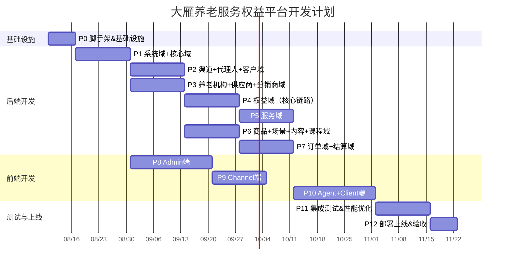
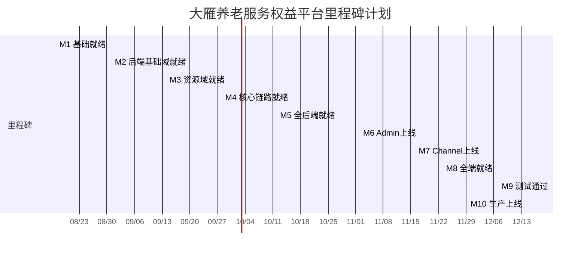

---
AIGC:
    Label: "1"
    ContentProducer: 001191110102MACQD9K64018705
    ProduceID: 59831912238739_0/project_7654537080038572324-files/大雁养老_项目计划书.md
    ReservedCode1: ""
    ContentPropagator: 001191110102MACQD9K64028705
    PropagateID: 59831912238739#1785762087025
    ReservedCode2: ""
---
# 大雁养老 - 项目计划书

> **文档版本**：v1.1  
> **编制日期**：2026-08-03  
> **适用范围**：大雁养老服务权益平台全栈开发  
> **依据**：《产品需求设计文档 v4.2》、《数据库设计文档 v4.2》、《测试计划与测试用例 v1.1》
>
> **修订记录**：
> - 2026-08-04 跨文档一致性修订：§1.2 域表计数对齐 v4.2/v4.3（system18/client7/service7/order4/finance7）；核心域模块名 module-core→module-organ；supplier/distributor 后端按独立预留服务对齐（仅前端暂不实现）。

---

## 一、项目概述

### 1.1 项目目标

构建大雁养老服务权益平台，实现以下核心目标：

1. **权益全生命周期管理**：权益模板→批次→入库→出库→激活→使用→完成/过期/作废，8态状态机精确管控
2. **管家服务标准化交付**：需求收集→方案定制→全程安排→回访品控四环节闭环，7态会话状态机驱动
3. **四端协同**：Admin（平台运营）+ Channel（渠道）+ Agent（代理人小程序/H5）+ Client（客户端小程序/H5）
4. **多渠道数据隔离**：17个业务域127张表，渠道间逻辑隔离（channel_code租户拦截器）
5. **性能达标**：P99<500ms，峰值200QPS，支撑10万客户/30万权益卡/100万服务记录

### 1.2 项目范围

#### 17个业务域

| 序号 | 业务域 | 表数 | 核心功能 | 开发优先级 |
|------|--------|------|---------|-----------|
| 1 | 系统域（system_） | 18 | 字典/状态机/短信/消息/日志/配置/菜单 | P0 |
| 2 | 核心域（organ_） | 9 | 组织/部门/员工/账号/角色/权限RBAC | P0 |
| 3 | 养老管家域（butler_） | 8 | 管家/排班/客户关系/服务记录/评价/技能 | P1 |
| 4 | 供应商域（supplier_） | 10 | 供应商/合同/评估/账号/联系人 | P1 |
| 5 | 养老机构域（park_） | 15 | 机构/多媒体/设施/房型/照护/餐饮 | P1 |
| 6 | 场景域（scene_） | 5 | 场景/项目/定价/排期/资源 | P2 |
| 7 | 渠道域（channel_） | 11 | 渠道/开放平台/账号/内容配置/数据同步 | P0 |
| 8 | 分销商域（distributor_） | 1 | 分销商信息（记录渠道归属） | P1 |
| 9 | 代理人域（agent_） | 6 | 代理人/账号/收藏/客户绑定/业绩/分享 | P1 |
| 10 | 客户域（client_） | 7 | 客户/账号/健康档案/需求/家庭/地址 | P1 |
| 11 | 权益域（equity_） | 6 | 模板/批次/卡函库/激活/使用人/更换权益人 | P0（核心） |
| 12 | 服务域（service_） | 7 | 会话/需求/方案/安排/回访/评价/探访/日志 | P0（核心） |
| 13 | 商品域（goods_） | 5 | SPU/权益SKU/场景SKU/课程SKU/旅居SKU | P1 |
| 14 | 内容域（content_） | 5 | 内容/分享/阅读/分类/多媒体 | P2 |
| 15 | 课程域（course_） | 3 | 课程/讲师/学习记录 | P2 |
| 16 | 订单域（order_） | 4 | 权益/场景/课程/旅居订单+支付+退款 | P0 |
| 17 | 结算域（finance_） | 7 | 流水/结算单/发票/应收/对账 | P1 |

#### 四端开发

| 端 | 技术栈 | 核心页面数 | 开发优先级 |
|----|--------|-----------|-----------|
| Admin（平台后台） | Vue3 + TypeScript + Element Plus + Pinia | ~50个页面 | P0 |
| Channel（渠道后台） | Vue3 + TypeScript + Element Plus + Pinia | ~30个页面 | P1 |
| Agent（代理人端） | uniapp（小程序/H5） | ~15个页面（4 Tab） | P1 |
| Client（客户端） | uniapp（小程序/H5） | ~15个页面（4 Tab） | P1 |

### 1.3 关键假设与约束

**假设**：
1. 产品需求文档v4.2和数据库设计v4.2为终版，开发期间不发生重大需求变更
2. 第三方服务（微信支付、阿里云短信、OSS）接口文档稳定，沙箱环境可用
3. 团队核心成员稳定，无大规模人员变动
4. 开发环境和测试基础设施（MySQL/Redis/CI/CD）可在P0阶段就绪
5. 微信小程序账号已注册，企业微信已开通

**约束**：
1. 性能硬约束：P99<500ms，峰值200QPS
2. 安全硬约束：渠道数据严格隔离，敏感数据加密存储
3. 状态机硬约束：状态转移必须通过状态机引擎，禁止绕过
4. 编码规范：对外接口使用业务编码（entity_code），不暴露id主键
5. 技术栈约束：后端Spring Boot 3.x + MyBatis-Plus + Sa-Token + Redis；前端Vue3/uniapp

---

## 二、开发阶段规划

### 2.1 阶段总览

| 阶段 | 名称 | 工期 | 前置依赖 | 交付物 |
|------|------|------|---------|--------|
| P0 | 脚手架 & 基础设施 | 1周 | 无 | 项目骨架、CI/CD、数据库初始化、登录可用 |
| P1 | 系统域 + 核心域 | 2周 | P0 | RBAC/字典/日志/组织/配置/菜单 |
| P2 | 渠道域 + 代理人域 + 客户域 | 2周 | P1 | 渠道/代理人/客户管理+账号体系 |
| P3 | 养老机构域 + 供应商域 + 分销商域 | 2周 | P1 | 机构/供应商入驻管理+分销商 |
| P4 | 权益域（核心链路） | 2周 | P2 | 权益模板/库存/出库/激活/使用人 |
| P5 | 服务域 | 2周 | P4 | 管家服务四环节+状态机+评价 |
| P6 | 商品域 + 场景域 + 内容域 + 课程域 | 2周 | P3 | 商品/场景/内容/课程管理 |
| P7 | 订单域 + 结算域 | 2周 | P4, P6 | 订单/支付/退款/结算/对账 |
| P8 | 前端Admin端 | 3周 | P1-P7（增量并行） | Admin全功能页面 |
| P9 | 前端Channel端 | 2周 | P8（复用组件） | Channel端全功能页面 |
| P10 | 前端Agent端 + Client端 | 3周 | P4, P5（核心链路就绪后） | 小程序/H5 |
| P11 | 集成测试 & 性能优化 | 2周 | P8-P10 | 全链路测试通过 |
| P12 | 部署上线 & 验收 | 1周 | P11 | 生产环境上线 |

**总工期**：18周（约4.5个月）

### 2.2 里程碑甘特图

### 2.3 各阶段详细任务拆解

---

#### P0：脚手架 & 基础设施（1周）

**目标**：搭建项目骨架，完成开发基础设施，确保可开发状态

**任务清单**：

- [ ] **后端项目初始化（Spring Boot 3.x + Maven多模块）**
  - [ ] 父POM创建，统一依赖版本管理
  - [ ] 子模块拆分（v4.2 对齐四端独立启动架构）：
    - `dayan-gateway`（Spring Cloud Gateway 网关：路由/限流/鉴权）
    - `dayan-common`（公共工具/响应封装/异常处理，含子模块）
    - `dayan-modules/`（17个业务模块，命名 `dayan-module-xxx`）：
      - `dayan-module-system`（系统域）
      - `dayan-module-organ`（核心域RBAC）
      - `dayan-module-channel`（渠道域）
      - `dayan-module-agent`（代理人域）
      - `dayan-module-client`（客户域）
      - `dayan-module-equity`（权益域）
      - `dayan-module-service`（服务域）
      - `dayan-module-order`（订单域）
      - `dayan-module-finance`（结算域）
      - `dayan-module-park`（养老机构域）
      - `dayan-module-supplier`（供应商域）
      - `dayan-module-butler`（管家域）
      - `dayan-module-goods`（商品域）
      - `dayan-module-scene`（场景域）
      - `dayan-module-content`（内容域）
      - `dayan-module-course`（课程域）
      - `dayan-module-distributor`（分销商域）
    - 当前实现的启动模块（架构基准：dayan-gateway + dayan-admin + dayan-channel + dayan-agent + dayan-client + dayan-supplier + dayan-distributor + dayan-job；后端独立部署）：
      - `dayan-admin`（Admin后端启动模块）
      - `dayan-channel`（Channel后端启动模块）
      - `dayan-agent`（Agent端后端启动模块）
      - `dayan-client`（Client端后端启动模块）
      - `dayan-supplier`（供应商端后端启动模块，预留 `/supplier-api/`，最小 1 副本）
      - `dayan-distributor`（分销商端后端启动模块，预留 `/distributor-api/`，最小 1 副本）
    - `dayan-job`（定时任务模块：权益过期扫描、订单超时取消、对账等，K8s CronJob 部署）
    - **预留说明**：`dayan-supplier`（供应商）/`dayan-distributor`（分销商）为独立预留后端启动模块（后端预留 `/supplier-api/` / `/distributor-api/` 路径，最小部署 1 副本，K8s 独立部署，与 Channel 平级的独立系统，对齐 PRD §3.4/§3.5、doc03 §5.1、doc04 §2.3；表结构与 Service 已建）；仅其**前端**（`dayan-supplier-web` / `dayan-distributor-web`）暂不实现，相关管理由 Admin 后台代管（走 admin-api）。
  - [ ] 统一响应封装 `R<T>`（code/message/data）
  - [ ] 全局异常处理 `GlobalExceptionHandler`（业务异常/参数异常/权限异常/系统异常）
  - [ ] Sa-Token多端认证配置（admin/channel/agent/client四端Token命名空间隔离）
  - [ ] MyBatis-Plus配置
    - [ ] 分页插件 `PaginationInnerInterceptor`
    - [ ] 自动填充 `MetaObjectHandler`（created_at/updated_at/deleted_at/creator/updater）
    - [ ] 租户拦截器 `TenantLineInnerInterceptor`（channel_code字段级隔离+忽略清单）
    - [ ] 乐观锁插件 `OptimisticLockerInnerInterceptor`
  - [ ] Redis配置（Lettuce连接池、Jackson序列化、key前缀规范）
  - [ ] 统一日志配置（trace_id贯穿、脱敏规则）
- [ ] **数据库初始化**
  - [ ] MySQL 8.0数据库创建（字符集utf8mb4，排序规则utf8mb4_unicode_ci）
  - [ ] 127张表DDL脚本执行（按域分文件，含索引）
  - [ ] 字典初始数据导入（system_dict_common/system_dict_business/system_dict_region/system_dict_iplocation）
  - [ ] 超级管理员账号创建（admin/admin123）
  - [ ] 菜单数据初始化（system_menu，Admin/Channel/Agent/Client四端菜单树）
  - [ ] 状态机配置数据初始化（system_state_machine，SERVICE_SESSION_SM/ORDER_SM/EQUITY_SM/PARK_SM）
- [ ] **前端项目初始化**
  - [ ] Admin端：Vue3 + TypeScript + Element Plus + Pinia + Vue Router + Axios
    - [ ] 项目骨架搭建（Vite构建）
    - [ ] 基础布局（侧边栏+顶栏+面包屑+标签页）
    - [ ] 路由守卫 + 权限指令
    - [ ] Axios拦截器（Token/响应处理/错误码）
  - [ ] Channel端：复用Admin基础模板，调整布局与路由
  - [ ] Agent端：uniapp项目初始化（微信小程序+H5）
  - [ ] Client端：uniapp项目初始化（微信小程序+H5）
- [ ] **CI/CD流水线搭建**（v4.2 统一为 GitLab CI）
  - [ ] `.gitlab-ci.yml` 流水线（阶段：lint → test → build → scan → deploy）
    - [ ] 后端：Maven构建 + 单元测试（覆盖率门禁≥70%）+ SonarQube扫描 + Docker镜像（六端 admin/channel/agent/client/supplier/distributor 独立构建 + dayan-job，私有 Harbor registry.dayanpeng.com）
    - [ ] 前端：npm构建 + 静态资源打包
  - [ ] 自动构建触发规则（push to dev/sit/uat/main）
- [ ] **开发规范文档发布**
  - [ ] 编码规范（命名/注释/异常处理/日志规范）
  - [ ] Git分支策略（GitFlow：main/dev/feature/hotfix）
  - [ ] API设计规范（RESTful/业务编码/分页/排序）
  - [ ] 数据库变更规范（Migration管理）

**验收标准**：
- ✅ 后端可启动（dayan-admin + dayan-channel + dayan-agent + dayan-client 四端），数据库可连接
- ✅ 登录接口可用（Sa-Token四端认证；Agent/Client 端登录支持选渠道）
- ✅ 前端Admin/Channel可启动并显示登录页
- ✅ Agent/Client小程序可启动
- ✅ CI流水线可自动构建并通过单元测试
- ✅ 127张表DDL全部执行成功

---

#### P1：系统域 + 核心域（2周）

**目标**：完成平台基础能力——字典、RBAC权限体系、组织架构、日志审计

**任务清单**：

- [ ] **系统域后端开发（~7天）**
  - [ ] 字典管理
    - [ ] 通用字典CRUD（system_dict_common）
    - [ ] 业务字典CRUD（system_dict_business，按domain区分17域）
    - [ ] 地域字典（system_dict_region，省市区三级）
    - [ ] IP地域字典（system_dict_iplocation）
    - [ ] 树形结构查询接口（parent_code递归）
    - [ ] Redis缓存预热 + 变更刷新机制
  - [ ] 状态机配置
    - [ ] 状态机规则CRUD（system_state_machine）
    - [ ] 规则校验：同一from+event唯一to
    - [ ] 规则缓存（应用启动加载 + DB变更刷新）
  - [ ] 短信模板管理
    - [ ] 多场景模板CRUD（验证码/服务提醒/活动通知/到期提醒）
    - [ ] 多服务提供商抽象（阿里云/腾讯云，@Conditional切换）
    - [ ] 占位符变量校验
  - [ ] 系统消息
    - [ ] 5种message_type × 6种target_type
    - [ ] 消息发送/已读追踪
    - [ ] 优先级排序
  - [ ] 操作审计日志
    - [ ] AOP切面自动记录（@OperationLog注解）
    - [ ] 异步落库（@Async），不阻塞主流程
    - [ ] 6类账号操作全量记录
    - [ ] trace_id贯穿 + IP/UA/设备指纹
  - [ ] 系统配置
    - [ ] 多级配置管理（global → organ → user）
    - [ ] 运行时热更新（Nacos或Redis发布订阅）
  - [ ] 菜单管理
    - [ ] 多端可见性控制（admin/channel/agent/client）
    - [ ] 树形结构查询
    - [ ] 角色-菜单关联

- [ ] **核心域后端开发（~7天）**
  - [ ] 组织管理（organ_info）
    - [ ] 公司/分公司树形结构CRUD
    - [ ] 营业执照OCR识别（可选）
    - [ ] 信用代码格式校验
  - [ ] 部门管理（organ_department）
    - [ ] 多级组织架构（parent_code + ancestors祖级链）
    - [ ] 部门人数统计
    - [ ] ancestors变更时树形完整性校验
  - [ ] 员工管理（organ_employee）
    - [ ] 员工档案CRUD，与account 1:1绑定
    - [ ] 工号唯一校验
  - [ ] 账号管理（organ_account / butler_account / supplier_account / channel_account）
    - [ ] 用户名/手机号/邮箱三选一登录
    - [ ] 密码BCrypt加盐哈希
    - [ ] 登录失败5次锁定30分钟
    - [ ] 超级管理员标记（不可删除）
  - [ ] 角色管理（organ_role等）
    - [ ] 角色CRUD + 角色继承
    - [ ] 数据权限四级（全部/部门及下级/本部门/仅本人）
    - [ ] 子角色权限 ⊆ 父角色权限校验
  - [ ] 权限项管理（organ_permission）
    - [ ] 4类权限CRUD（菜单/按钮/接口/数据）
    - [ ] permission_code全局唯一
  - [ ] 角色权限关联（organ_role_permission_ship）
    - [ ] 多对多关联管理
    - [ ] 批量授权/撤销
    - [ ] 权限变更审计日志

- [ ] **Admin前端 - 系统管理页面**
  - [ ] 字典管理页面（4套字典Tab切换 + 树形展示）
  - [ ] 状态机配置页面（规则列表 + 新增/编辑弹窗）
  - [ ] 用户管理页面（账号CRUD + 状态切换）
  - [ ] 角色管理页面（角色CRUD + 权限树分配 + 数据权限配置）
  - [ ] 菜单管理页面（树形表格 + 多端可见性勾选）
  - [ ] 组织架构页面（树形结构 + 部门管理）
  - [ ] 操作日志页面（多维查询 + 详情查看）
  - [ ] 系统配置页面（多级配置编辑）

**验收标准**：
- ✅ 字典CRUD + 缓存生效
- ✅ 状态机规则配置 + 缓存刷新
- ✅ 四端登录成功（Admin/Channel/Agent/Client）
- ✅ Agent/Client 端登录支持选渠道（/auth/channels 按手机号/open_id 检索关联渠道，选定后登录锁定）
- ✅ RBAC权限校验通过（菜单/按钮/接口/数据四级）
- ✅ 操作日志自动记录
- ✅ Admin端系统管理页面功能完整

---

#### P2：渠道域 + 代理人域 + 客户域（2周）

**目标**：完成渠道侧用户体系搭建，实现渠道-代理人-客户的归属关系管理

**任务清单**：

- [ ] **渠道域后端开发（~5天）**
  - [ ] 渠道信息管理（channel_info）
    - [ ] 5类渠道CRUD
    - [ ] 多级组织架构（parent_code树形）
    - [ ] 信用代码唯一校验
  - [ ] 开放平台配置（channel_open_platform）
    - [ ] app_key/app_secret生成
    - [ ] 回调地址/IP白名单配置
    - [ ] Token认证 + 签名验证逻辑
    - [ ] app_secret加密存储（AES）
  - [ ] 渠道账号管理（channel_account）
    - [ ] 多账号CRUD + 角色权限
    - [ ] username唯一校验
  - [ ] 渠道配置管理
    - [ ] 内容配置（channel_config_content）：按appType区分agent/client
    - [ ] 场景配置（channel_config_scene）
    - [ ] 商品配置（channel_config_goods）
  - [ ] 数据同步日志（channel_data_sync_log）
    - [ ] 同步任务记录 + 失败重试
    - [ ] 自动归档（30天前）
  - [ ] 功能开关（feature_config）
    - [ ] JSON格式功能开关管理
    - [ ] 后端@RequiresFeature切面拦截

- [ ] **代理人域后端开发（~3天）**
  - [ ] 代理人信息管理（agent_info）
    - [ ] 编码AG+5位自动生成
    - [ ] 4级等级管理
    - [ ] 渠道归属绑定
    - [ ] 工号唯一校验
  - [ ] 代理人账号（agent_account，按渠道隔离）
    - [ ] 微信登录（open_id/union_id）
    - [ ] 手机号登录
    - [ ] open_id/手机号至少一个校验
    - [ ] channel_code 必填；同一代理人多渠道各一条记录（渠道内 agent_code/username 唯一 uk_channel_agent_code/uk_channel_username）
    - [ ] ext_account_no（渠道本身账号系统编码，可空）支持渠道侧账号登录
    - [ ] 登录时选渠道（/auth/channels 按手机号/open_id 检索关联渠道；多渠道由用户选择，选定后登录锁定）
  - [ ] 客户绑定关系（agent_client_rel）
    - [ ] 绑定/解绑
    - [ ] 同期唯一约束
    - [ ] 关系有效期管理
  - [ ] 收藏夹（agent_favorite）
  - [ ] 业绩记录（agent_performance）
  - [ ] 分享记录（agent_share_record）
    - [ ] trace_id生成（全局唯一）
    - [ ] 多分享渠道记录

- [ ] **客户域后端开发（~4天）**
  - [ ] 客户信息管理（client_info）
    - [ ] 编码CL+5位自动生成
    - [ ] 多类型（本人/家属/老人）
    - [ ] 手机号唯一校验
  - [ ] 客户账号（client_account，按渠道隔离；client_info 同样按渠道隔离，每渠道独立个体）
    - [ ] 微信登录 + 手机号登录
    - [ ] channel_code 必填；同一客户多渠道各一条记录（渠道内 client_code/username 唯一 uk_channel_client_code/uk_channel_username）
    - [ ] ext_account_no（渠道本身账号系统编码，可空）支持渠道侧账号登录
    - [ ] 登录时选渠道（/auth/channels 按手机号/open_id 检索关联渠道；多渠道由用户选择，选定后登录锁定）
  - [ ] 健康档案（client_health_profile）
    - [ ] 一客户一档案约束
    - [ ] 多类型健康信息
  - [ ] 照护需求（client_care_need）
    - [ ] 5类需求
    - [ ] 优先级 + 评估结果
  - [ ] 家庭成员（client_family_member）
    - [ ] 多成员管理
    - [ ] 同客户同关系唯一
  - [ ] 收货地址（client_address）
    - [ ] ≤20地址限制
    - [ ] 默认地址标记
  - [ ] 登录日志（system_login_log，v4.2 迁入 system 域）
    - [ ] 自动归档（90天前）

- [ ] **Channel前端 - 渠道管理基础页面**
  - [ ] 渠道架构管理（树形结构）
  - [ ] 渠道账号管理页面
  - [ ] 开放平台配置页面

**验收标准**：
- ✅ 渠道CRUD + 多级组织 + 开放平台认证
- ✅ 代理人注册/登录 + 渠道归属（账号按渠道隔离，登录前选渠道）
- ✅ 客户注册/登录 + 基础信息管理（client_info / client_account 均按渠道隔离，每渠道独立个体）
- ✅ 渠道数据隔离生效（A渠道不可见B渠道数据；同一代理人 A渠道不可见其在B渠道的账号/业绩）
- ✅ Agent/Client 登录选渠道可用（/auth/channels 检索关联渠道 + 选定渠道登录，跨渠道身份以手机号/open_id 自然键关联；ext_account_no 支持渠道侧账号登录）
- ✅ 内容/场景/商品白名单配置可用

---

#### P3：养老机构域 + 供应商域 + 分销商域（2周）

**目标**：完成养老机构与供应商入驻管理，实现资源供给端基础能力

**任务清单**：

- [ ] **供应商域后端开发（~4天）**
  - [ ] 供应商信息管理（supplier_info）
    - [ ] 编码SP+5位自动生成
    - [ ] 3种供应商类型
    - [ ] 资质上传 + 审核流程
    - [ ] 信用代码唯一校验
  - [ ] 供应商账号（supplier_account）
    - [ ] 多账号管理 + 角色权限独立
  - [ ] 合同管理（supplier_contract）
    - [ ] 4类合同CRUD
    - [ ] 4种结算周期
    - [ ] 续约链管理
    - [ ] 合同编号唯一 + 日期校验
  - [ ] 评估评价（supplier_evaluation）
    - [ ] 季度评估
    - [ ] 4维评分 + A/B/C/D评级
  - [ ] 联系人管理
    - [ ] 4类型联系人
    - [ ] 主联系人标记

- [ ] **养老机构域后端开发（~6天）**
  - [ ] 机构核心信息（park_info）
    - [ ] 编码PK+5位自动生成
    - [ ] 9类机构能力（多选）
    - [ ] 6类性质 + 6级大雁评级 + 6维评分
    - [ ] 4态状态机（待审核/已上线/已下架/暂停营业）
    - [ ] 坐标精度校验
  - [ ] 多媒体资源（park_media_*，4张表）
    - [ ] 图片/视频/文件/VR上传
    - [ ] 11类图片分类
    - [ ] VR三种格式
    - [ ] URL唯一校验
  - [ ] 配套设施（park_facility）
  - [ ] 服务项目（park_service_item）
  - [ ] 顾问信息（park_adviser）
  - [ ] 周边配套（park_periphery）
  - [ ] 房型管理（park_room_type + park_room_price）
    - [ ] 5类房型 + 时段定价
    - [ ] 总数≥可用数校验
  - [ ] 照护类型（park_care_type + park_care_price）
    - [ ] 5级照护
  - [ ] 餐饮类型（park_food_type + park_food_price）
    - [ ] 多餐饮类型 + 时段不冲突

- [ ] **分销商域后端开发（~1天）**
  - [ ] 分销商信息（distributor_info）
    - [ ] 编码DS+5位自动生成
    - [ ] 企业/个人两种类型
    - [ ] 渠道归属关联
    - [ ] 分佣比例

- [ ] **Admin前端 - 资源管理页面**
  - [ ] 养老机构列表页（多维筛选 + 状态标签）
  - [ ] 养老机构详情页（14个扩展Tab：多媒体/房型/照护/餐饮/设施/服务/顾问/周边）
  - [ ] 供应商管理页面
  - [ ] 分销商管理页面

**验收标准**：
- ✅ 供应商入驻→审核→合同→机构录入→上线全流程
- ✅ 机构15张表数据CRUD完整
- ✅ 机构4态状态机流转正确
- ✅ 多媒体上传/展示可用
- ✅ 分销商-渠道关联关系建立

---

#### P4：权益域（核心链路）（2周）

**目标**：实现权益全生命周期管理——模板→批次→入库→出库→激活→使用→完成/过期

**任务清单**：

- [ ] **权益模板管理（equity_template）**
  - [ ] 7类权益模板CRUD
  - [ ] 5级等级配置
  - [ ] 有效期天数 + 最大使用次数
  - [ ] template_code唯一

- [ ] **批次管理（equity_batch）**
  - [ ] 批次创建（关联模板）
  - [ ] 统计字段自动更新（outbound_count/activated_count等）
  - [ ] outbound ≤ total校验

- [ ] **权益卡/函库（equity_depot）——核心**
  - [ ] 批量入库（批量生成权益记录，status=0库存中）
  - [ ] 编码生成：EQ+12位，并发安全（Redis INCR或号段模式）
  - [ ] 出库操作
    - [ ] outbound_channel_code / outbound_agent_code
    - [ ] equity_status → 1（已出库）
    - [ ] logistics_no物流单号
    - [ ] 批次统计更新
  - [ ] 激活操作（核心链路）
    - [ ] 激活码DY-8位 / 绑定码BF-12位验证
    - [ ] equity_status → 2（已激活）
    - [ ] activate_time + expire_time = activate_time + valid_days
    - [ ] client_code绑定
    - [ ] 事务保证原子性
  - [ ] 作废操作（前置条件校验）
  - [ ] 过期扫描定时任务（expire_time < 当前时间 → status=5）
  - [ ]  shelf过期扫描（shelf_expire_time < 当前时间 → status=5）

- [ ] **激活记录（equity_activate）**
  - [ ] 激活码/绑定码激活
  - [ ] 一权益一激活记录
  - [ ] 操作人/IP记录

- [ ] **使用人管理（equity_use_person）**
  - [ ] 登记使用人（≤3人）
  - [ ] 同身份证号唯一
  - [ ] 默认权益人标记
  - [ ] 支持更换默认权益人

- [ ] **更换权益人（equity_change_holder）**
  - [ ] 发起更换（equity_status → 7）
  - [ ] 同一权益同一时间仅一条更换中记录
  - [ ] 完成更换（equity_status → 2）
  - [ ] 更换回滚

- [ ] **权益状态机集成**
  - [ ] 8态状态机引擎接入（EQUITY_SM）
  - [ ] 所有状态变更通过状态机引擎
  - [ ] 非法转换抛业务异常

- [ ] **Admin前端 - 商品管理页面**
  - [ ] 权益模板管理页面
  - [ ] 权益仓库页面（入库/出库/作废操作）
  - [ ] 批次管理页面

**验收标准**：
- ✅ 权益8态状态机全部合法/非法流转验证通过
- ✅ 批量入库1000张权益卡性能<5秒
- ✅ 激活接口P99<200ms
- ✅ 编码生成并发安全（1000并发不重复）
- ✅ 过期扫描定时任务正确执行

---

#### P5：服务域（2周）

**目标**：实现管家服务四环节（需求收集→方案定制→全程安排→回访品控）闭环

**任务清单**：

- [ ] **服务会话管理（service_session）——核心**
  - [ ] 编码session_code自动生成
  - [ ] 二维状态机：session_status(7态) + sub_status(7值：normal/hold/urgent/reassign/refund_review/refund_done/interrupted)
  - [ ] 状态转移引擎接入（SERVICE_SESSION_SM）
  - [ ] 权益激活自动创建会话（status=1待分配）
  - [ ] 优先级管理 + SLA计时
  - [ ] 超时升级（2小时未受理 → sub_status=urgent）
  - [ ] 终态校验（6已完成/7已取消 + refund_done不可再转）

- [ ] **需求收集（service_equity_demand）**
  - [ ] 5类需求CRUD
  - [ ] 优先级 + 预算 + 时间要求
  - [ ] 关联健康档案（client_health_profile）更新/创建
  - [ ] 关联照护需求（client_care_need）创建

- [ ] **方案定制（service_equity_solution）**
  - [ ] 多方案（推荐/备选）
  - [ ] 关联park_info推荐机构
  - [ ] 价格预估
  - [ ] 至少1方案校验
  - [ ] 方案版本号管理（rejectScheme时version+1）

- [ ] **全程安排（service_equity_arrange）**
  - [ ] 4类安排状态（待入住/待参访/服务中/已完成）
  - [ ] 时间安排 + 资源对接
  - [ ] is_confirmed标记（安排确认后方可开始服务）

- [ ] **回访品控（service_equity_followup）**
  - [ ] 回访记录CRUD
  - [ ] 评分1-5 + 点评
  - [ ] 7天内必回访校验（定时任务检查）
  - [ ] 评分<3创建跟进记录

- [ ] **服务评价（service_evaluation）**
  - [ ] 客户1-5星评价
  - [ ] 4维度评分（服务态度/专业度/响应速度/满意度）
  - [ ] 匿名选项
  - [ ] 一会话一评价约束

- [ ] **探访记录（service_visit_record）**
  - [ ] 管家探访记录CRUD

- [ ] **变更日志（service_change_log）**
  - [ ] 4类变更记录（状态/方案/安排/回访）
  - [ ] 前后值记录（append-only）

- [ ] **管家域联动**
  - [ ] 管家分配逻辑（butler_client_rel绑定）
  - [ ] 一客户一管家约束
  - [ ] 管家服务记录（butler_service_record）
  - [ ] 沟通方式记录（communicate_way：电话/企微/微信）
  - [ ] 管家排班冲突检测
  - [ ] 管家评价管理（butler_rating）

- [ ] **Admin前端 - 养老管家页面**
  - [ ] 管家列表页面
  - [ ] 需求收集列表 + 详情页
  - [ ] 方案定制列表 + 详情页
  - [ ] 全程安排列表 + 详情页
  - [ ] 回访品控列表 + 详情页
  - [ ] 综合查询页面（equity_code维度）
  - [ ] 会话详情页面

**验收标准**：
- ✅ 服务会话7态+子状态全部合法/非法流转验证通过
- ✅ 权益激活→自动创建会话→分配→四环节→完成全流程走通
- ✅ SLA计时/暂停/压缩逻辑正确
- ✅ 7天回访定时任务校验
- ✅ Admin管家页面全功能可用

---

#### P6：商品域 + 场景域 + 内容域 + 课程域（2周）

**目标**：完成商品管理、场景活动、内容素材、课程学习的管理能力

**任务清单**：

- [ ] **商品域后端开发（~3天）**
  - [ ] 商品SPU管理（goods_info）
    - [ ] 4类型（权益/场景/课程/旅居）
    - [ ] goods_code唯一
    - [ ] 上下架管理
  - [ ] 权益SKU（goods_sku_equity）
    - [ ] 关联equity_template
    - [ ] 分等级配置 + 库存
  - [ ] 场景SKU（goods_sku_scene）
    - [ ] 关联scene_info + 时段定价 + 批量折扣
  - [ ] 课程SKU（goods_sku_course）
    - [ ] 关联course_info + 学员上限
  - [ ] 旅居SKU（goods_sku_sojourn）
    - [ ] 关联park_info + 房型 + 时长

- [ ] **场景域后端开发（~4天）**
  - [ ] 场景信息（scene_info）
    - [ ] 8类场景CRUD
    - [ ] 关联park_info
    - [ ] 场景名唯一
  - [ ] 项目明细（scene_item）
    - [ ] 多项目组成场景
    - [ ] 项目code同场景内唯一
  - [ ] 项目定价（scene_item_price）
    - [ ] 渠道差异化定价
    - [ ] 批量采购折扣
  - [ ] 日程安排（scene_schedule）
    - [ ] 日期/时间段/容量
    - [ ] current_person ≤ max_person
    - [ ] 3态（开放/已约满/关闭）
  - [ ] 场景资源（scene_resource）
    - [ ] 资源冲突检测

- [ ] **内容域后端开发（~3天）**
  - [ ] 内容信息（content_info）
    - [ ] 5类型CRUD（文章/视频/图片集/专题/问答）
    - [ ] 多状态流转（草稿/待审/通过/拒绝/下线）
    - [ ] SEO配置
    - [ ] title唯一
  - [ ] 分享记录（content_record_share）
    - [ ] trace_id归因
  - [ ] 阅读记录（content_record_read）
    - [ ] UV/PV统计
    - [ ] 按月分区
  - [ ] 内容分类（content_category）
  - [ ] 多媒体资源（content_media）

- [ ] **课程域后端开发（~2天）**
  - [ ] 课程信息（course_info）
    - [ ] 4类型CRUD
    - [ ] course_code唯一
  - [ ] 课程讲师（course_lecturer）
  - [ ] 学习记录（course_record_learn）

- [ ] **Admin前端 - 场景/内容/课程页面**
  - [ ] 场景总库管理页面
  - [ ] 场景活动管理页面（含订单+评价）
  - [ ] 内容素材库管理页面
  - [ ] 内容分类管理页面
  - [ ] 课程管理页面
  - [ ] 数据运营页面（内容访问/分享记录）

**验收标准**：
- ✅ 商品SPU+4类SKU管理完整
- ✅ 场景活动全生命周期（创建→排期→预约→执行→评价）
- ✅ 内容生产→审核→渠道配置展示→阅读统计链路
- ✅ 课程管理+学习记录完整

---

#### P7：订单域 + 结算域（2周）

**目标**：实现全类型订单管理、支付退款、结算对账

**任务清单**：

- [ ] **订单域后端开发（~7天）**
  - [ ] 权益订单（order_equity）
    - [ ] 创建订单（渠道对公/代理人个人两种模式，order_source区分）
    - [ ] 订单编号OD+日期+4位序号生成
    - [ ] 30分钟超时自动取消定时任务
  - [ ] 场景订单（order_scene）
    - [ ] 人数校验（≤max_person）
    - [ ] 预约日期合理性
  - [ ] 课程订单（order_course）
  - [ ] 旅居订单（order_sojourn）
    - [ ] 退房日期>入住日期校验
  - [ ] 支付记录（finance_payment，v4.2 迁入结算域）
    - [ ] 多支付方式（微信支付/支付宝/银行转账/余额支付/线下支付）
    - [ ] 第三方回调验签
    - [ ] 金额一致性校验
    - [ ] 金额以"分"为单位
  - [ ] 退款记录（finance_refund，v4.2 迁入结算域）
    - [ ] 退款前置条件（权益未全部激活）
    - [ ] 退款金额≤原订单
  - [ ] 状态日志（system_order_status_log，v4.2 迁入系统域）
  - [ ] 订单状态机（ORDER_SM）
    - [ ] 8态状态机引擎
    - [ ] 禁止应用层绕过

- [ ] **结算域后端开发（~5天）**
  - [ ] 财务流水（finance_flow）
    - [ ] 5种类型（收入/支出/退款/充值/结算）
    - [ ] 流水号FL+日期+6位序号
    - [ ] 自动归集
  - [ ] 结算单（finance_bill）
    - [ ] 结算单=应收概念
    - [ ] 2类型（渠道结算/供应商结算）
    - [ ] 3状态（待审核/审核通过/已结算）
    - [ ] 金额=订单-退款±调整
    - [ ] 关联flow_ids
  - [ ] 发票管理（finance_invoice）
    - [ ] 3类型发票
    - [ ] 发票号唯一
  - [ ] 应收管理（finance_account）
    - [ ] 基于结算单应收跟踪
    - [ ] 账龄分析
  - [ ] 对账记录（finance_reconciliation）
    - [ ] 每日03:00自动对账
    - [ ] 差异告警
    - [ ] 5个工作日处理

- [ ] **Admin前端 - 订单/财务页面**
  - [ ] 权益订单管理页面
  - [ ] 场景/课程/旅居订单管理页面
  - [ ] 收款管理页面
  - [ ] 退款管理页面
  - [ ] 结算管理页面（结算单CRUD + 审核）
  - [ ] 发票管理页面
  - [ ] 对账管理页面

**验收标准**：
- ✅ 订单8态状态机合法/非法流转全部通过
- ✅ 支付回调验签 + 金额一致性
- ✅ 退款前置条件校验
- ✅ 结算单金额计算正确
- ✅ 自动对账定时任务可执行
- ✅ 订单超时取消定时任务可执行

---

#### P8：前端Admin端（3周，与P1-P7增量并行）

**目标**：完成Admin平台后台全功能页面开发

**说明**：Admin前端开发从P1完成后开始，随后端各域接口就绪增量开发，此阶段为集中完善期。

**任务清单**：

- [ ] **工作台（Dashboard）**
  - [ ] 数据总览（活跃代理人/新增客户/待处理服务会话/今日活动场次）
  - [ ] 待办事项列表
- [ ] **渠道管理页面集**
  - [ ] 分销商管理
  - [ ] 采购渠道管理（列表 + 详情页）
  - [ ] 渠道详情页内4类配置Tab（保典配置/客平配置/场景配置/商品配置）
  - [ ] 渠道数据看板
- [ ] **养老保典管理页面集**
  - [ ] 代理人账号管理
  - [ ] 客户线索管理 + 客户分配
  - [ ] 内容管理（按渠道+appType='agent'过滤）
- [ ] **客户平台管理页面集**
  - [ ] 客户账号管理
  - [ ] 权益激活记录
  - [ ] 内容管理（appType='client'）
- [ ] **资源管理页面集**（对接P3）
- [ ] **场景管理页面集**（对接P6）
- [ ] **养老管家页面集**（对接P5）
- [ ] **商品管理页面集**（对接P4+P6）
- [ ] **数据运营页面**
- [ ] **财务结算页面集**（对接P7）
- [ ] **订单管理页面集**（对接P7）
- [ ] **报表统计页面**
- [ ] **系统管理页面集**（对接P1）
- [ ] **日志管理页面集**
- [ ] **菜单权限联调**
  - [ ] meta.roles角色控制菜单可见
  - [ ] hidden页面路由跳转
  - [ ] alwaysShow不自动折叠

**验收标准**：
- ✅ 全部菜单结构与设计文档一致
- ✅ 角色登录后仅可见授权菜单
- ✅ 全部CRUD页面功能完整
- ✅ 详情页Tab切换正常
- ✅ 响应式布局（1280/1440/1920）

---

#### P9：前端Channel端（2周）

**目标**：完成渠道后台全功能页面开发（仅渠道，供应商/分销商前端暂不实现）

**任务清单**：

- [ ] **工作台Dashboard**（本渠道数据概览）
- [ ] **系统管理**
  - [ ] 架构管理（渠道组织树形）
  - [ ] 账号管理 + 角色分配
- [ ] **采购结算**
  - [ ] 大雁商城（本渠道可购商品）
  - [ ] 订单管理（按本渠道筛选）
  - [ ] 发票管理
  - [ ] 收银台页面
- [ ] **养老保典**
  - [ ] 代理人账号管理
  - [ ] 内容配置（appType='agent'）
  - [ ] 场景营销 + 排期管理
  - [ ] 客户线索 + 分享记录 + 阅读记录
- [ ] **客户平台**
  - [ ] 客户账号管理
  - [ ] 内容配置（appType='client'）
  - [ ] 激活记录 + 服务记录
- [ ] **开放平台**
  - [ ] 接口文档页面
  - [ ] 应用管理（app_key/secret/回调/白名单）
  - [ ] 接入指南
- [ ] **供应商账号收敛**
  - [ ] 供应商登录后仅显示采购结算+供货维度
  - [ ] feature_config功能开关联动

**验收标准**：
- ✅ 菜单结构与设计文档一致
- ✅ 渠道数据隔离生效
- ✅ 供应商账号菜单收敛正确
- ✅ 采购下单→收银台→订单流程完整

---

#### P10：前端Agent端 + Client端（3周）

**目标**：完成代理人小程序/H5和客户端小程序/H5开发

**前置条件**：P4（权益域）+ P5（服务域）后端核心链路就绪

**任务清单**：

- [ ] **Agent端 - 首页Tab**
  - [ ] Banner区 + 快捷功能入口
  - [ ] 今日数据（线索/客户/权益/活动）
  - [ ] 热门活动列表
  - [ ] 获客内容列表（渠道配置范围）
  - [ ] 学习任务
  - [ ] 公告消息
- [ ] **Agent端 - 获客Tab**
  - [ ] 活动邀约
  - [ ] 名片分享（trace_id）
  - [ ] 内容分享（文章/视频/话术）
  - [ ] 线索管理
  - [ ] 获客数据统计
  - [ ] 海报生成
- [ ] **Agent端 - 客户Tab**
  - [ ] 我的客户列表
  - [ ] 客户跟进
  - [ ] 客户权益查看
  - [ ] 服务支持（参访预约/联系管家）
- [ ] **Agent端 - 活动Tab**
  - [ ] 可邀约活动列表
  - [ ] 我的活动
  - [ ] 活动效果统计
- [ ] **Agent端 - 我的Tab**
  - [ ] 个人信息 + 数据 + 收藏 + 学习记录 + 消息 + 设置
- [ ] **Agent端基础能力**
  - [ ] 微信登录 + 手机号登录
  - [ ] 小程序分享（trace_id生成）
  - [ ] 微信支付（JSAPI）

- [ ] **Client端 - 首页Tab**
  - [ ] 问候语 + 快捷服务入口
  - [ ] 推荐活动 + 热门机构
  - [ ] 养老资讯（渠道配置范围）
  - [ ] 我的管家
- [ ] **Client端 - 找机构Tab**
  - [ ] 机构搜索 + 多维筛选
  - [ ] 机构详情（多媒体/VR/评分）
  - [ ] 养老测评
  - [ ] 收藏与对比
  - [ ] 预约参访
- [ ] **Client端 - 服务Tab**
  - [ ] 权益列表 + 权益激活（输入激活码/绑定码）
  - [ ] 服务会话列表 + 进度查看（只读）
  - [ ] 服务评价
  - [ ] 我的管家 + 参访/活动
- [ ] **Client端 - 我的Tab**
  - [ ] 个人信息 + 家庭 + 收藏 + 活动 + 地址 + 消息 + 设置
- [ ] **Client端基础能力**
  - [ ] 微信登录 + 手机号登录
  - [ ] 微信支付
  - [ ] 地图定位（机构距离计算）

**验收标准**：
- ✅ Agent端4 Tab全功能可用
- ✅ Client端4 Tab全功能可用
- ✅ 微信小程序登录 + 支付流程走通
- ✅ 权益激活流程在Client端可用
- ✅ 服务进度查看（只读）正确
- ✅ 主流机型兼容测试通过（P0设备）

---

#### P11：集成测试 & 性能优化（2周）

**目标**：全链路集成测试，性能达标，缺陷修复

**任务清单**：

- [ ] **集成测试（第1周）**
  - [ ] 6条核心E2E流程回归测试
  - [ ] 状态机全量测试（权益8态+订单8态+会话7态+子状态）
  - [ ] 渠道数据隔离全量验证
  - [ ] RBAC权限全量验证
  - [ ] 接口测试全量执行（Postman/Newman）
  - [ ] 四端联调验证
  - [ ] 第三方服务集成验证（微信支付沙箱/短信/地图）
  - [ ] 定时任务验证（过期扫描/超时升级/自动对账/自动取消）
- [ ] **性能测试（第1-2周）**
  - [ ] 压测环境数据准备（10万客户/30万权益卡/100万服务记录）
  - [ ] 9个压测场景执行
  - [ ] 性能瓶颈定位与优化
    - [ ] SQL慢查询优化（执行计划分析）
    - [ ] Redis缓存命中率优化
    - [ ] 连接池参数调优
    - [ ] JVM参数调优
    - [ ] 批量操作优化（分批/异步）
  - [ ] 性能报告输出
- [ ] **安全测试（第2周）**
  - [ ] 敏感数据脱敏验证
  - [ ] SQL注入/XSS扫描
  - [ ] 接口鉴权全量验证
  - [ ] 支付安全验证（验签/金额/大额审核）
- [ ] **兼容性测试（第2周）**
  - [ ] Admin/Channel端浏览器兼容
  - [ ] Agent/Client端机型兼容
- [ ] **缺陷修复**
  - [ ] P0/P1缺陷4小时内修复
  - [ ] P2缺陷24小时内修复

**验收标准**：
- ✅ 全部E2E用例通过
- ✅ 状态机测试100%通过
- ✅ 渠道隔离测试100%通过
- ✅ 性能指标全部达标（P99<500ms，TPS≥200）
- ✅ P0/P1缺陷归零
- ✅ 安全扫描无高危漏洞

---

#### P12：部署上线 & 验收（1周）

**目标**：生产环境部署，业务验收，正式上线

**任务清单**：

- [ ] **生产环境准备**
  - [ ] MySQL主从搭建 + 数据备份策略
  - [ ] Redis Cluster搭建
  - [ ] 应用服务器部署（K8s/Docker）
  - [ ] Nginx反向代理 + SSL证书
  - [ ] 域名解析 + CDN配置
  - [ ] 监控告警配置（Prometheus + Grafana）
- [ ] **数据迁移**
  - [ ] DDL脚本执行
  - [ ] 字典数据导入
  - [ ] 菜单数据初始化
  - [ ] 超级管理员账号创建
  - [ ] 状态机规则初始化
- [ ] **生产验证**
  - [ ] 核心流程冒烟测试
  - [ ] 支付回调验证（真实微信支付）
  - [ ] 短信发送验证
  - [ ] 文件上传验证
- [ ] **业务验收**
  - [ ] 业务方UAT验收
  - [ ] 验收问题修复
  - [ ] 验收签字
- [ ] **上线切换**
  - [ ] 上线checklist确认
  - [ ] 灰度发布（如适用）
  - [ ] 全量发布
  - [ ] 上线后监控（1小时密切观察）
- [ ] **交付文档**
  - [ ] 运维手册
  - [ ] 用户操作手册
  - [ ] 应急预案

**验收标准**：
- ✅ 生产环境部署成功
- ✅ 核心流程冒烟测试通过
- ✅ 业务方验收签字
- ✅ 监控告警正常

---

## 三、里程碑计划

### 3.1 关键里程碑

| 里程碑 | 日期（相对开工日） | 标志 | 验收方式 |
|--------|-------------------|------|---------|
| M1 基础就绪 | T+1周 | P0完成，项目骨架搭建完成，可开始业务开发 | 演示：四端登录 + CI流水线 |
| M2 后端基础域就绪 | T+3周 | P1+P2完成，RBAC/渠道/代理人/客户可用 | 演示：登录+权限+渠道管理 |
| M3 资源域就绪 | T+5周 | P3完成，机构/供应商入驻管理可用 | 演示：入驻审核全流程 |
| M4 核心链路就绪 | T+7周 | P4+P5完成，权益激活+管家服务可用 | 演示：激活→服务全流程 |
| M5 全后端就绪 | T+9周 | P6+P7完成，所有后端API可用 | 接口测试全量通过 |
| M6 Admin上线 | T+12周 | P8完成，Admin端全功能可用 | Admin全流程操作 |
| M7 Channel上线 | T+14周 | P9完成，Channel端全功能可用 | Channel端全流程操作 |
| M8 全端就绪 | T+15周 | P10完成，四端联调完成 | 四端端到端联调 |
| M9 测试通过 | T+17周 | P11完成，集成测试+性能测试通过 | 测试报告评审 |
| M10 生产上线 | T+18周 | P12完成，生产环境上线 | 业务验收签字 |

### 3.2 里程碑甘特图

---

## 四、团队与分工建议

> **⚠️ 重要前提：本项目为纯个人开发**。以下角色配置并非招聘计划，而是**单人全栈开发者身兼多角色**的能力地图 + AI 辅助放大器。传统多人分工的所有职责，由 1 人借助 AI 工具链覆盖。

### 4.1 角色配置（单人全栈 + AI 辅助）

| 角色（一人多角色） | 职责 | AI 放大策略 |
|-------------------|------|------------|
| 产品/PM（你） | 需求决策、进度管控、优先级排序 | 文档已完成，按阶段推进即可 |
| 后端架构师（你） | 技术选型、架构、核心代码 | AI 辅助生成框架，人工把关设计 |
| 后端开发（你 + AI） | 17 业务域接口开发 | **主力靠 AI**：CRUD/单测/SQL，人工补业务逻辑 |
| 前端 Web（你 + AI） | Admin + Channel 端 | AI 生成页面骨架，人工调交互/权限 |
| 前端小程序（你 + AI） | Agent + Client 端 | AI 生成组件，人工调适配 |
| 测试（你 + AI） | 用例设计、接口测试、E2E | AI 生成基础用例，人工补边界/状态机 |
| UI 设计（你 + AI） | 四端 UI | v0.dev / AI 生成设计稿，微调即可 |
| DBA/运维（你 + 自动化） | DB 优化、CI/CD、监控 | 自动化流水线 + 监控告警替代人力 |

**单人开发的核心约束**：精力有限，必须严格按 P0→P12 顺序推进，**不并行多端**（后端优先，前端跟进）。

> **工期估算说明（重要）**：18 周工期基于以下假设：
> - **AI 加速系数**：CRUD 接口/单测/前端骨架/SQL 等标准化任务由 AI（Copilot/Cursor/ZCode）生成，效率提升约 2-3 倍；纯串行无 AI 辅助估算约 26 周，AI 加速压缩至 18 周。
> - **每日有效投入**：6-8 小时；若投入不足需线性延长。
> - **不并行假设**：单人无法真正并行多端，但 P8-P10（前端）可与 P11（测试准备）部分增量重叠（前端页面完成即可联调，不必等全部后端就绪）。
> - **风险提示**：若 AI 辅助效果不及预期、或业务逻辑复杂度超预期（结算/退款/状态机），实际工期可能延长至 22-26 周。建议每个里程碑（M1-M10）按实际进度复盘，动态修正后续排期。

### 4.2 AI辅助开发建议

| 任务类型 | AI适合度 | 推荐工具 | 说明 |
|---------|---------|---------|------|
| CRUD接口开发 | ⭐⭐⭐⭐⭐ | Copilot / Cursor / ZCode | 标准CRUD模式，AI生成效率极高，单人开发主力 |
| 单测编写 | ⭐⭐⭐⭐⭐ | Copilot / Cursor / ZCode | AI生成单测覆盖率高 |
| 前端页面开发 | ⭐⭐⭐⭐ | v0.dev / Copilot | Element Plus组件组合，AI辅助快速出页面 |
| SQL编写 | ⭐⭐⭐⭐ | Copilot / ZCode | 标准查询/索引优化 |
| 状态机逻辑 | ⭐⭐⭐ | Cursor / ZCode | 需要人工校验边界条件 |
| 复杂业务逻辑 | ⭐⭐ | - | 结算/退款等需人工主导 |
| 数据库设计 | ⭐⭐ | - | 已完成设计文档，仅需微调 |
| 性能优化 | ⭐⭐ | Arthas + AI辅助分析 | 需结合实际压测数据 |
| 安全审计 | ⭐ | - | 需人工审查，AI仅辅助扫描 |

**单人开发 AI 使用策略**：
- 后端CRUD接口：AI生成框架代码 → 人工补充业务逻辑和校验
- 前端页面：AI生成页面骨架 → 人工调整交互细节和权限控制
- 测试用例：AI生成基础用例 → 人工补充状态机边界和异常场景
- Code Review：**单人无他人 Review**，改为「AI 预扫描 + 自审 + 隔天冷启动复查」（写完隔天再 review 自己的代码，模拟他人视角）

---

## 五、风险管理

### 5.1 风险清单

| 风险 | 影响 | 概率 | 等级 | 缓解措施 |
|------|------|------|------|---------|
| 需求变更频繁 | 返工、延期 | 中 | 🔴高 | ①需求基线冻结，变更走CR流程 ②P4/P5核心域优先开发，锁定核心链路 ③预留P11阶段吸收变更 |
| 状态机逻辑复杂 | Bug多、测试困难 | 高 | 🔴高 | ①状态机引擎独立封装，100%单测覆盖 ②转移规则配置化，支持热更新 ③提前编写状态机专项测试用例 |
| 渠道数据隔离泄漏 | 安全事故 | 低 | 🔴高 | ①MyBatis-Plus租户拦截器统一处理 ②CI纳入隔离回归测试 ③UAT阶段专项验证 |
| 微信支付对接复杂 | 支付链路延迟 | 中 | 🟡中 | ①提前申请沙箱环境 ②封装支付抽象层，先Mock后真实 ③预留3天支付联调时间 |
| 性能不达标 | 上线延迟 | 中 | 🟡中 | ①P11阶段预留完整2周做性能优化 ②关键接口提前做压测（P4/P5完成后） ③Redis缓存策略提前设计 |
| 小程序审核不通过 | 上线延迟 | 低 | 🟡中 | ①提前了解审核规则 ②预留3天审核缓冲 ③准备H5降级方案 |
| 个人精力中断/健康风险 | 进度受阻 | 低 | 🟡中 | ①代码自审+文档完善+AI辅助 ②关键模块优先攻坚 |
| 第三方服务不稳定 | 联调受阻 | 中 | 🟢低 | ①封装抽象层+Mock ②主备服务提供商切换 ③降级方案 |
| 数据库性能瓶颈 | 列表查询慢 | 中 | 🟡中 | ①127张表索引提前设计 ②大表分区策略 ③读写分离 |
| 前端四端联调工作量大 | 联调延期 | 中 | 🟡中 | ①后端统一API规范 ②Postman Collection提前交付 ③前端增量联调 |
| 配置中心选型返工 | 热更新方案返工 | 低 | 🟡中 | ①v4.2 已定 Nacos 为配置中心+Sentinel 规则中心 ②system_config 表多级配置 + Nacos pub-sub 热更新 ③P0 阶段锁定选型 |
| AES-ECB 安全合规问题 | 敏感数据泄露/合规不通过 | 低 | 🟡中 | ①v4.2 已改 AES-256-GCM ②补加密模式正确性测试用例 |
| CI 门禁与质量要求不一致 | 劣质代码流入 | 低 | 🟢低 | ①v4.2 已统一 CI 覆盖率门禁为 70% ②SonarQube 质量门禁联动 |
| 文档版本漂移 | 开发依据过期文档 | 中 | 🟡中 | ①v4.2 已完成 8 份文档一致性对齐 ②以数据库设计文档 v4.2 为唯一真相源 ③建立文档版本对应矩阵 |

### 5.2 应急预案

| 场景 | 应急方案 |
|------|---------|
| P4/P5核心域延期 | ①P6部分任务可后移 ②前端Mock接口并行开发 ③加班赶工（不超过2周） |
| 性能测试不达标 | ①优先优化Top 10慢接口 ②引入缓存/异步/批量优化 ③必要时扩容服务器 |
| 支付功能异常 | ①先上线非支付功能 ②支付降级为线下对账模式 ③修复后补上线 |
| 小程序审核被拒 | ①分析拒绝原因快速修复 ②切换H5版本先行 ③重新提交审核 |
| 严重线上Bug | ①Hotfix流程快速修复 ②数据回滚预案 ③事后复盘 + 补充测试 |

---

## 六、质量保障

### 6.1 Code Review机制

> **单人开发模式**：无他人参与 Review，采用「AI 预扫描 + 自审 + 隔天冷启动复查」机制，对齐 §4.2 单人开发策略。

| 规则 | 说明 |
|------|------|
| AI预扫描 | SonarQube 自动扫描 + AI 预审查（代码风格/潜在缺陷/安全风险），合入 dev/main 前必须通过 |
| 自审 | 提交 PR 前自行通读变更，核对业务逻辑、事务边界、权限校验 |
| 隔天冷启动复查 | 写完隔天再复查自己的代码（冷启动模拟他人视角），核心模块（权益/服务/订单/结算/状态机）强制执行 |
| 重点Review内容 | ①状态机逻辑 ②金额计算 ③权限校验 ④数据隔离 ⑤事务边界 |
| 处理时效 | AI 扫描实时反馈；自审/复查于提交当日或次日完成 |

### 6.2 测试策略

| 测试层 | 覆盖目标 | 执行时机 | 工具 |
|--------|---------|---------|------|
| 单元测试 | Service层≥80% / 工具类≥90% / 状态机100% | 每次提交 | JUnit 5 + Mockito |
| 接口测试 | 全部接口正向100% + 反向95% | 每日构建 | Postman + Newman |
| E2E测试 | 6条核心流程100% | 每周/发版前 | Playwright + 微信开发者工具 |
| 性能测试 | 9个场景全部达标 | 发版前 | JMeter + wrk |
| 安全测试 | 无高危漏洞 | UAT阶段 | SonarQube + OWASP ZAP |

### 6.3 验收标准

| 维度 | 标准 |
|------|------|
| 功能 | 全部需求点覆盖，E2E用例100%通过 |
| 性能 | P99<500ms，峰值200QPS，错误率<0.1% |
| 安全 | RBAC全量通过，渠道隔离100%，无高危漏洞 |
| 兼容 | P0设备全功能通过，主流浏览器兼容 |
| 缺陷 | P0=0, P1=0, P2≤5 |
| 文档 | 运维手册 + 用户手册 + 应急预案 |

---

## 七、沟通与协作

> **单人开发模式**：无团队沟通成本，重点在于**自我管理 + AI 协作 + 业务方对齐**。

### 7.1 个人节奏与对齐机制

| 机制 | 频率 | 内容 |
|------|------|------|
| 每日复盘 | 每日收工前 10 分钟 | 记录今日完成/明日计划/阻塞点（写入开发日志） |
| 周回顾 | 每周一次 | 对照 P0-P12 进度，调整下周优先级 |
| 里程碑自检 | 每个 M 节点 | 按验收标准自测，录制演示视频备查 |
| 业务方对齐 | 按需（建议每 2 周） | 与业务方确认需求理解、演示阶段性成果、收集反馈 |
| 隔天代码自审 | 每天早上 | 复查昨日代码（冷启动模拟他人视角）+ AI 预扫描 |
| 缺陷处理 | 发现即修 | 单人开发无缺陷分诊环节，发现后立即评估优先级并修复 |

### 7.2 文档管理

| 文档类型 | 存放位置 | 更新频率 |
|---------|---------|---------|
| 需求文档 | 语雀/飞书知识库 | 变更时更新，版本管理 |
| 数据库设计 | 语雀/飞书知识库 | 变更时更新，版本管理 |
| API文档 | Swagger/Knife4j（自动生成） | 实时 |
| 测试文档 | 语雀/飞书知识库 | 每轮测试后更新 |
| 会议纪要 | 飞书妙记/群消息 | 每次会议后 |
| 代码仓库 | GitLab | 实时 |
| 运维文档 | 语雀/飞书知识库 | 上线前完成 |

### 7.3 变更管理

> **单人开发模式**：单人兼任 PM/架构师/DBA/前端/后端所有角色，所有变更由个人决策 + AI 辅助评审。

| 变更类型 | 流程 | 决策人 |
|---------|------|--------|
| 需求变更 | 提交CR单 → 个人评估影响 → 业务方确认 → 排期调整 | 本人（兼任PM）+ 业务方 |
| 技术方案变更 | 个人决策 + AI辅助评审 → 记录决策（架构/选型/取舍） | 本人（兼任架构师） |
| 数据库变更 | 个人决策 + AI辅助评审（DDL影响/索引/迁移） → 测试环境验证 → 生产执行 | 本人（兼任DBA） |
| 接口变更 | 更新API文档 → 自测联调 | 本人（兼任前后端） |
| 紧急变更 | 个人判断 → 即时实施 → 事后补记变更日志 | 本人 |

**变更原则**：
1. P4/P5/P7核心域开发完成后，原则上不接受需求变更
2. 必须变更的，评估对工期影响，调整里程碑计划
3. 所有变更记录在变更日志中，可追溯

---

> **文档结束**  
> 大雁养老项目计划书 v1.1  
> 13个开发阶段 | 18周总工期 | 10个关键里程碑 | 单人全栈+AI辅助

---

> 本内容由 Coze AI 生成，请遵循相关法律法规及《人工智能生成合成内容标识办法》使用与传播。
